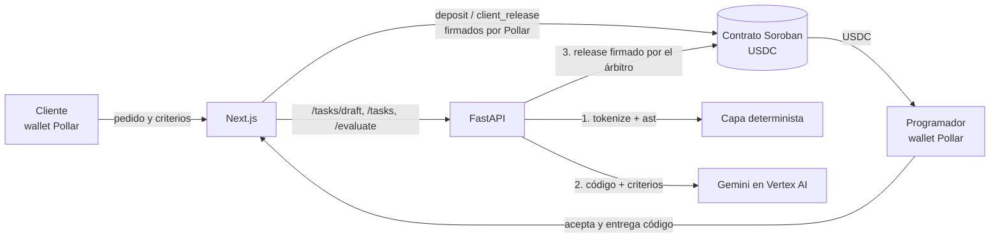

# Cumple&Cobra

**Si cumple lo acordado, cobras. Sin discusiones.**

Cumple&Cobra es el acuerdo verificable para trabajo de código. MVP para GOYA HACK (reto Stellar BAF y pool de Pollar); todo corre en la testnet de Stellar.

## Qué es

Un cliente necesita un script de Python y un programador lo escribe. Hoy el cliente paga sin saber si el código hace lo pedido, o el programador entrega sin garantía de cobro. Cumple&Cobra fija el acuerdo antes de trabajar y deja que lo juzgue un motor, no una de las partes:

1. **Pedido asistido.** El cliente escribe lo que necesita con sus palabras. Gemini lo convierte en una descripción, criterios medibles y ejemplos, que el cliente edita. «Revisar criterios» marca los que no se pueden verificar («que sea rápido») y propone una versión medible.
2. **Acuerdo.** Al crear la tarea, la versión final queda fija en un `rules_hash`. El cliente invita a su programador con un enlace; el programador acepta esos criterios antes de trabajar.
3. **Depósito.** El cliente deposita USDC en un contrato Soroban firmando con [Pollar](https://pollar.xyz); el `rules_hash` queda on-chain. Los montos se muestran primero en pesos (estimados) y el USDC debajo.
4. **Veredicto.** El programador entrega el script y, si quiere, un video demo en Google Drive. El **Motor de Análisis Estático de Código basado en LLM** revisa el código en cuatro capas (higiene, revisión determinista con `ast`, Gemini con salida estructurada y una regla final) y responde criterio por criterio.
5. **Pago.** Si cumple, el backend, que es el árbitro del contrato, firma `release` y el programador cobra en segundos. El código llega al cliente solo después del pago. Si la IA rechaza, el programador puede autorizar que el cliente vea esa entrega, y el cliente puede aprobar manualmente. Si vence el plazo, cualquiera dispara el reembolso y el dinero solo vuelve al cliente.

## Arquitectura



- El **contrato** es la fuente de verdad del dinero: guarda cliente, monto, plazo y `rules_hash`, y cambia de estado antes de transferir (`Funded` → `Released` o `Refunded`).
- El **backend** guarda las tareas, los tokens de acceso y los veredictos en `backend/state.json` (no hay base de datos) y firma `release` con la llave del árbitro. Nunca ejecuta el código entregado.
- El **frontend** arma las transacciones con `@stellar/stellar-sdk`. Pollar las firma en su servidor y las envuelve en un fee-bump pagado por la app, así que las wallets no necesitan XLM. El frontend nunca ve llaves privadas ni la API de Gemini.

## Contrato en testnet

| | |
| --- | --- |
| Contrato | [`CAWAZODOFP67HETHN4NLYOECPCJACGLUTCLARVGLBZ7TJDLT4KLQRATQ`](https://stellar.expert/explorer/testnet/contract/CAWAZODOFP67HETHN4NLYOECPCJACGLUTCLARVGLBZ7TJDLT4KLQRATQ) |
| USDC (SAC) | [`CBIELTK6YBZJU5UP2WWQEUCYKLPU6AUNZ2BQ4WWFEIE3USCIHMXQDAMA`](https://stellar.expert/explorer/testnet/contract/CBIELTK6YBZJU5UP2WWQEUCYKLPU6AUNZ2BQ4WWFEIE3USCIHMXQDAMA) (emisor `GBBD47IF6LWK7P7MDEVSCWR7DPUWV3NY3DTQEVFL4NAT4AQH3ZLLFLA5`) |
| Árbitro (backend) | `GAGGEH7TNBV7Z7TX7OLTBJPEFBWTMLD477P3DTTFFBUAYOZXGGVOKZGY` |

Funciones: `deposit` (cliente), `release` (árbitro, solo antes del plazo), `client_release` (cliente, aprobación manual), `timeout_refund` (cualquiera, después del plazo; paga siempre al cliente) y `get_task`. Comandos, errores y tests en [`contracts/cumpleycobra/README.md`](contracts/cumpleycobra/README.md).

## Cómo verificar un pago

Cada `release` publica un evento con el `task_id`, el programador, el monto, el `code_hash` del código pagado y el `verdict_hash` del veredicto. Cualquiera puede recalcular esos dos hashes y compararlos con el evento, sin depender del backend:

```bash
backend/.venv/Scripts/python scripts/verificar_pago.py TX_HASH --veredicto veredicto.json --codigo entrega.py
```

- `TX_HASH`: la transacción del pago (aparece en la terminal del programador y en la vista del cliente).
- `veredicto.json` puede ser cualquiera de estos:
  - la respuesta de `POST /evaluate` (la tiene el programador; incluye `task_id` y `video_url`);
  - la respuesta completa de `GET /tasks/{id}/verdicts` (la tiene el cliente); el script toma el veredicto cuyo `code_hash` es el del evento;
  - un solo elemento de `/verdicts`, con `--tarea TASK_ID` porque el elemento no trae el `task_id`.

  Una respuesta de caché (`stage: "cache"`) también sirve: un veredicto pagado siempre viene de Gemini, y el script usa `stage: "llm"`.
- `entrega.py`: el código tal como se entregó (`GET /tasks/{id}/delivery`).

Desde la vista del cliente, con su `client_token`:

```bash
curl -s -H "X-Client-Token: $CLIENT_TOKEN" localhost:8000/tasks/$TASK_ID/verdicts > veredicto.json
curl -s -H "X-Client-Token: $CLIENT_TOKEN" localhost:8000/tasks/$TASK_ID/delivery | jq -j .code > entrega.py
```

Usa `jq -j .code`, no `jq -r`: `-r` agrega un salto de línea al final, y un solo byte de más cambia el `code_hash`.

El script lee el evento del RPC de testnet y compara:

1. el `task_id`;
2. el SHA-256 del código contra `code_hash`;
3. el `verdict_hash` recalculado contra el del evento.

Ejemplo real con el pago de la fase 3:

```text
Evento release: tarea GgdBDlp6pwxyAfrQ, 10000000 unidades a GA7MXQO3OL6IMISROP3JJM3NBGOEDHPPK7B5Q2ASNIBNVAPVCE6FBEVJ
  code_hash    on-chain  c9b846f4cafc89920593d805ffa0fd7a087b9b29d928e00d835bdc782334e534
  verdict_hash on-chain  6615bcb81b317b6750897016502850231b8bb98bdb962cdbc9634b602ce20782
  code_hash    recalculado c9b846f4cafc89920593d805ffa0fd7a087b9b29d928e00d835bdc782334e534
  verdict_hash recalculado 6615bcb81b317b6750897016502850231b8bb98bdb962cdbc9634b602ce20782
✓ task_id
✓ code_hash del código entregado
✓ code_hash del veredicto
✓ verdict_hash
```

Definición de los hashes (SHA-256 sobre JSON canónico: claves ordenadas, separadores `,` y `:` sin espacios, UTF-8 sin escapar, cadenas en NFC y sin `float`; los montos son enteros, 1 USDC = 10 000 000 unidades). La implementación está en [`backend/hashing.py`](backend/hashing.py).

| Hash | Se calcula sobre | Dónde queda |
| --- | --- | --- |
| `rules_hash` | `{"version": 1, "description", "criteria", "language", "allowed_deps" (ordenada), "examples"}` de la versión final editada; el pedido original no entra | depósito on-chain |
| `code_hash` | los bytes UTF-8 del código tal como se entregó | evento `release` |
| `verdict_hash` | `{"version": 1, "task_id", "code_hash", "approved", "reason", "stage", "comparison", "security_flags", "video_url"}` | evento `release` |

En un veredicto pagado, `security_flags` es `[]` (una bandera de seguridad impide el pago) y `video_url` es la URL canónica de Drive (`…/preview`) o `null`.

## Instalación

Desde un clon limpio. Requisitos: Python 3.14, Node.js con npm, la CLI de Google Cloud (`gcloud`) y, para los scripts de testnet, la Stellar CLI. Las rutas `backend/.venv/Scripts/` son de Windows; en Linux y macOS usa `backend/.venv/bin/`.

1. **Variables de entorno.** Copia `.env.example` a `backend/.env` y llénalo. `ARBITER_SECRET_KEY` debe ser la llave del árbitro con que se inicializó el contrato (`stellar keys secret cyc-arbiter`); con otra llave hay que desplegar un contrato propio (ver [`contracts/cumpleycobra/README.md`](contracts/cumpleycobra/README.md)). Copia la sección `NEXT_PUBLIC_*` del mismo archivo a `frontend/.env.local` y pon ahí la clave publicable de Pollar. Ninguno de los dos archivos se sube al repositorio.
2. **Credenciales de Vertex AI** (si `GOOGLE_GENAI_USE_VERTEXAI=true`):

   ```bash
   gcloud auth application-default login
   ```

3. **Backend:**

   ```bash
   python -m venv backend/.venv
   backend/.venv/Scripts/python -m pip install -r backend/requirements.txt
   ```

4. **Frontend.** `next typegen` genera los tipos de las rutas (`LayoutProps`, `PageProps`) que necesita el chequeo de tipos; `next build` los genera solo.

   ```bash
   cd frontend
   npm ci
   npx next typegen
   npx tsc --noEmit
   ```

5. **Pollar.** Configura la app en el dashboard (https://dashboard.pollar.xyz):

| Sección | Qué configurar |
| --- | --- |
| Build → API Keys | Clave publicable de testnet (`pub_testnet_…`) en `frontend/.env.local` como `NEXT_PUBLIC_POLLAR_API_KEY` |
| Build → Domains | `http://localhost:3000` (sin él, la API responde `403 ORIGIN_NOT_ALLOWED`) |
| Autenticación | Correo (OTP). Google necesita además URIs de redirección (sin ellas: `APPLICATION_HAS_NO_REDIRECT_URIS`) |
| Treasury → Tokens & Trustlines | `USDC:GBBD47IF6LWK7P7MDEVSCWR7DPUWV3NY3DTQEVFL4NAT4AQH3ZLLFLA5` |
| Treasury → Auth Policy | El contrato `CAWAZODOFP67HETHN4NLYOECPCJACGLUTCLARVGLBZ7TJDLT4KLQRATQ` |
| Treasury → Sponsorship | Activo para contratos y transferencias (sin él, la red responde `txInsufficientBalance`) |

## Cómo correrlo

```bash
# Contrato
cargo test -p cumpleycobra
stellar contract build

# Backend
backend/.venv/Scripts/python -m pytest backend/tests
backend/.venv/Scripts/python -m uvicorn backend.main:app --port 8000

# Frontend
cd frontend && npm run build && npx next start -p 3000
```

El backend lee `backend/.env` al importarse: sin esas variables, `backend.main` no arranca.

La demo paso a paso, con sus respaldos, está en [`docs/demo.md`](docs/demo.md). Para fondear una wallet de la demo con USDC de testnet: `bash scripts/fondear.sh DIRECCION_G MONTO_USDC`.

**Respaldos de la wallet:**

- **Pollar no firma el depósito:** `backend/.venv/Scripts/python scripts/tarea_respaldo.py` crea la tarea con la identidad `cyc-client` de la Stellar CLI y la deposita desde la terminal. Un depósito por CLI de una tarea creada con la wallet de Pollar no sirve: `/evaluate` exige que el cliente on-chain sea el que creó la tarea (`TASK_MISMATCH`).
- **Freighter:** `NEXT_PUBLIC_WALLET=freighter` está implementado pero **sin probar**; no es un respaldo validado.

## Motor medido

Medición del 24 de septiembre de 2026 con `gemini-3.5-flash` ([detalle](docs/fases/fase-5.md#4-motor-medido-resumen-para-el-pitch)):

| Casos | Aciertos | Falsas aprobaciones | Falsos rechazos | Latencia mediana | Latencia máxima |
| --- | --- | --- | --- | --- | --- |
| 60: A–D diez veces cada uno y 20 entregas distintas | 60/60 | 0 | 0 | 3.32 s | 17.78 s |

Las expectativas se fijaron antes de medir. La latencia es la del análisis con Gemini; los rechazos deterministas tardan menos de 1 ms.

## Límites honestos

- **No ejecuta el código.** El motor lo lee: la capa determinista revisa sintaxis, imports y llamadas prohibidas con `ast`, y Gemini traza la lógica contra cada criterio. Así el servidor nunca corre código ajeno, pero tampoco puede comprobar resultados en tiempo de ejecución.
- **Bucles:** se detectan los patrones evidentes de bucles sin salida (como un `while` que no incrementa su índice), no todos. Decidir si cualquier programa termina no es posible en general.
- **El token no prueba la propiedad de la wallet.** El enlace de invitación prueba que el programador lo recibió; la tarea se amarra a la dirección con la que acepta. Una firma de mensaje con la wallet queda en el roadmap.
- La medición del motor cubre un solo requisito y un corpus de 20 casos escrito por el equipo: describe esa muestra, no una garantía general.
- El video demo es evidencia de apoyo: el backend valida el formato del enlace de Drive, no sus permisos ni su duración, y nunca condiciona un pago aprobado.
- Los pesos son un estimado con el tipo de cambio de referencia de Frankfurter (17.50 fijo si no responde); el depósito es en USDC.
- Todo corre en testnet, con el backend local.

## Estructura

```
contracts/cumpleycobra/   # contrato Soroban (Rust) y sus tests
backend/                  # FastAPI: pedido asistido, motor de análisis, tokens, release del árbitro
frontend/                 # Next.js + Tailwind + shadcn/ui, wallet Pollar
scripts/                  # demo, respaldos, fondeo, mediciones del motor y verificación de pagos
docs/fases/               # un reporte por fase, con comandos, salidas y hashes reales
docs/demo.md              # checklist de la demo
```

## Créditos

Desarrollado por Rodrigo Martínez Reyes. Construido con asistencia de IA: Claude Code (Anthropic) y Codex (OpenAI) como agentes de programación, y Claude en claude.ai para planeación y revisión de cada fase.
