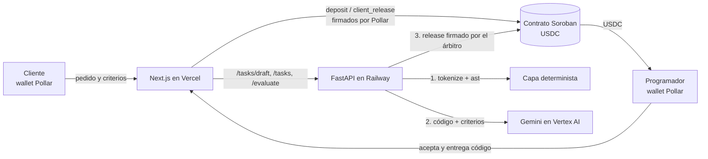

# Cumple&Cobra

**Si cumple lo acordado, cobras. Sin discusiones.**

**Demo en línea:** https://cumpleycobra.vercel.app (backend: https://cumpleycobra-production.up.railway.app)

**Jueces:** el recorrido de 5 minutos está en [`docs/probar-en-linea.ejemplo.md`](docs/probar-en-linea.ejemplo.md). Úsalo con la invitación privada que les comparte el equipo.

Cumple&Cobra es el acuerdo verificable para trabajo de código. El cliente describe su pedido, la IA lo convierte en criterios medibles y el programador los acepta antes de trabajar. El pago en USDC queda depositado en un contrato Soroban. El **Motor de Análisis Estático de Código basado en LLM** juzga la entrega contra esos criterios: si cumple, el contrato paga en segundos. MVP para GOYA HACK (reto Stellar BAF y pool de Pollar), en la testnet de Stellar.

## Qué hace

1. **Pedido asistido.** El cliente escribe lo que necesita con sus palabras. Gemini lo convierte en una descripción, criterios medibles y ejemplos, que el cliente edita. «Revisar criterios» marca los que no se pueden verificar («que sea rápido») y propone una versión medible.
2. **Acuerdo.** Al crear la tarea, la versión final queda fija en un `rules_hash`. El cliente invita a su programador con un enlace, o le envía una **propuesta directa** desde su perfil público, que llega a su **buzón**. El programador acepta esos criterios antes de trabajar.
3. **Depósito.** El cliente deposita USDC en el contrato firmando con [Pollar](https://pollar.xyz), y el `rules_hash` queda on-chain. Pollar **patrocina las comisiones** (fee-bump de la app) y la reserva de la trustline, así que una wallet nueva funciona con 0 XLM. Los montos se muestran primero en **pesos** (estimados) y el USDC debajo.
4. **Veredicto por criterio.** El programador entrega el script y, si quiere, un **video demo** en Google Drive. El motor revisa el código en cuatro capas: higiene, revisión determinista con `ast`, Gemini con salida estructurada y una regla final. La terminal muestra cada criterio con ✓ o ✗ y su razón.
5. **Pago.** Si cumple, el backend, que es el árbitro del contrato, firma `release` y el programador cobra en segundos. El código llega al cliente solo después del pago.
   - Si la IA rechaza, el programador puede dar su **consentimiento** para que el cliente vea la entrega, y el cliente puede aprobar manualmente (`client_release`).
   - Si vence el plazo, cualquiera dispara el reembolso y el dinero solo vuelve al cliente.
6. **Reputación verificable.** Cada programador tiene un perfil público con las tareas pagadas en el contrato, los clientes distintos y la calificación. «Verificar identidad» firma un reto **SEP-10** con la wallet de Pollar y permite publicar nombre, habilidades y bio.

## Arquitectura


```mermaid
flowchart LR
  CL[Cliente<br/>wallet Pollar] -->|pedido y criterios| FE[Next.js en Vercel]
  PR[Programador<br/>wallet Pollar] -->|acepta y entrega código| FE
  FE -->|deposit / client_release<br/>firmados por Pollar| SC[(Contrato Soroban<br/>USDC)]
  FE -->|/tasks/draft, /tasks, /evaluate| BE[FastAPI en Railway]
  BE -->|1. tokenize + ast| DET[Capa determinista]
  BE -->|2. código + criterios| GM[Gemini en Vertex AI]
  BE -->|3. release firmado por el árbitro| SC
  SC -->|USDC| PR
```

- El **contrato** es la fuente de verdad del dinero: guarda cliente, monto, plazo y `rules_hash`, y cambia de estado antes de transferir (`Funded` → `Released` o `Refunded`).
- El **backend** guarda tareas, tokens de acceso, veredictos, perfiles y propuestas en `state.json` (no hay base de datos) y firma `release` con la llave del árbitro. Nunca ejecuta el código entregado.
- El **frontend** arma las transacciones con `@stellar/stellar-sdk`. Pollar las firma en su servidor y las envuelve en un fee-bump pagado por la gas wallet de la app. El frontend nunca ve llaves privadas ni la API de Gemini.

## Contrato en testnet

| | |
| --- | --- |
| Contrato | [`CAWAZODOFP67HETHN4NLYOECPCJACGLUTCLARVGLBZ7TJDLT4KLQRATQ`](https://stellar.expert/explorer/testnet/contract/CAWAZODOFP67HETHN4NLYOECPCJACGLUTCLARVGLBZ7TJDLT4KLQRATQ) |
| USDC (SAC) | [`CBIELTK6YBZJU5UP2WWQEUCYKLPU6AUNZ2BQ4WWFEIE3USCIHMXQDAMA`](https://stellar.expert/explorer/testnet/contract/CBIELTK6YBZJU5UP2WWQEUCYKLPU6AUNZ2BQ4WWFEIE3USCIHMXQDAMA) (emisor `GBBD47IF6LWK7P7MDEVSCWR7DPUWV3NY3DTQEVFL4NAT4AQH3ZLLFLA5`) |
| Árbitro (backend) | [`GAGGEH7TNBV7Z7TX7OLTBJPEFBWTMLD477P3DTTFFBUAYOZXGGVOKZGY`](https://stellar.expert/explorer/testnet/account/GAGGEH7TNBV7Z7TX7OLTBJPEFBWTMLD477P3DTTFFBUAYOZXGGVOKZGY) |

Funciones: `deposit` (cliente), `release` (árbitro, solo antes del plazo), `client_release` (cliente, aprobación manual), `timeout_refund` (cualquiera, después del plazo; paga siempre al cliente) y `get_task`. Comandos, errores y tests en [`contracts/cumpleycobra/README.md`](contracts/cumpleycobra/README.md).

## Cómo verificar un pago

Cada `release` publica un evento con el `task_id`, el programador, el monto, el `code_hash` del código pagado y el `verdict_hash` del veredicto. Cualquiera puede recalcular esos dos hashes y compararlos con el evento, sin depender del backend:

```bash
backend/.venv/Scripts/python scripts/verificar_pago.py TX_HASH --veredicto veredicto.json --codigo entrega.py
```

- `TX_HASH`: la transacción del pago (aparece en la terminal del programador y en la vista del cliente).
- `veredicto.json` puede ser cualquiera de estos:
  - la respuesta de `POST /evaluate` (la tiene el programador; incluye `task_id` y `video_url`);
  - la respuesta completa de `GET /tasks/{id}/verdicts` (la tiene el cliente); el script toma el veredicto cuyo `code_hash` es el del evento;
  - un solo elemento de `/verdicts`, con `--tarea TASK_ID` porque el elemento no trae el `task_id`.

  Una respuesta de caché (`stage: "cache"`) también sirve: un veredicto pagado siempre viene de Gemini, y el script usa `stage: "llm"`.
- `entrega.py`: el código tal como se entregó (`GET /tasks/{id}/delivery`).

Desde la vista del cliente, con su `client_token` (`API` es `https://cumpleycobra-production.up.railway.app` o `http://localhost:8000`):

```bash
curl -s -H "X-Client-Token: $CLIENT_TOKEN" $API/tasks/$TASK_ID/verdicts > veredicto.json
curl -s -H "X-Client-Token: $CLIENT_TOKEN" $API/tasks/$TASK_ID/delivery | jq -j .code > entrega.py
```

Usa `jq -j .code`, no `jq -r`: `-r` agrega un salto de línea al final, y un solo byte de más cambia el `code_hash`.

El script lee el evento del RPC de testnet y compara el `task_id`, el SHA-256 del código contra `code_hash` y el `verdict_hash` recalculado contra el del evento. Salida real (27 de septiembre de 2026) con el pago [`cd0a505a…8f9f`](https://stellar.expert/explorer/testnet/tx/cd0a505a30222a70c89ff2993fa3de58626662fc78dcb1ac078a6134a11a8f9f):

```text
Evento release: tarea 93RrIWSmYWPGISxS, 11328172 unidades a GA7MXQO3OL6IMISROP3JJM3NBGOEDHPPK7B5Q2ASNIBNVAPVCE6FBEVJ
  code_hash    on-chain  c9b846f4cafc89920593d805ffa0fd7a087b9b29d928e00d835bdc782334e534
  verdict_hash on-chain  b2670c81b1e40c10d7c27ec4fb990122ace29017f085e74c686b366feb27df1e
  code_hash    recalculado c9b846f4cafc89920593d805ffa0fd7a087b9b29d928e00d835bdc782334e534
  verdict_hash recalculado b2670c81b1e40c10d7c27ec4fb990122ace29017f085e74c686b366feb27df1e
✓ task_id
✓ code_hash del código entregado
✓ code_hash del veredicto
✓ verdict_hash
```

Definición de los hashes (SHA-256 sobre JSON canónico: claves ordenadas, separadores `,` y `:` sin espacios, UTF-8 sin escapar, cadenas en NFC y sin `float`; los montos son enteros, 1 USDC = 10 000 000 unidades). La implementación está en [`backend/hashing.py`](backend/hashing.py).

| Hash | Se calcula sobre | Dónde queda |
| --- | --- | --- |
| `rules_hash` | `{"version": 1, "description", "criteria", "language", "allowed_deps" (ordenada), "examples"}` de la versión final editada; el pedido original no entra | depósito on-chain |
| `code_hash` | los bytes UTF-8 del código tal como se entregó | evento `release` |
| `verdict_hash` | `{"version": 1, "task_id", "code_hash", "approved", "reason", "stage", "comparison", "security_flags", "video_url"}` | evento `release` |

En un veredicto pagado, `security_flags` es `[]` (una bandera de seguridad impide el pago) y `video_url` es la URL canónica de Drive (`…/preview`) o `null`.

## Motor medido

Medición del 25 de septiembre de 2026 con `gemini-3.5-flash` en Vertex AI y el prompt vigente, con el acuerdo como dato delimitado ([detalle](docs/fases/fase-5.md#4-motor-medido-resumen-para-el-pitch)):

| Casos | Aciertos | Falsas aprobaciones | Falsos rechazos | Latencia mediana | Latencia máxima |
| --- | --- | --- | --- | --- | --- |
| 60: A–D diez veces cada uno y 20 entregas distintas | 60/60 | 0 | 0 | 4.41 s | 23.02 s |

- Las expectativas de cada caso se fijaron antes de medir.
- La latencia es la del análisis con Gemini e incluye sus reintentos. Las dos máximas (23.0 y 21.4 s) son un intento que Vertex cortó con `ServerError`, más el reintento.
- Los rechazos deterministas tardan menos de 1 ms y no llaman a Gemini.
- Los casos de seguridad (inyección en el docstring y los que atrapa la capa determinista) se rechazaron con `security_flags` en todas sus corridas.

Tests actuales: **294** del backend (`pytest`), **19** del frontend (`npm test`) y **18** del contrato (`cargo test`), todos en verde.

## Despliegue

Guía completa, variables por servicio y verificación en [`docs/despliegue.md`](docs/despliegue.md).

- **Backend en Railway:** imagen de [`backend/Dockerfile`](backend/Dockerfile) configurada en [`railway.json`](railway.json).
  - **Un solo proceso** (`uvicorn --workers 1`, una réplica, sin solapamiento entre despliegues), porque los candados por tarea, la secuencia del árbitro, los retos SEP-10 y los límites viven en memoria.
  - `state.json` vive en un **volumen persistente en `/data`**: el despliegue no arranca sin él.
  - Health check en `/health`.
- **Frontend en Vercel:** Root Directory `frontend`. Las variables `NEXT_PUBLIC_*` se incrustan al construir; cambiar una exige volver a desplegar. `NEXT_PUBLIC_API_URL` es obligatoria en producción.
- **Gemini:** Vertex AI con una cuenta de servicio (solo rol Vertex AI User) cargada en memoria desde `GOOGLE_CREDENTIALS_B64`. La alternativa es una API key de AI Studio (`GEMINI_API_KEY` con `GOOGLE_GENAI_USE_VERTEXAI=false`).
- **Límites de peticiones** (429 `RATE_LIMITED`, con CORS y `Retry-After`):
  - por IP y minuto en draft, review y evaluate (`RATE_LIMIT_PER_MINUTE`), contando también las peticiones inválidas;
  - cuotas diarias separadas para borrador y revisión (`RATE_LIMIT_DAILY_BORRADOR`) y para el motor (`RATE_LIMIT_DAILY_MOTOR`); solo las consumen las llamadas reales a Gemini;
  - una ventana por IP para escrituras (`RATE_LIMIT_WRITES_PER_MINUTE`, 30 por defecto).

  La IP del cliente sale de `X-Real-IP`, que el proxy de Railway sobrescribe. Los rechazos por límite no gastan envíos del programador.

## Instalación local

Desde un clon limpio. Requisitos: Python 3.14, Node.js con npm, la Stellar CLI para los scripts de testnet y, si usas Vertex AI con tus credenciales, la CLI de Google Cloud (`gcloud`). Las rutas `backend/.venv/Scripts/` son de Windows; en Linux y macOS usa `backend/.venv/bin/`.

1. **Variables del backend.** Copia [`backend/.env.example`](backend/.env.example) a `backend/.env` y llénalo:

   | Variable | Qué es |
   | --- | --- |
   | `GOOGLE_GENAI_USE_VERTEXAI`, `GOOGLE_CLOUD_PROJECT`, `GOOGLE_CLOUD_LOCATION` | Gemini por Vertex AI. En local basta `gcloud auth application-default login`. |
   | `GOOGLE_CREDENTIALS_B64` | Opcional: cuenta de servicio en base64 (producción). Déjala comentada para usar las credenciales locales; presente pero vacía impide arrancar. |
   | `GEMINI_API_KEY` | Alternativa a Vertex: API key de AI Studio, con `GOOGLE_GENAI_USE_VERTEXAI=false`. |
   | `GEMINI_MODEL` | `gemini-3.5-flash` |
   | `ARBITER_SECRET_KEY` | La llave del árbitro con que se inicializó el contrato (`stellar keys secret cyc-arbiter`). Con otra llave hay que desplegar un contrato propio ([`contracts/cumpleycobra/README.md`](contracts/cumpleycobra/README.md)). |
   | `CONTRACT_ID`, `USDC_SAC_ID`, `STELLAR_RPC_URL`, `NETWORK_PASSPHRASE` | Ya vienen llenas para testnet. |
   | `FRONTEND_ORIGIN` | Origen permitido por CORS; admite varios separados por comas. Por defecto `http://localhost:3000`. |
   | `STATE_FILE` | Por defecto `backend/state.json` (en Railway, `/data/state.json`). |
   | `SEP10_SIGNING_SECRET` | Llave Stellar **nueva y sin fondos** que firma los retos SEP-10; **nunca** la del árbitro (si coinciden: `503 AUTH_NOT_CONFIGURED`). |
   | `SESSION_SECRET` | Secreto aleatorio de **al menos 32 caracteres** para firmar las sesiones; más corto, la identidad queda sin configurar. |
   | `RATE_LIMIT_PER_MINUTE`, `RATE_LIMIT_DAILY`, `RATE_LIMIT_DAILY_BORRADOR`, `RATE_LIMIT_DAILY_MOTOR` | Vacías o en 0: sin límite (lo normal en local). |
   | `RATE_LIMIT_WRITES_PER_MINUTE` | Escrituras por IP y minuto; por defecto 30. |
   | `ENABLE_API_DOCS` | Solo `true` publica `/docs`, `/redoc` y `/openapi.json`. |

   Opcionales de identidad: `SEP10_HOME_DOMAIN` (si falta, el host del primer `FRONTEND_ORIGIN`), `SEP10_WEB_AUTH_DOMAIN` (si falta, `RAILWAY_PUBLIC_DOMAIN` o `localhost:8000`) y `HORIZON_URL` (testnet). Sin `SEP10_SIGNING_SECRET` y `SESSION_SECRET`, el flujo del dinero funciona igual, pero identidad, perfil, calificación y propuestas responden `503 AUTH_NOT_CONFIGURED`.

   Para generarlas: `stellar keys generate cyc-sep10` y `stellar keys secret cyc-sep10`, y `python -c "import secrets; print(secrets.token_urlsafe(32))"`.

2. **Variables del frontend.** Copia la sección `NEXT_PUBLIC_*` de [`.env.example`](.env.example) a `frontend/.env.local` y pon ahí la clave publicable de Pollar (`NEXT_PUBLIC_POLLAR_API_KEY`). Las demás son `NEXT_PUBLIC_API_URL`, `NEXT_PUBLIC_CONTRACT_ID`, `NEXT_PUBLIC_WALLET` (`pollar`), `NEXT_PUBLIC_STELLAR_RPC_URL` y `NEXT_PUBLIC_USDC_ASSET`. Ni `backend/.env` ni `frontend/.env.local` se suben al repositorio.
3. **Backend:**

   ```bash
   python -m venv backend/.venv
   backend/.venv/Scripts/python -m pip install -r backend/requirements.txt
   ```

4. **Frontend.** `next typegen` genera los tipos de las rutas que necesita el chequeo de tipos; `next build` los genera solo.

   ```bash
   cd frontend
   npm ci
   npx next typegen
   npx tsc --noEmit
   ```

5. **Pollar.** Configura la app en el dashboard (https://dashboard.pollar.xyz):

| Sección | Qué configurar |
| --- | --- |
| Build → API Keys | Clave publicable de testnet (`pub_testnet_…`) en `frontend/.env.local` como `NEXT_PUBLIC_POLLAR_API_KEY` |
| Build → Domains | `http://localhost:3000` y, en producción, el dominio de Vercel (sin él, la API responde `403 ORIGIN_NOT_ALLOWED`) |
| Autenticación | Correo (OTP). Google necesita además URIs de redirección (sin ellas: `APPLICATION_HAS_NO_REDIRECT_URIS`) |
| Treasury → Tokens & Trustlines | `USDC:GBBD47IF6LWK7P7MDEVSCWR7DPUWV3NY3DTQEVFL4NAT4AQH3ZLLFLA5` |
| Treasury → Auth Policy | El contrato `CAWAZODOFP67HETHN4NLYOECPCJACGLUTCLARVGLBZ7TJDLT4KLQRATQ` |
| Treasury → Sponsorship | Activo para contratos y transferencias (sin él, la red responde `txInsufficientBalance`). La gas wallet necesita XLM. |

## Cómo correrlo

```bash
# Contrato
cargo test -p cumpleycobra
stellar contract build

# Backend
backend/.venv/Scripts/python -m pytest backend/tests
backend/.venv/Scripts/python -m uvicorn backend.main:app --port 8000

# Frontend
cd frontend && npm test && npm run build && npx next start -p 3000
```

El backend lee `backend/.env` al importarse: sin esas variables, `backend.main` no arranca.

La demo paso a paso, con sus respaldos, está en [`docs/demo.md`](docs/demo.md). Para fondear una wallet de la demo con USDC de testnet: `bash scripts/fondear.sh DIRECCION_G MONTO_USDC`.

**Respaldos de la wallet:**

- **Pollar no firma el depósito:** `backend/.venv/Scripts/python scripts/tarea_respaldo.py` crea la tarea con la identidad `cyc-client` de la Stellar CLI y la deposita desde la terminal. Un depósito por CLI de una tarea creada con la wallet de Pollar no sirve: `/evaluate` exige que el cliente on-chain sea el que creó la tarea (`TASK_MISMATCH`).
- **Freighter:** `NEXT_PUBLIC_WALLET=freighter` está implementado pero **sin probar**; no es un respaldo validado.

## Identidad, reputación y propuestas

Rutas aditivas: el flujo del dinero (invitación, `/accept`, depósito, `/evaluate`, pago) no las exige.

- **Identidad:** «Verificar identidad» pide un reto SEP-10, Pollar lo firma con `getClient().stellar.sep10.sign` y el backend devuelve una sesión HMAC de 12 h que viaja en `Authorization: Bearer`. Detalle en [`docs/identidad.md`](docs/identidad.md).
- **Reputación:** `/programadores` y `/programador/{dirección}` muestran solo tareas `Released` confirmadas en el contrato, separando las pagadas por el motor de las aprobadas a mano. El cliente califica una vez, con su token y su sesión. Detalle en [`docs/reputacion.md`](docs/reputacion.md).
- **Propuestas directas y buzón:** desde el perfil público de un programador, el cliente le propone su tarea; el programador la acepta o rechaza desde `/buzon`. Aceptar amarra la tarea igual que la invitación. Detalle en [`docs/propuestas.md`](docs/propuestas.md).

Errores con el mismo formato `{"error": "CODIGO", "message": "..."}`.

<details>
<summary>Rutas, autorización y errores</summary>

| Ruta | Autorización | Entrada y salida | Errores |
| --- | --- | --- | --- |
| `GET /auth/challenge?address=G…` | Ninguna | Reto SEP-10 firmado con `SEP10_SIGNING_SECRET`, de un solo uso y válido 5 min: `transaction`, `network_passphrase`, `home_domain`, `web_auth_domain`, `expires_in` | `400 INVALID_REQUEST` (dirección), `503 AUTH_NOT_CONFIGURED` |
| `POST /auth/token` | El reto firmado por la wallet | `{transaction}` (el XDR firmado). Verifica la firma del servidor, el plazo y los firmantes de la cuenta en Horizon; devuelve `{token, address, expires_at}`, una sesión HMAC de 12 h | `401 CHALLENGE_INVALID`, `401 CHALLENGE_USED`, `401 CHALLENGE_EXPIRED`, `401 SIGNATURE_INVALID`, `502 CHAIN_UNAVAILABLE` (Horizon; el reto se puede reintentar), `503 AUTH_NOT_CONFIGURED` |
| `PUT /perfil` | Sesión (`Authorization: Bearer`) | `{address?, nombre? (máx. 60), habilidades[] (máx. 8, 30 c/u), bio? (máx. 280)}`; solo el perfil de la dirección de la sesión | `401 SESSION_REQUIRED`, `403 NOT_PROFILE_OWNER`, `400 INVALID_REQUEST` |
| `GET /programadores` | Ninguna | Lista de programadores con tareas `Released` confirmadas en el contrato: pagadas por el motor y manualmente, clientes distintos y calificación | `502 CHAIN_UNAVAILABLE` |
| `GET /programadores/{address}` | Ninguna | Perfil público: métricas, historial (sin código, tokens ni dirección del cliente) y nombre, habilidades y bio si los publicó | `400 INVALID_REQUEST`, `502 CHAIN_UNAVAILABLE` |
| `POST /tasks/{task_id}/calificacion` | `X-Client-Token` y sesión del cliente on-chain | `{estrellas (1 a 5), comentario? (máx. 280)}`, una vez, con la tarea `Released` | `403 INVALID_TOKEN`, `401 SESSION_REQUIRED`, `403 NOT_TASK_CLIENT`, `409 TASK_NOT_RELEASED`, `409 ALREADY_RATED`, `404 TASK_NOT_FOUND`, `502 CHAIN_UNAVAILABLE` |
| `POST /propuestas` | `X-Client-Token` y sesión cuya dirección es el `client_address` de la tarea | `{task_id, programador}` para una tarea que nadie ha aceptado; devuelve la propuesta (`id`, `task_id`, `programador`, `estado: "pendiente"`, `created_at`) | `401 SESSION_REQUIRED`, `403 NOT_TASK_CLIENT`, `400 INVALID_REQUEST` (dirección inválida o propuesta a ti mismo), `404 TASK_NOT_FOUND`, `409 TASK_TAKEN`, `409 PROPOSAL_EXISTS` (misma tarea y programador, incluso rechazada) |
| `GET /tasks/{task_id}/propuestas` | `X-Client-Token` y sesión del cliente | Las propuestas de esa tarea con su estado (`pendiente`, `aceptada` o `rechazada`) | `401 SESSION_REQUIRED`, `403 NOT_TASK_CLIENT`, `404 TASK_NOT_FOUND` |
| `GET /buzon` | Sesión | Solo las propuestas dirigidas a la dirección de la sesión, con el resumen de la tarea: descripción, criterios, monto, programador amarrado y estado on-chain (o `onchain_error`). El contrato se lee en paralelo (máx. 8) con caché de estados terminales | `401 SESSION_REQUIRED` |
| `POST /propuestas/{id}/aceptar` | Sesión del destinatario | Amarra la tarea con la misma función que `/accept` (exige trustline) y devuelve la propuesta `aceptada` con `freelancer_token`. Si la tarea ya está amarrada al destinatario (por esta propuesta o por la invitación), devuelve el mismo token | `401 SESSION_REQUIRED`, `403 NOT_PROPOSAL_RECIPIENT`, `404 PROPOSAL_NOT_FOUND`, `409 PROPOSAL_REJECTED`, `409 TASK_TAKEN` (la tomó otro), `409 NO_USDC_TRUSTLINE`, `502 CHAIN_UNAVAILABLE` |
| `POST /propuestas/{id}/rechazar` | Sesión del destinatario | Marca la propuesta `rechazada`; ya no se puede aceptar | `401 SESSION_REQUIRED`, `403 NOT_PROPOSAL_RECIPIENT`, `404 PROPOSAL_NOT_FOUND`, `409 TASK_TAKEN` |

Una propuesta pendiente cuya tarea tomó otro programador se muestra como «Cerrada: la tomó otro programador» en la vista del cliente y en el buzón; es un estado calculado en el frontend, no se guarda.

</details>

## Límites honestos

- **No ejecuta el código.** El motor lo lee: la capa determinista revisa sintaxis, imports y llamadas prohibidas con `ast`, y Gemini traza la lógica contra cada criterio. Así el servidor nunca corre código ajeno, pero tampoco puede comprobar resultados en tiempo de ejecución.
- **Bucles:** se detectan los patrones evidentes de bucles sin salida (como un `while` que no incrementa su índice), no todos. Decidir si cualquier programa termina no es posible en general.
- **La medición del motor** cubre un solo requisito y un corpus de 20 casos escrito por el equipo: describe esa muestra, no una garantía general.
- **La reputación puede inflarse entre wallets de una misma persona:** crear wallets no cuesta, y un cliente y un programador de la misma persona pueden pagarse tareas entre sí. «Clientes distintos» lo hace visible, pero no lo impide.
- **«Identidad verificada» significa que controla la wallet**, no quién es la persona.
- **El token de invitación no prueba la propiedad de la wallet.** Prueba que el programador recibió el enlace; la tarea se amarra a la dirección con la que acepta.
- **La sesión y los tokens de cada tarea viven en `localStorage`:** un script en la misma página podría leerlos. En producción convendría una cookie `HttpOnly`.
- **El estado vive en memoria y en `state.json`,** en un solo proceso. Los retos SEP-10 pendientes y los contadores de límites se pierden al reiniciar.
- **El video demo es evidencia de apoyo:** el backend valida el formato del enlace de Drive, no sus permisos ni su duración, y nunca condiciona un pago aprobado.
- **Los pesos son un estimado** con el tipo de cambio de referencia de Frankfurter (17.50 fijo si no responde); el depósito es en USDC.
- **Todo corre en la testnet de Stellar:** no se mueve dinero real.
- **Freighter** está implementado como respaldo, pero sin probar.

## Siguiente paso

- **Proyectos por hitos,** con un depósito y un veredicto por hito, juzgados con **pruebas ejecutables en un sandbox** además del análisis estático.
- **Retiro a pesos** con la rampa SEP-24 de Pollar, para que el programador cobre en su cuenta y no solo en USDC.

## Estructura

```
contracts/cumpleycobra/   # contrato Soroban (Rust) y sus tests
backend/                  # FastAPI: pedido asistido, motor, tokens, identidad, reputación, propuestas, release
frontend/                 # Next.js + Tailwind + shadcn/ui, wallet Pollar
scripts/                  # demo, respaldos, fondeo, mediciones del motor, tareas para jueces y verificación de pagos
docs/fases/               # un reporte por fase, con comandos, salidas y hashes reales
docs/                     # demo, despliegue, identidad, reputación, propuestas y recorrido para jueces
railway.json              # despliegue del backend: un solo proceso con volumen en /data
```

## Créditos

Desarrollado por Rodrigo Martínez Reyes. Construido con asistencia de IA: Claude Code (Anthropic) y Codex (OpenAI) como agentes de programación, y Claude para planeación y revisión de cada fase.
