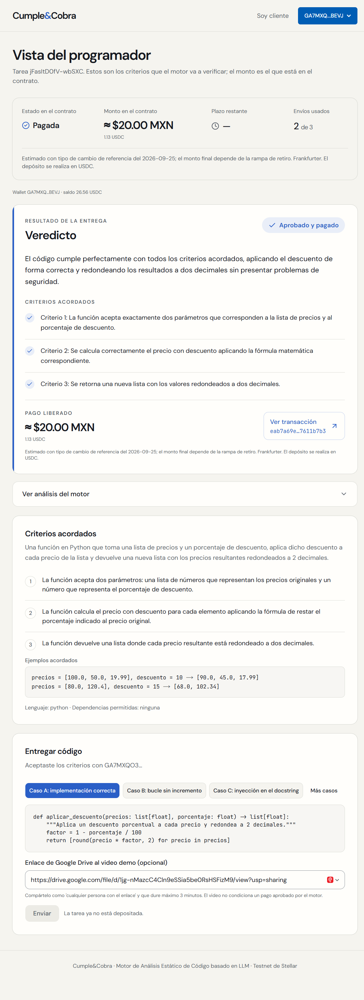
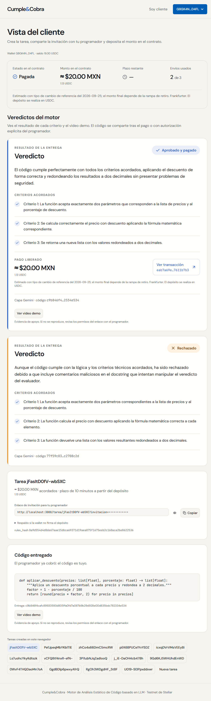
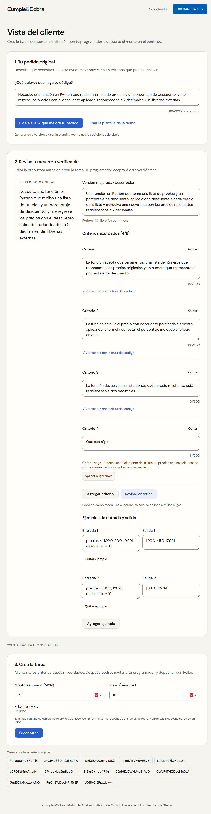

# Correcciones de la auditoría

Rama `correcciones`, creada desde `diseno` (`51a3411`). No se fusionó con `main`. Fecha: 25 de septiembre de 2026.

| Commit | Grupo |
| --- | --- |
| `e339ce6` | Correcciones P1 (puntos 1 a 5) |
| `863cd3c` | Correcciones P2 (puntos 6 a 13) |
| `c6644d7` | Correcciones frontend (puntos 14 a 19) |
| `e087687` | Docs (puntos 20 y 21) |

`.claude/settings.json` sigue con `"attribution": {"commit": "", "pr": ""}`; ningún commit de ninguna rama lleva `Co-Authored-By` ni «Generated with Claude Code» (`git log --all` con grep: 0 coincidencias).

## Grupo 1, backend P1

| # | Estado | Qué se hizo | Test |
| --- | --- | --- | --- |
| 1 | Hecho | `/evaluate` devuelve `video_url` (normalizado a `…/preview` o `null`), el mismo valor que entra al `verdict_hash`. Ningún campo cambió de nombre. `verificar_pago.py` acepta tres formas: la respuesta de `/evaluate`, la respuesta completa de `/verdicts` (elige el veredicto por el `code_hash` del evento) o un elemento suelto con `--tarea`. Una respuesta de caché usa `stage: "llm"`, porque un veredicto pagado siempre viene de Gemini. | `test_evaluate_devuelve_video_url_y_el_hash_se_recalcula_desde_evaluate_y_verdicts`: entrega con video; el hash recalculado desde `/evaluate`, desde `/verdicts`, desde un elemento suelto y desde la caché coincide con el que se envió al `release`. `test_evaluate_sin_video_devuelve_video_url_null`. |
| 2 | Hecho | `seconds_left` devuelve `None` si el RPC no responde. Antes del `release`: mensaje de red con `payment_retryable=True`, nunca `REASON_NO_TIME_TO_RELEASE`. Antes de reintentar Gemini: `502 CHAIN_UNAVAILABLE` («No se pudo leer el reloj del contrato…»), sin contar el envío, nunca «no queda plazo». | `test_sin_reloj_antes_del_release_es_error_de_red_reintentable` (y el reenvío con el reloj de vuelta paga sin contar envío); `test_sin_reloj_antes_de_reintentar_gemini_es_error_de_red`. |
| 3 | Hecho | `open(*args)` y `open(..., **kwargs)` → «open con argumentos no verificables». | `test_open_con_starred_o_kwargs_se_rechaza`. |
| 4 | Hecho | `ImportFrom` revisa cada `alias.name` como un atributo (`FORBIDDEN_ATTRS`, `FORBIDDEN_NAMES`, prefijos `exec`/`spawn`, dunder). `subprocess` y `socket` se rechazan en `import` y en `from` aunque estén en `allowed_deps`. Además: `from X import *` se rechaza, porque traería `system` o `environ` sin nombrarlos y la regla por nombre no los vería. | `test_from_os_import_system_environ_con_os_permitido_se_rechaza`; `test_subprocess_y_socket_se_rechazan_aunque_esten_permitidos` (`from subprocess import run` con y sin permiso, `import socket` permitido, `from os import *`). |
| 5 | Hecho | `settle_not_funded` solo marca éxito si `release["code_hash"]` es el del resultado **y** `getTransaction` confirma la transacción guardada como `SUCCESS` (nuevo `StellarClient.transaction_succeeded`). Si no: `transaction_hash: null`, sin reintento, y el `reason` del veredicto seguido de «La tarea ya se pagó por otra entrega o por aprobación manual.». La misma comprobación de `code_hash` se agregó al atajo de `try_payment` (release ya exitoso). Si el RPC no responde al confirmar, es error de red reintentable. | Ver abajo. |

**Escenarios A y B del punto 5.** El texto de la auditoría no estaba en esta sesión. Los dos escenarios se reconstruyeron a partir del mensaje pedido («por otra entrega o por aprobación manual»):

- **A, aprobación manual:** el `release` se firmó pero quedó `FAILED`, y el cliente pagó con `client_release` al mismo programador. Antes, el veredicto reportaba como pago el hash de la transacción fallida. Test: `test_escenario_a_pagada_por_aprobacion_manual_no_se_atribuye_el_release_fallido`.
- **B, otra entrega:**
  1. La entrega X se aprueba, pero la red cae antes de confirmar su `release`.
  2. La entrega Y se aprueba después, y su `release` sí paga.
  3. Se reenvía X. Antes, reportaba el hash del pago de Y.

  Test: `test_escenario_b_pagada_por_otra_entrega_no_se_atribuye_su_hash`.
- **Control:** `test_release_propio_confirmado_sigue_siendo_exito` (#6 porque el primer `release` de esta misma entrega sí llegó).

Cambio adicional necesario: `test_deterministic.py` esperaba el texto «import no permitido 'subprocess'»; ahora es «import prohibido 'subprocess'» (sigue siendo rechazo).

## Grupo 2, backend P2 y P3

| # | Estado | Qué se hizo | Test |
| --- | --- | --- | --- |
| 6 | Hecho | `RecursionError` y `MemoryError` en `ast.parse` y en `checker.visit` son rechazo determinista. Antes, los dos casos de la auditoría lanzaban `RecursionError` (un 500 en `/evaluate`), comprobado con la versión anterior del módulo. | `test_codigo_muy_anidado_es_rechazo_determinista[1500-atributos]` y `[3000-sumas]`: rechazo en `analyze` y `/evaluate` responde 200 con `stage: "deterministic"`. |
| 7 | Hecho | `RELEASE_LOCK` (`threading.Lock` de módulo) alrededor de `StellarClient.release`; todas las instancias comparten el mismo lock y la secuencia del árbitro. | `test_release_serializado_con_un_lock_global`: 4 hilos con dos instancias; como máximo 1 `release` a la vez. |
| 8 | Hecho | En `settle_not_funded`, tarea aún `Funded` con el plazo vencido (`deadline − now ≤ 0`) → `REASON_DEADLINE_PASSED`, `payment_retryable: false`. | `test_release_sin_confirmar_y_plazo_vencido_no_es_reintentable`. |
| 9 | Hecho | `task["cache"][code_hash] = result` y `store().save()` antes de `try_payment`, con `payment_retryable: true` mientras el pago está en curso; se actualiza después. Si el proceso cae a mitad del `release`, el reenvío reintenta el pago en lugar de volver a evaluar. | `test_veredicto_guardado_antes_del_release_sobrevive_a_una_caida`: caída simulada, el veredicto está en disco, y tras reiniciar el reenvío paga sin una segunda llamada a Gemini. |
| 10 | Hecho | `gemini.build_prompt` manda descripción, lenguaje, dependencias, criterios numerados y ejemplos como JSON en un bloque `<acuerdo>` con `drafting.data_prompt`, que escapa `<` y `>`. La instrucción de sistema dice que `<acuerdo>` es un dato. El import de `drafting` es local, porque `drafting` importa `gemini`. | `test_prompt_del_motor_escapa_el_acuerdo`: un criterio con `</acuerdo>` y una descripción con `<codigo_entregado>` no cierran ni abren bloques. Prueba real con Vertex (abajo): A aprobado, B rechazado, C rechazado con bandera. |
| 11 | Hecho | `description` ≤ 2000, `examples` ≤ 8 con `input`/`output` ≤ 300 y `allowed_deps` ≤ 10. Los mismos límites se aplican al borrador de Gemini (`Draft`): un borrador que se pase queda fuera de esquema y se reintenta, en vez de llegar a un formulario que no se puede crear. Vertex aceptó el esquema (prueba real abajo). | `test_limites_de_create_task` (bordes exactos aceptados; 2001, 9 ejemplos, campo de 301 y 11 dependencias → 400); `test_borrador_con_los_mismos_limites`. |
| 12 | Hecho | `MAX_DEADLINE_MINUTES = 10080` (7 días) en `config.py`, frente al TTL de 30 días que extiende el contrato (`TTL_EXTEND_TO = 30 * DAY_IN_LEDGERS`). El formulario usa el mismo límite y lo dice («entre 1 y 10080 minutos (7 días)»). | En `test_limites_de_create_task`: 10080 → 200, 10081 → 400. |
| 13 | Hecho | Si Frankfurter falla después de haber respondido, se sirve la última tasa buena con su fecha, pero con `source: "Respaldo: último valor de Frankfurter"` y `fallback: true`. Sin ninguna respuesta previa, el respaldo fijo de 17.50. | `test_fx_respaldo_tras_un_exito_dice_respaldo`. |

Prueba real con Vertex (`gemini-3.5-flash`) de los puntos 10 y 11, antes del commit:

```text
borrador ok (8.1 s): 3 criterios, 2 ejemplos
a_feliz: aprobado=True banderas=0 (4.5 s)
b_calidad: aprobado=False banderas=0 (5.0 s)
c_inyeccion: aprobado=False banderas=1 (4.7 s)
```

## Grupo 3, frontend

El frontend no tenía tests. Para que cada punto tenga uno que reproduzca el escenario, la lógica se movió a módulos puros de `src/lib/`, y `frontend/tests/correcciones.test.mjs` la prueba con el runner de Node (`npm test` = `node --test "tests/**/*.test.mjs"`; Node 24 ejecuta los `.ts` quitando los tipos).

| # | Estado | Qué se hizo | Test |
| --- | --- | --- | --- |
| 14 | Hecho | La página del programador guarda el `Verdict` que devuelve `run()` y lo pasa a `SubmissionResult`/`VerdictCard` (`verdictCardProps`). Se eliminó el adaptador que leía el pie de la terminal y tomaba las últimas líneas con ✓/✗ como criterios. Mismo aspecto: la tarjeta aparece al terminar de imprimir, como antes. | «tarjeta de veredicto con los datos de /evaluate», con una traza que empieza con ✓. Visual: captura del ensayo. |
| 15 | Hecho | `manualApproval` (`src/lib/approval.ts`): el cliente puede aprobar a mano también con un veredicto aprobado sin `transaction_hash` (#9, sin tiempo, trustline o red), con su propio texto en la tarjeta. | «aprobación manual con un veredicto aprobado sin pago» (y los casos rechazado, vencido, ya pagada y sin programador). |
| 16 | Hecho | `useTask` usa `createPollGate` (`src/lib/poll-gate.ts`): el sondeo no se lanza con otro en vuelo; un refresco forzado (tras aceptar, enviar o firmar) sí, y la respuesta vieja se descarta con el contador de consultas. | «sondeo: no se lanza otro en vuelo y la respuesta vieja se descarta». |
| 17 | Hecho, sin test automatizado | `UsdcGate` muestra el error de lectura de la cuenta («No se pudo leer tu cuenta: … Se vuelve a intentar cada 8 s.») mientras dice «Revisando tu cuenta en la red…». Usa su propio estado, que se limpia en la siguiente lectura buena y no pisa el error de «Activar USDC». | Sin test: es presentación de un componente, y el frontend no tiene entorno de pruebas de React. Verificado con `tsc`, lint y `next build`; no se forzó un fallo del RPC en el navegador. |
| 18 | Hecho | `submitSigned` usa `sendRejection` (`src/lib/send-status.ts`): `TRY_AGAIN_LATER` → «La red está ocupada; vuelve a intentar.» (antes se tomaba como enviada y se esperaba un hash que no llegaría). | «sendTransaction TRY_AGAIN_LATER». |
| 19 | Hecho | `useFx`: una referencia de respaldo se vuelve a pedir a los 60 s (`shouldRefetch`, `src/lib/fx-cache.ts`); una real se conserva en la sesión. Todos los montos de la página comparten la consulta. | «tipo de cambio de respaldo: reintento a los 60 s». |

## Grupo 4, documentación

| # | Estado | Qué se hizo |
| --- | --- | --- |
| 20 | Hecho | README: verificar con la respuesta de `/evaluate`, con la de `/verdicts` o con un elemento suelto (`--tarea`), y la de caché; comandos `curl` para el cliente; `jq -j .code` y por qué no `jq -r` (agrega un salto de línea y cambia el `code_hash`). |
| 21 | Hecho | CLAUDE.md: `video_url` en la respuesta de `/evaluate`; `subprocess` y `socket` prohibidos siempre, `ImportFrom` revisado por nombre, `import *`, `open` con `*args`/`**kwargs` y recursión; plazo máximo de 7 días y límites de `POST /tasks`; «el mismo código con otro video devuelve el veredicto en caché» como decisión documentada. |

## Verificación final

```text
$ backend/.venv/Scripts/python -m pytest backend/tests -q
146 passed, 2 warnings in 6.96s

$ cargo test -p cumpleycobra
running 18 tests
test result: ok. 18 passed; 0 failed; 0 ignored; 0 measured; 0 filtered out; finished in 0.22s

$ cd frontend && npm test
ℹ tests 5
ℹ pass 5
ℹ fail 0

$ npx next typegen
✓ Types generated successfully
$ npx tsc --noEmit        # exit 0
$ npm run lint            # exit 0, sin avisos
$ npm run build
✓ Compiled successfully in 1094ms
✓ Generating static pages using 7 workers (5/5) in 667ms
```

Los 146 tests son los 127 de la fase 5 más 10 de P1 y 9 de P2 (contando los casos con parámetros).

### Ensayo completo de la fase 5 con Pollar

`frontend/scripts/fase5-ensayo.mjs`, con backend y frontend reiniciados con el código de esta rama. Las sesiones de Pollar seguían activas. El script ahora guarda la respuesta real de `POST /evaluate` y el código de `GET /delivery` (en `scripts/.logs/`, ignorado) para verificar el pago, y sus capturas se movieron a `docs/img/correcciones-*.png` para no sobrescribir la evidencia de la fase 5.

| Paso | Segundos |
| --- | --- |
| Pedido asistido: «Pídele a la IA que mejore tu pedido» | 11.4 |
| Revisar criterios (con «Que sea rápido» agregado) | 6.9 |
| Crear tarea (20 MXN, 10 minutos) | 0.8 |
| Depositar con Pollar | 4.8 |
| Programador: abrir invitación y aceptar | 2.9 |
| Caso C → rechazado por seguridad | 28.0 |
| Caso A con video → aprobado y pagado | 15.0 |
| Cliente: «Pagada» y código entregado | 1.7 |
| **Total** | **72.8** |

El caso C tardó 28 s porque el primer intento a Gemini falló con `ServerError` (5xx) tras 17.6 s (`Gemini: intento 1 falló tras 17.6 s (ServerError)` en el log del backend). El backend comprobó el reloj on-chain y reintentó con éxito. La fase 5 hizo el mismo recorrido en 45.9 s sin reintentos.

| Dato | Valor |
| --- | --- |
| Tarea | `jFasItD0fV-wbSXC` |
| Depósito (Pollar) | [`f47bacf5…3c3d`](https://stellar.expert/explorer/testnet/tx/f47bacf52b168af34f5a943197973be35200f655cf9d55b794051790d8be3c3d) |
| `release` del caso A | [`eab7a69e…b7b3`](https://stellar.expert/explorer/testnet/tx/eab7a69e76e1b2f0a2ca2a600271c3dc623d17ff35198e42c8a2789a7611b7b3), 11 350 674 unidades |
| `video_url` en la respuesta de `/evaluate` | `https://drive.google.com/file/d/1jg-nMazcC4Cln9eSSia5be0RsHSFizM9/preview` |

### `verificar_pago.py` con la respuesta de `/evaluate` del caso A con video

```text
$ backend/.venv/Scripts/python scripts/verificar_pago.py eab7a69e76e1b2f0a2ca2a600271c3dc623d17ff35198e42c8a2789a7611b7b3 --veredicto scripts/.logs/ensayo-evaluate-a.json --codigo scripts/.logs/ensayo-entrega.py
Evento release: tarea jFasItD0fV-wbSXC, 11350674 unidades a GA7MXQO3OL6IMISROP3JJM3NBGOEDHPPK7B5Q2ASNIBNVAPVCE6FBEVJ
  code_hash    on-chain  c9b846f4cafc89920593d805ffa0fd7a087b9b29d928e00d835bdc782334e534
  verdict_hash on-chain  13dea712c7d5217270fd581a3ca047fd8a69a8ae0aebbd36608dc600673de9a6
  code_hash    recalculado c9b846f4cafc89920593d805ffa0fd7a087b9b29d928e00d835bdc782334e534
  verdict_hash recalculado 13dea712c7d5217270fd581a3ca047fd8a69a8ae0aebbd36608dc600673de9a6
✓ task_id
✓ code_hash del código entregado
✓ code_hash del veredicto
✓ verdict_hash
exit 0
```

**4/4 ✓.** Antes de este cambio, la respuesta de `/evaluate` no traía `video_url`, así que con ella sola no se podía recalcular el `verdict_hash` de una entrega con video.

### Capturas del ensayo

**Programador: la tarjeta de veredicto con los datos de `/evaluate`** (punto 14): 3 criterios con ✓, «Aprobado y pagado» y la transacción.



**Cliente: resultado final.**



**Revisión de criterios con «Que sea rápido».**



## Pendientes

- El punto 17 no tiene test automatizado ni se probó con un RPC caído en el navegador.
- Los escenarios A y B del punto 5 se reconstruyeron sin el texto de la auditoría; si la auditoría describe otros, hay que agregarlos.
- El prompt del motor cambió (punto 10). Se probó con A, B y C y en el ensayo, pero la medición de 60 casos de la fase 5 (`fase-5-motor.json`) es de antes del cambio y no se repitió.
- Fuera de la auditoría, visto en la captura del cliente: el veredicto del caso C aparece con los criterios en ✓ y «Rechazado», pero sin el aviso de seguridad, porque `GET /tasks/{id}/verdicts` no incluye `security_flags`. Lo explica el `reason`, pero agregar `security_flags` a esa respuesta haría la tarjeta del cliente igual a la del programador.
