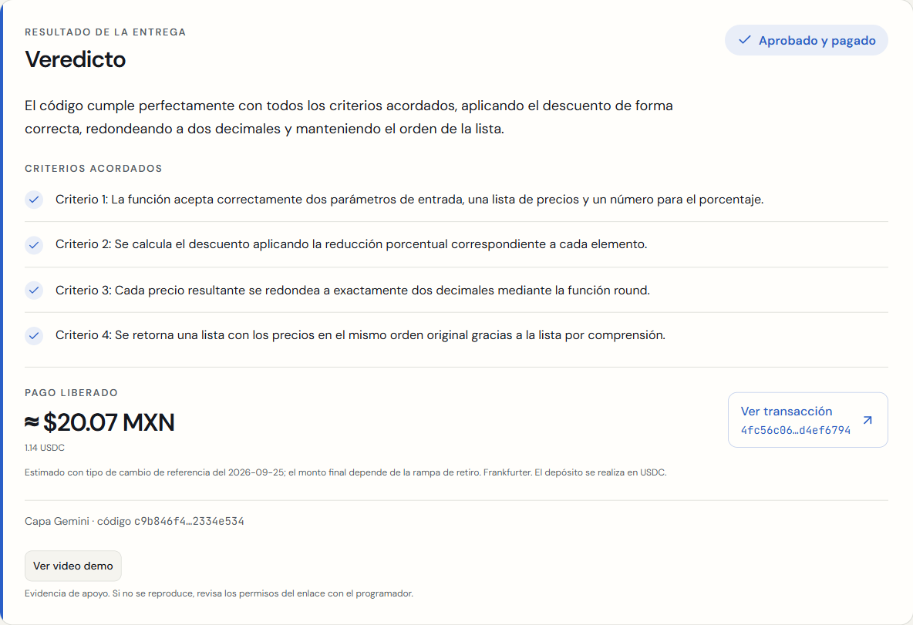

# Diseño del frontend para la demo

Fecha: 25 de septiembre de 2026. Carpeta original `cumpleycobra`, rama `diseno`, base `dade75a`.

## Resultado

- DM Sans para la interfaz; JetBrains Mono para código, hashes y direcciones. Fuentes servidas por Next.js.
- Papel `#F5F4EF`, tinta `#15181F` y azul `#2A5FC7`. El naranja `#E8963A` se reserva para alertas, acompañado de texto oscuro.
- Controles más amplios, texto principal de 16–18 px y jerarquía tipográfica para proyección.
- Tarjeta compartida de **Veredicto**, con estado explícito, motivo, criterios e iconos y bloque de pago en pesos con enlace a la transacción. Una aprobación sin transacción dice «Aprobado · sin pago».
- El programador recibe el aviso de seguridad cuando existen banderas. La terminal pasa a «Ver análisis del motor», abierta durante la petición con el contador existente, y plegada al finalizar.
- El cliente recibe únicamente los campos de su endpoint actual; la tarjeta no recibe trazas, lógica ni código.
- Estado del contrato más legible; pedido original y edición en columnas desde 768 px, criterios separados por líneas y adaptación a móvil.
- Portada con la frase «Si cumple lo acordado, cobras. Sin discusiones.» y explicación del acuerdo, depósito y veredicto.

## Alcance y archivos

Se modificaron la maquetación de `src/app/{page,layout,globals,cliente/page,tarea/[id]/page}`, los componentes de presentación (`assisted-task-form`, `comparison-list`, `criteria-card`, `site-header`, `status-card`, JSX de `terminal`, `tx-result`) y estilos de los componentes shadcn existentes. Se añadieron `verdict-card.tsx` y `submission-result.tsx`.

No cambian `src/lib`, `src/hooks`, backend, contratos, wallet, Pollar, proveedores, dependencias ni el script de ensayo. No se cambiaron estados, eventos, textos de botones ni `data-testid`. El componente de Pollar conserva su presentación original.

Para respetar la restricción sobre hooks y estado, `SubmissionResult` proyecta los datos que ya imprime `useTerminal`: lee su pie real y las últimas marcas por criterio. No vuelve a evaluar ni guardar el resultado. Este adaptador depende del formato documentado en el hook; un cambio futuro del pie requiere revisar el adaptador.

## Verificación

Comandos ejecutados desde `frontend/`, usando las dependencias instaladas:

```text
npx --no-install next typegen
✓ Types generated successfully

npx --no-install tsc --noEmit
Salida vacía; código de salida 0.

npm run lint
> eslint
Salida sin errores; código de salida 0.

npm run build
✓ Compiled successfully in 2.8s
Finished TypeScript in 1741ms
✓ Generating static pages using 7 workers (5/5) in 717ms
Route (app): /, /_not-found, /cliente, /tarea/[id]
Código de salida 0.
```

El build imprime el aviso existente de Pollar sobre su constructor en servidor; la compilación termina correctamente y la integración se comprobó en el navegador.

Comprobaciones adicionales:

- Comparación por AST contra la base: **0 diferencias** en hooks, eventos, textos de botones y `data-testid` de cliente, programador, formulario y terminal. El cuerpo de `useTerminal` permanece idéntico.
- **6 comprobaciones de presentación**: salida vacía, espera, aprobación pagada, aprobación sin pago, rechazo y bandera real. Una frase parecida al veredicto dentro de una traza no sustituye el pie real.
- Las dos respuestas reales registradas del primer ensayo se pasaron por el hook existente y el adaptador: `approved`, `reason`, `comparison`, `security_flags` y `transaction_hash` coinciden exactamente con las props de la tarjeta.
- `git diff --check`: sin errores. Archivos protegidos y capturas históricas de `docs/fases/`: sin diferencias.
- Chrome 154.0.8037.57: cliente sin desbordamiento horizontal a 390, 768, 1024 y 1440 px; formulario también comprobado a 390 px. DM Sans y JetBrains Mono confirmadas mediante estilos calculados. [Datos de la revisión visual](verificacion-visual.json).

Contrastes calculados con luminancia relativa según [WCAG, técnica G18](https://www.w3.org/WAI/WCAG21/Techniques/general/G18):

| Texto / fondo | Contraste |
| --- | ---: |
| Tinta / papel | 16.13:1 |
| Texto secundario / papel | 6.13:1 |
| Azul / papel | 5.36:1 |
| Azul / tarjeta | 5.85:1 |
| Azul / superficie azul clara | 5.07:1 |
| Texto de alerta / fondo de alerta | 7.43:1 |
| Azul claro / terminal | 10.97:1 |
| Texto secundario / terminal | 9.34:1 |
| Texto de alerta / terminal | 10.32:1 |

Los estados también llevan texto e iconos. Se conserva el foco visible y se respeta la preferencia de movimiento reducido.

## Ensayo de fase 5 con Pollar

Se ejecutó **sin modificar** `node scripts/fase5-ensayo.mjs`. La corrida válida empezó a las 05:24:17 UTC y completó el recorrido medido en **37.618 s**. [Salida estructurada completa](ensayo-pollar.json).

| Paso | Tiempo real |
| --- | ---: |
| Pedido asistido: «Pídele a la IA que mejore tu pedido» | 5.961 s |
| Revisar criterios (con «Que sea rápido» agregado) | 5.226 s |
| Crear tarea | 0.938 s |
| Depositar con Pollar (firma, envío y confirmación) | 5.835 s |
| Programador: abrir invitación y aceptar criterios | 2.304 s |
| Caso C enviado → veredicto | 5.091 s |
| Caso A con video enviado → veredicto y pago | 8.985 s |
| Cliente: estado «Pagada» y código entregado | 1.880 s |

Resultado: caso C rechazado sin pago; caso A aprobado y pagado; contrato `Released`; cliente con acceso al código tras pulsar «Ver código».

- Tarea: `PefJpeqMbYKblTlE`.
- Monto: `11400754` unidades USDC, aproximadamente 20 MXN en el ensayo.
- [Depósito en Stellar testnet](https://stellar.expert/explorer/testnet/tx/855440656cb15f40a62e3dfc93194132644006f4d96360c7c1ba1ad9fe40f054).
- [Pago en Stellar testnet](https://stellar.expert/explorer/testnet/tx/4fc56c060cb55b5224abb6c5cbebdd4866ebf9de7f89e0b8e3f5b083d4ef6794).

La primera corrida realizó correctamente el rechazo y el pago, pero el lector `innerText` del ensayo devolvía vacío con la terminal cerrada. Se corrigió exclusivamente el CSS de `details`: el contenido plegado conserva su maquetación y queda recortado e inerte. Se verificó que los enlaces ocultos no reciben foco. La segunda corrida validó todos los campos del script. En navegadores sin soporte de `interactivity: inert` se conserva el plegado nativo.

Después del ensayo se afinaron el texto de la portada, el ancho de las métricas y la lectura del pie del veredicto. Se validó nuevamente el build y la equivalencia de la tarjeta con las respuestas reales; no se repitieron depósitos por esos ajustes de presentación.

## Capturas

Las capturas «antes» corresponden a la demo anterior. Las del programador pagado y rechazado se tomaron durante los ensayos reales; no se reconstruyeron sus resultados tras la caducidad de las sesiones. Las capturas nuevas del cliente corresponden a la tarea del ensayo válido. Se conservaron intactas las imágenes históricas de la fase 5.

| Vista | Antes | Después |
| --- | --- | --- |
| Cliente | [Original](img/antes-cliente.png) | [Diseño final](img/despues-cliente.png) |
| Programador | [Original](img/antes-programador.png) | [Veredicto pagado en el ensayo](img/ensayo-programador-pagado.png) |

- [Portada](img/despues-portada.png).
- [Pedido original, paso 1](img/despues-cliente-paso-1.png) y [edición, paso 2](img/despues-cliente-paso-2.png).
- [Revisión de criterio vago con IA](img/despues-revision-ia.png).
- [Espera con contador real](img/despues-programador-espera.png).
- [Rechazo y aviso de seguridad](img/despues-programador-rechazado.png).
- [Cliente con el código entregado durante el ensayo](img/ensayo-cliente-pagada.png).
- [Cliente en móvil](img/movil-cliente.png), [formulario en móvil](img/movil-formulario.png) y [portada en móvil](img/movil-portada.png).



## Cierre y condiciones para la próxima demo

La pausa inicial se hizo al superar el reloj de la sesión el límite solicitado. Rodrigo autorizó continuar. Al reanudar, se detectaron sesiones de Pollar caducadas y se detuvo el trabajo hasta que Rodrigo inició sesión de nuevo; ambas cuentas quedaron verificadas.

La salida del programador sigue teniendo el ciclo de vida original: vive en la sesión del formulario y se pierde al desmontarse. Este encargo no introduce persistencia ni cambia ese estado.

Tras los dos ensayos, el cliente tiene aproximadamente **0.43 USDC de testnet**. Antes de repetir una demo con depósito de 20 MXN, se necesita fondeo de testnet mediante el mecanismo ya existente. No se cambió la integración de wallet ni se recargó como parte del trabajo de diseño.

Entrega exclusivamente en la rama `diseno`; sin fusión a `main`.
