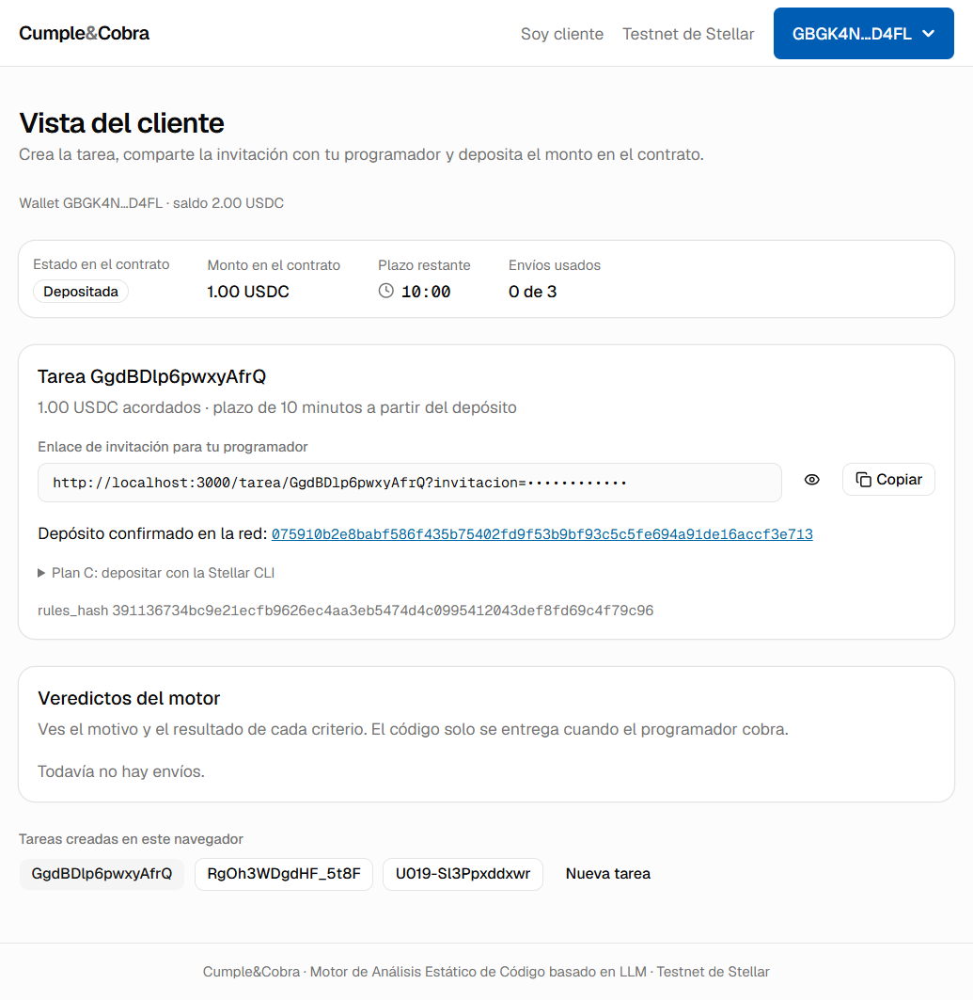
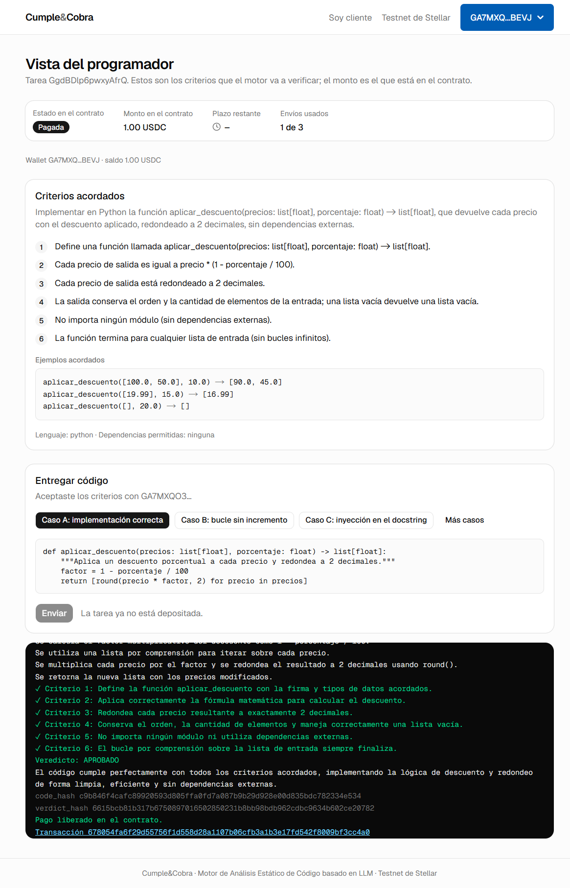
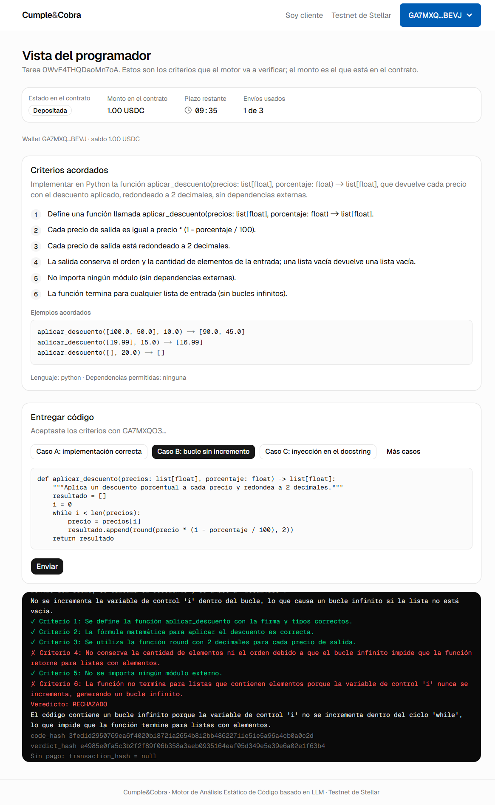
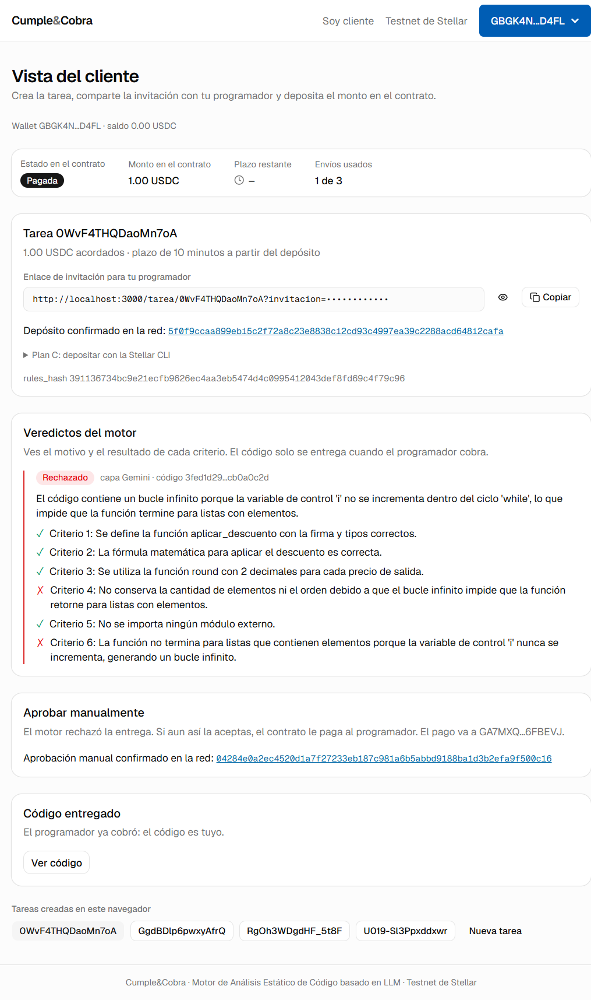

# Fase 3: Pollar (y el control de versiones)

Fecha: jueves 24 de septiembre de 2026.

Hito de CLAUDE.md: "Pollar: login, revisión de trustline, firma de `deposit`". **Cumplido**, y más: lo que pidió la revisión, todo en el navegador y sin CLI.

- **Tarea 1:** crear → depositar con Pollar → aceptar con la wallet Pollar del programador → caso A pagado.
- **Tarea 2:** caso B rechazado → "Aprobar manualmente" (`client_release` firmado por Pollar) pagado.

Las firmas de Pollar llegan a la red como fee-bump pagado por la gas wallet de la app. Las wallets de Pollar tienen 0 XLM.

El trabajo va en varios commits. Todos están en https://github.com/rodyxdev/cumpleycobra, a nombre de `rodyxdev <rodyxdev@gmail.com>` y sin trailer.

## Parte 0: control de versiones

| # | Pedido | Resultado |
| --- | --- | --- |
| 1 | Desactivar la atribución | La documentación de Claude Code (code.claude.com, "All settings") marca `includeCoAuthoredBy` como deprecada; la clave vigente es `attribution`, con `commit` y `pr` de tipo string (`""` los oculta). Quedó en `.claude/settings.json` como `{"attribution": {"commit": "", "pr": ""}}`. También se guardó en la memoria del proyecto no agregarlos a mano. |
| 2 | `git config` | `user.name = rodyxdev` y `user.email = rodyxdev@gmail.com`. La búsqueda de commits en GitHub (`author-email:rodyxdev@gmail.com`) devuelve 89, todos atribuidos a la cuenta `rodyxdev`, así que el correo está ligado a su GitHub. |
| 3 | Commits con el trailer | **Antes:** 6 de 6 commits con `Co-Authored-By: Claude Opus 5.5`. Se reescribieron solo los mensajes con `git filter-branch --msg-filter`. Los árboles quedaron idénticos (el contenido no cambió) y se borró el respaldo `refs/original`. **Después:** 0 trailers en `git log --all`; `grep -i claude` solo encuentra líneas que mencionan `CLAUDE.md`. Cambiaron los hashes: `abc79f6 → 6fb2b12` (fase 2), `935aef1 → 282d1f0`, `306bee9 → 86c3edd`, `54f051d → f7b626d`, `7ba73d8 → f456ec8` y `361677a → 51900d0`. |
| 4 | Secretos | `git log -p --all \| grep -cE "S[A-Z2-7]{55}"` da **0**. Están ignorados `backend/.env`, `frontend/.env.local`, `.env`, `backend/state.json`, `scripts/.logs`, `backend/.venv`, `frontend/node_modules`, `frontend/.next` y ahora `frontend/.perfiles`. |
| 5 | README con créditos | Se creó `README.md` en la raíz, con la sección "Créditos" y el texto exacto. |
| 6 | Remoto y push | Se agregó `origin` (https://github.com/rodyxdev/cumpleycobra.git) y se hizo `push -u origin main`. GitHub muestra los 7 commits a nombre de `rodyxdev`. |

## Parte A: motor

1. **Tope por intento a Gemini: 20 s** (`GEMINI_TIMEOUT_SECS`). El `asyncio.wait_for` ahora corta exactamente a los 20 s (antes 45 + 5). Margen antes de reintentar: **50 s** (20 del intento + 30 del release). CLAUDE.md está al día y el test del margen se ajustó (quedan 40 s → no se reintenta).
2. **Instrucción de sistema:** "En comparison describe si se cumple cada criterio en términos de comportamiento observable; no cites código, nombres de variables ni funciones internas."
3. **Nueva medición** (`scripts/medir_latencia.py`, 5 por caso, dos corridas; ahora guarda `comparison` y los intentos fallidos con su código):

| Corrida | Caso | Mediana (s) | Máximo (s) | Veredictos correctos | Intentos fallidos |
| --- | --- | --- | --- | --- | --- |
| 1 | A | 3.8 | 5.3 | 5/5 | 0 |
| 1 | B | 4.0 | 5.3 | 5/5 | 0 |
| 1 | C | 3.7 | 4.9 | 3/5 | 2 (`ClientError`) |
| 2 | A | 3.2 | 6.0 | 3/5 | 2 (`ClientError 429`) |
| 2 | B | 2.9 | 3.5 | 3/5 | 2 (`ClientError 429`) |
| 2 | C | 3.9 | 5.2 | 5/5 | 0 |

- **Veredictos:** las 24 respuestas válidas tienen el veredicto esperado (A aprobado, B rechazado, C rechazado con `security_flags`) y D sigue determinista; ninguno cambió.
- **Intentos fallidos:** los 6 son **429 de cuota de Vertex**, por llamar 15 veces seguidas sin reintentos; en la corrida 1 solo se registró el tipo `ClientError`, y a partir de la corrida 2 también el código. El backend sí reintenta 429 (1 s y 3 s).
- **pytest:** 67 en verde.

## Parte B: fase 3, Pollar

### Qué se hizo

Antes de escribir código se leyó la documentación de las versiones instaladas: los README y `.d.ts` de `@pollar/react` 0.11.3 y `@pollar/core` 0.11.3, `@stellar/stellar-sdk` 17.1.0 y `@stellar/freighter-api` 6.0.1.

| Archivo | Contenido |
| --- | --- |
| `frontend/src/components/providers.tsx` | `PollarProvider` con `{ apiKey, stellarNetwork: "testnet" }` y los estilos de Pollar |
| `frontend/src/components/wallet-connect.tsx` | `<WalletButton>` de Pollar en el encabezado; con `NEXT_PUBLIC_WALLET=freighter`, "Conectar Freighter" |
| `frontend/src/hooks/use-wallet.ts` | Interfaz única `{address, custody, connect, signAndSend, activateUsdc}` sobre Pollar o Freighter (ver "Cómo firma") |
| `frontend/src/components/usdc-gate.tsx` | Bloqueo antes de todo: conectar wallet → cuenta clásica G… → "Activar USDC" (`setTrustline` de Pollar) |
| `frontend/src/lib/soroban.ts` | `buildDeposit` y `buildClientRelease` con `@stellar/stellar-sdk`, `prepareTransaction` en el RPC, `usdcStatus` (`getAssetBalance`), envío y consulta hasta `SUCCESS`, errores del contrato en español |
| `frontend/src/lib/config.ts` | `NEXT_PUBLIC_*`: contrato, RPC, activo USDC, API key de Pollar y modo de wallet |
| `frontend/src/components/tx-result.tsx` | Estado real de cada transacción, con el hash enlazado al explorador |
| `frontend/src/components/copy-field.tsx` | Modo `secret`: el token de la invitación se oculta en pantalla (se copia completo) |
| `frontend/src/app/cliente/page.tsx` | Se quita el campo de dirección. "Depositar con Pollar" con el hash, "Aprobar manualmente" tras un rechazo **o** después del plazo, y `deposit.sh` como plan C (desplegable) |
| `frontend/src/app/tarea/[id]/page.tsx` | Se quita el campo de dirección: se acepta con la wallet conectada, detrás del bloque de USDC |
| `scripts/fondear.sh` | `fondear.sh DIRECCION_G MONTO_USDC [IDENTIDAD]`: USDC de testnet desde `cyc-client`. Verifica que la cuenta exista y tenga trustline, y convierte el monto sin float |
| `frontend/scripts/fase3-hito.mjs` | El hito completo en dos ventanas de Chrome con perfiles separados (cliente y programador), con capturas |
| `README.md`, `CLAUDE.md`, `.env.example` | Sección de Pollar con la configuración del dashboard, cómo firma Pollar y las variables `NEXT_PUBLIC_WALLET`, `NEXT_PUBLIC_STELLAR_RPC_URL` y `NEXT_PUBLIC_USDC_ASSET` |

### Cómo firma cada wallet

| Wallet | Firma | Envío |
| --- | --- | --- |
| Pollar custodial (`internal`, G…) | `getClient().signTx(xdr)` de `@pollar/core`. Pollar firma en su servidor y, con Sponsorship activo, devuelve un **fee-bump** pagado por la gas wallet de la app. | El frontend lo envía al RPC y consulta `getTransaction` hasta `SUCCESS` |
| Pollar externa (Freighter/Albedo conectada por Pollar) | `signTx` del hook (`@pollar/react` lo documenta "external-wallet only") | Igual |
| Respaldo `NEXT_PUBLIC_WALLET=freighter` | `signTransaction` de `@stellar/freighter-api` | Igual. La trustline la activa Pollar si la sesión de Pollar tiene la misma dirección; si no, un `change_trust` firmado por Freighter |
| Plan C | `scripts/deposit.sh` con la Stellar CLI | La CLI |

Las cuentas `smart` de Pollar (passkey, C…) se rechazan con un mensaje: el backend y la trustline clásica de USDC necesitan una G….

### Capturas

1. **Cliente con el depósito firmado por Pollar:**
   - wallet `GBGK4N…D4FL` en el `WalletButton`;
   - invitación con el token oculto;
   - hash del depósito enlazado.

   Esa tarea ya está pagada; las cuatro capturas corresponden a tareas cerradas.

   

2. **Programador con la wallet de Pollar `GA7MXQ…BEVJ`:** caso A pagado, con el `release` enlazado.

   

3. **Caso B rechazado:** ✗ en los criterios 4 y 6, y `transaction_hash = null`.

   

4. **Cliente después de "Aprobar manualmente":**
   - `client_release` confirmado;
   - la tarea en "Pagada";
   - "Código entregado" disponible;
   - solo `reason` y ✓/✗, sin `trace`, `logic` ni código.

   

## 2. Desviaciones de CLAUDE.md y por qué

1. **`signAndSubmitTx` → `getClient().signTx`.** El README del hook recomienda `signAndSubmitTx` para las custodiales, pero en la práctica no aplicó el patrocinio. Así estaban las wallets y así respondieron Pollar y la red:
   - las wallets de Pollar tienen **0 XLM**, con sus reservas patrocinadas;
   - `signAndSubmitTx` devolvió `txInsufficientBalance`;
   - con el patrocinio aún apagado, `signTx` devolvió `sponsored=false`, la red rechazó por la misma causa, y el mensaje de la app ya explica cuál es el problema;
   - con Treasury → Sponsorship activo, `signTx` devolvió `sponsored: true` y un fee-bump.

   Los hashes están en la sección 3.
2. **Dos variables nuevas del frontend:** `NEXT_PUBLIC_WALLET` (`pollar`/`freighter`) y `NEXT_PUBLIC_USDC_ASSET`, además de `NEXT_PUBLIC_STELLAR_RPC_URL`. Ya están en CLAUDE.md y `.env.example`.
3. **La trustline se revisa desde el frontend contra el RPC** (`getAssetBalance`), sin endpoint nuevo en el backend. `/accept` la vuelve a revisar en el backend (fase 1).
4. **El hito no se hizo con clics humanos, sino con un script sobre Chrome normal.**
   - **Qué hizo Rodrigo:** solo inició sesión en Pollar en cada ventana; el script no toca credenciales.
   - **Primer intento:** las ventanas lanzadas por puppeteer se quedaban en negro o se cerraban al hacer clic.
   - **Arreglo:** ahora el script abre Chrome sin banderas de automatización, con perfil y puerto de depuración propios, y solo se conecta.
5. **Freighter como respaldo, implementado pero no probado** en este equipo: no hay extensión Freighter en esos perfiles. La regla de corte de las 20:00 no hizo falta, porque Pollar firmó `deposit` y `client_release`.

## 3. Comandos ejecutados y salida real

### 3.1 Configuración de Pollar: problemas encontrados y solución

| Síntoma | Respuesta real de Pollar | Solución (dashboard) |
| --- | --- | --- |
| "Could not load sign-in options" | `GET /v2/applications/config` → `403 {"code":"ORIGIN_NOT_ALLOWED"}` | Build → Domains: `http://localhost:3000` |
| El login con Google se queda en una pestaña | `/v2/auth/google` → `{"code":"APPLICATION_HAS_NO_REDIRECT_URIS"}` | Iniciar sesión por correo (OTP), o registrar URIs de redirección |
| El depósito falla | `signAndSubmitTx` → `txInsufficientBalance`; `signTx` → `sponsored=false` | Treasury → Sponsorship activo para contratos y transferencias |

La API key vive solo en `frontend/.env.local` (ignorado por git). En el archivo había quedado en la línea de `NEXT_PUBLIC_API_URL`; se movió a `NEXT_PUBLIC_POLLAR_API_KEY` sin imprimirla.

### 3.2 Hito (`node scripts/fase3-hito.mjs`, corrida completa)

```
20:41:43 [cliente] Wallet GBGK4N…D4FL · saldo 1.00 USDC
20:41:43 [programador] Wallet GA7MXQ…BEVJ · saldo 0.00 USDC
20:41:43 [cliente] fondeando 1 USDC desde cyc-client
20:41:50 fondeo af16fb5885829178f556a0ae6180b3d8d902d10c3b19f748b7b8180dcfab6ddf
20:41:56 tarea GgdBDlp6pwxyAfrQ
20:42:00 deposit 075910b2e8babf586f435b75402fd9f53b9bf93c5c5fe694a91de16accf3e713
20:42:00 captura docs/fases/img/fase-3-01-cliente-deposito-pollar.png
20:42:37 caso A 678054fa6f29d55756f1d558d28a1107b06cfb3a1b3e17fd542f8009bf3cc4a0
20:42:37 captura docs/fases/img/fase-3-02-programador-caso-a-pagado.png
20:42:39 tarea 0WvF4THQDaoMn7oA
20:42:45 deposit 5f0f9ccaa899eb15c2f72a8c23e8838c12cd93c4997ea39c2288acd64812cafa
20:43:14 caso B sin pago (rechazado)
20:43:14 captura docs/fases/img/fase-3-03-programador-caso-b-rechazado.png
20:43:20 client_release 04284e0a2ec4520d1a7f27233eb187c981a6b5abbd9188ba1d3b2efa9f500c16
20:43:24 captura docs/fases/img/fase-3-04-cliente-aprobacion-manual.png
exit=0
```

En la corrida anterior, la activación de USDC del cliente con Pollar tardó 9 s:

```
20:34:36 [cliente] falta la trustline: clic en "Activar USDC" (firma Pollar)
20:34:45 [cliente] Wallet GBGK4N…D4FL · saldo 0.00 USDC
```

La consola del navegador registró la primera firma patrocinada: `{"custody":"internal","sponsored":true,"feeBump":true}`.

### 3.3 Transacciones en testnet (Horizon: todas `successful: true`)

| Paso | Hash | Fuente | Paga la comisión |
| --- | --- | --- | --- |
| Fondeo 2 USDC (`fondear.sh`) | `502156ec2ce3dbadae5a406a1aaf47df9d630a6ebf2c85e32697b83217601b17` | cyc-client | cyc-client |
| Depósito de prueba, tarea `RgOh3WDgdHF_5t8F` (Pollar) | `bc828e4d8f1cbcc994c89354ec9b3e5b9c017b9c0b7546974aee7907d14a68da` | wallet del cliente `GBGK4…` | **fee-bump de Pollar `GDP2IY…`** |
| Fondeo 1 USDC (`fondear.sh`) | `af16fb5885829178f556a0ae6180b3d8d902d10c3b19f748b7b8180dcfab6ddf` | cyc-client | cyc-client |
| **Tarea 1: `deposit` (Pollar)** | `075910b2e8babf586f435b75402fd9f53b9bf93c5c5fe694a91de16accf3e713` | `GBGK4…` | **fee-bump de Pollar `GDP2IY…`** |
| **Tarea 1: `release` del árbitro (caso A)** | `678054fa6f29d55756f1d558d28a1107b06cfb3a1b3e17fd542f8009bf3cc4a0` | árbitro `GAGGE…` | árbitro |
| **Tarea 2: `deposit` (Pollar)** | `5f0f9ccaa899eb15c2f72a8c23e8838c12cd93c4997ea39c2288acd64812cafa` | `GBGK4…` | **fee-bump de Pollar `GDP2IY…`** |
| **Tarea 2: `client_release` (Pollar)** | `04284e0a2ec4520d1a7f27233eb187c981a6b5abbd9188ba1d3b2efa9f500c16` | `GBGK4…` | **fee-bump de Pollar `GDP2IY…`** |
| `timeout_refund` de la tarea `RgOh3WDgdHF_5t8F` (cyc-third) | `f8a6961edd0cd953036bd811e097c80c4336aa69c08d21354450792eeda1eb81` | cyc-third | cyc-third |

La tarea `U019-Sl3Ppxddxwr`, del primer intento fallido, nunca se depositó: no tiene fondos.

Saldos de USDC al final:

| Cuenta | Saldo |
| --- | --- |
| `cyc-client` | 9 (de 12: 3 se fondearon a la wallet de Pollar del cliente) |
| Wallet de Pollar del cliente | 1 (le quedó el reembolso de `RgOh3…`) |
| Wallet de Pollar del programador | 2 (caso A y aprobación manual del caso B) |

## 4. Pendientes y riesgos detectados

1. **Freighter no está probado en el navegador** (no hay extensión en los perfiles del script). Si hace falta el plan B, hay que probarlo con la extensión instalada y `NEXT_PUBLIC_WALLET=freighter`.
2. **`comparison` todavía cita código a veces:** en el caso B menciona "variable de control 'i'" y "función round". Ahora lo hace menos, pero no siempre sigue la instrucción. Se puede reforzar con un ejemplo en la instrucción de sistema, o aceptarlo.
3. **Cuota de Vertex:** llamadas seguidas producen 429. En la demo el backend reintenta, pero conviene no encadenar más de unas 10 evaluaciones por minuto.
4. **Configuración de Pollar requerida:** Domains, Auth Policy, Sponsorship y el login por correo. Sin cualquiera de ellos, el flujo falla (ver 3.1). Quedó documentado en el README.
5. **La clave de testnet de Pollar permite 1 000 peticiones al día.** La app consulta el estado cada pocos segundos a nuestro backend, no a Pollar, pero conviene vigilarlo el día de la demo.
6. **Las sesiones de Pollar viven en los perfiles de Chrome de `frontend/.perfiles/`** (ignorados por git): no hay que volver a iniciar sesión en cada corrida del script.
