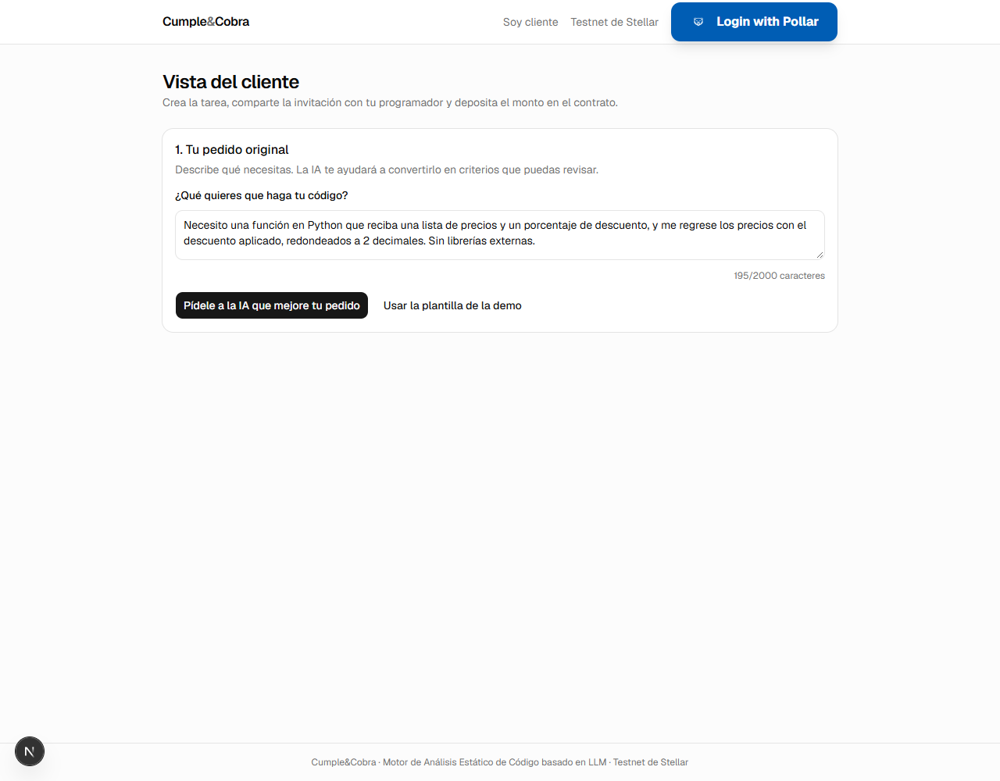
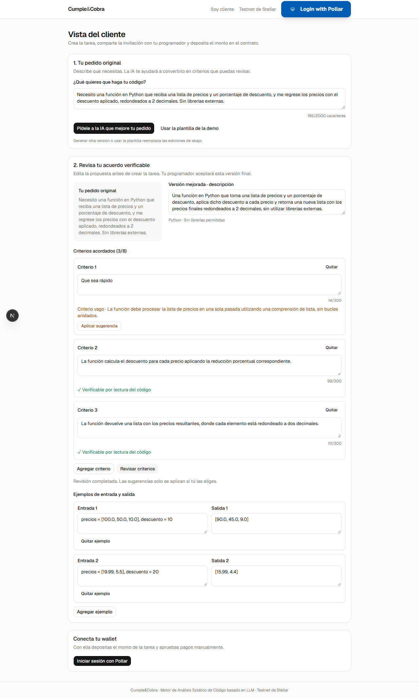
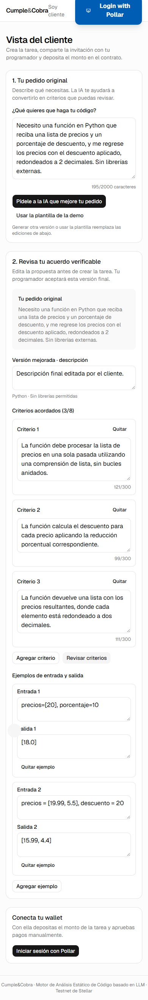

# Fase 4a: pedido asistido

Fecha: 24 de septiembre de 2026. **Implementación y pruebas completadas; lista para revisión local.**

Se continúa desde el cierre de fase 3 que dejó Claude Code. Por indicación final de Rodrigo, **no se hicieron commits ni push**. Freighter sigue sin probar; el respaldo de depósito es `scripts/deposit.sh`. Se mantiene la limitación aceptada de que `comparison` puede citar nombres del código.

## 1. Qué se hizo

| Archivos | Cambio |
| --- | --- |
| `backend/drafting.py` | Esquemas estrictos y prompts de borrador y revisión. Pedido y criterios delimitados como datos JSON, con `<` y `>` escapados para impedir cerrar el bloque desde el texto del cliente. |
| `backend/gemini.py` | Una sola política de llamadas estructuradas para evaluación, borrador y revisión: mismo cliente, temperatura 0, límite duro de 20 s por intento, dos reintentos transitorios (1 y 3 s) y uno por respuesta fuera de esquema. Se conservan los márgenes del evaluador. |
| `backend/main.py` | `POST /tasks/draft` y `POST /tasks/draft/review`; errores 400/502 en español. Límites también en `POST /tasks`, para que no se puedan eludir al crear. |
| `backend/plantilla.py` | Pedido precargado con el texto exacto solicitado; plantilla fija conservada como respaldo. |
| `frontend/src/components/assisted-task-form.tsx` | Pedido original, versión editable al lado del original, criterios individuales, ejemplos editables, revisión de vaguedad y aplicación explícita de sugerencias. Conserva las ediciones si falla Gemini; cualquier cambio a los criterios invalida su revisión anterior. |
| `frontend/src/app/cliente/page.tsx`, `frontend/src/lib/api.ts` | Integración con los endpoints y con el flujo existente de crear, invitar y depositar mediante Pollar. La creación envía el estado final del editor. |
| `backend/tests/test_drafting.py` | 41 tests con Gemini falso: validación, esquemas, orden y cantidad de revisiones, errores, reintentos, timeout y hash final. |
| `scripts/probar_pedido.py` | Cinco borradores reales y veinte análisis de A–D, sin importar el cliente de cadena ni ejecutar el código entregado. Evidencia JSON y Markdown; código de salida 1 si hay errores o resultados incorrectos. |
| `frontend/scripts/fase4a-ui.mjs` | Comprobación de navegador y capturas de escritorio y móvil. Generación y revisión reales; respuesta 502 controlada únicamente para comprobar conservación de ediciones y respaldo. |
| `frontend/scripts/fase3-hito.mjs` | El hito anterior elige ahora «Usar la plantilla de la demo» antes de crear. No se volvió a ejecutar el recorrido con fondos. |
| `frontend/eslint.config.mjs` | Excluye `.perfiles/**`; los perfiles de Chrome contenían extensiones ajenas al código del proyecto. |
| `README.md` | API, límites, prueba reproducible, hash final y estado de los respaldos. |

El borrador genera entre 3 y 8 criterios; cada criterio admite hasta 300 caracteres. El pedido admite hasta 2000 caracteres. El cliente puede dejar entre 1 y 8 criterios tras editar. `language` se valida como `python`; los ejemplos siempre son cadenas. Una revisión válida contiene exactamente un elemento por criterio, ordenado por `index` desde cero, con `vague` booleano y `suggestion` de texto o `null`.

### Verificación de `rules_hash`

No fue necesario cambiar `backend/hashing.py`. La prueba `test_hash_version_final_editada_no_original` obtiene un borrador, cambia descripción, un criterio y los ejemplos, crea la tarea y comprueba que:

1. La especificación guardada es la versión editada.
2. El hash coincide con `rules_hash(versión_editada)` y difiere del borrador inicial.
3. Cambiar solo `raw_request` mantiene el mismo hash.

El formulario envía esa versión final a `POST /tasks`. El depósito existente usa el `rules_hash` devuelto por el backend; no se calcula un hash del borrador en el navegador.

## 2. Decisiones y desviaciones

- **Sin commits ni push:** prevalece la última instrucción de Rodrigo sobre el encargo inicial de publicarlos.
- Se puede preparar y editar el pedido antes de conectar una wallet. El bloqueo de Pollar/USDC sigue antes de crear la tarea y en el panel de la tarea; no cambia la vista del programador.
- El paso 1 conserva el texto actual y el paso 2 una copia del original que produjo ese borrador. Si se cambia el texto de arriba, se avisa que hay que generar de nuevo para usarlo. Así no se vincula silenciosamente un borrador al pedido equivocado.
- La primera corrida real ya dio 20/20, pero se detectó un ejemplo con un empate de redondeo flotante y menciones a «lista nueva». Se reforzó el prompt para evitar ejemplos ambiguos y requisitos de identidad del objeto, y se repitieron los cinco borradores sin cambiar ningún caso. Se conservó [la evidencia inicial](fase-4a-pedido-inicial.json).
- En la comprobación visual inicial, la revisión de «Que sea rápido» sugirió definir un tiempo de ejecución. Se reforzó **solo el prompt de revisión** para producir un criterio estático listo para aplicar y se repitió la comprobación de navegador. La sugerencia final está guardada en [la evidencia UI](fase-4a-ui.json).
- Se usaron `localhost:8001` y `localhost:3001` para la revisión, con `STATE_FILE=.pytest_cache/fase4a-ui-state.json`. Las instancias anteriores en 8000/3000 no se detuvieron.

## 3. Pruebas y salidas reales

### Pytest

```text
backend/.venv/Scripts/python -m pytest backend/tests -q --basetemp=.pytest_cache/fase4a-final --tb=short
108 passed, 2 warnings in 2.11s
```

Son 67 tests previos más 41 nuevos. Los avisos provienen de las dependencias instaladas (`starlette.testclient`/httpx y un tipo interno de `google-genai`). El primer intento con el directorio temporal predeterminado de Windows falló por permisos; al usar un directorio temporal dentro del repositorio pasaron todos los tests.

### Frontend

```text
npm run lint
> eslint
exit=0

npm run build
✓ Compiled successfully in 2.5s
Finished TypeScript in 2.1s
✓ Generating static pages using 7 workers (5/5) in 760ms
exit=0
```

El build conserva el aviso del constructor de Pollar ejecutado durante el renderizado de servidor. La aplicación compiló y la prueba de navegador no registró errores de JavaScript. El primer lint incluyó extensiones de Chrome dentro de `.perfiles`; tras excluir esa carpeta terminó correctamente.

### Prueba real de cinco borradores

```text
backend/.venv/Scripts/python scripts/probar_pedido.py
Resultado: 20/20 correctos; intentos Gemini: 20
exit=0
```

Modelo: `gemini-3.5-flash`, Vertex AI. Corrida final: **22:05:59–22:08:35 UTC** (16:05:59–16:08:35, Ciudad de México). Cinco llamadas de borrador y quince de evaluación: D no llama a Gemini. Ningún reintento ni 429. Intervalo mínimo registrado entre inicios: **8.000 s**; máximo en cualquier ventana de 60 s: **8 llamadas**. Los segundos de la tabla incluyen la espera para respetar la cuota; no son una medición aislada de latencia de Gemini.

El primer intento desde el entorno restringido no encontró las credenciales ADC (`DefaultCredentialsError`) y no obtuvo borradores. La ejecución autorizada fuera de ese entorno usó las credenciales locales de Vertex. No se mostraron ni guardaron secretos en la evidencia.

| Borrador | A | B | C | D |
| --- | --- | --- | --- | --- |
| 1 | Aprobado (4.5 s, llm) | Rechazado (7.7 s, llm) | Rechazado (10.5 s, llm) | Rechazado (0.0 s, deterministic) |
| 2 | Aprobado (5.6 s, llm) | Rechazado (8.0 s, llm) | Rechazado (8.2 s, llm) | Rechazado (0.0 s, deterministic) |
| 3 | Aprobado (5.8 s, llm) | Rechazado (9.2 s, llm) | Rechazado (7.2 s, llm) | Rechazado (0.0 s, deterministic) |
| 4 | Aprobado (5.9 s, llm) | Rechazado (8.4 s, llm) | Rechazado (7.8 s, llm) | Rechazado (0.0 s, deterministic) |
| 5 | Aprobado (6.2 s, llm) | Rechazado (7.5 s, llm) | Rechazado (8.3 s, llm) | Rechazado (0.0 s, deterministic) |

#### Borrador 1

Una función en Python que toma una lista de precios y un porcentaje de descuento, aplica dicho descuento a cada precio y retorna una nueva lista con los precios finales redondeados a 2 decimales, sin utilizar librerías externas.

`rules_hash`: `3c22bbc1e5114fc41ca96bf806c4a2fbafcef248e576dc0f95a21bb1c3f7810c`

1. La función acepta como argumentos una lista de valores numéricos que representan los precios y un valor numérico que representa el porcentaje de descuento.
2. La función calcula el descuento para cada precio aplicando la reducción porcentual correspondiente.
3. La función devuelve una lista con los precios resultantes, donde cada elemento está redondeado a dos decimales.

Ejemplos:

- Entrada: `precios = [100.0, 50.0, 10.0], descuento = 10` → salida: `[90.0, 45.0, 9.0]`
- Entrada: `precios = [19.99, 5.5], descuento = 20` → salida: `[15.99, 4.4]`

#### Borrador 2

Una función en Python que toma una lista de precios y un porcentaje de descuento, aplica dicho descuento a cada precio y retorna una nueva lista con los precios finales redondeados a 2 decimales, sin utilizar librerías externas.

`rules_hash`: `3c22bbc1e5114fc41ca96bf806c4a2fbafcef248e576dc0f95a21bb1c3f7810c`

1. La función acepta como argumentos una lista de valores numéricos que representan los precios y un valor numérico que representa el porcentaje de descuento.
2. La función calcula el descuento para cada precio aplicando la reducción porcentual correspondiente.
3. La función devuelve una lista con los precios resultantes, donde cada elemento está redondeado a dos decimales.

Ejemplos:

- Entrada: `precios = [100.0, 50.0, 10.0], descuento = 10` → salida: `[90.0, 45.0, 9.0]`
- Entrada: `precios = [19.99, 5.5], descuento = 20` → salida: `[15.99, 4.4]`

#### Borrador 3

Una función en Python que toma una lista de precios y un porcentaje de descuento, aplica dicho descuento a cada precio, redondea los resultados a dos decimales y devuelve la lista con los nuevos precios.

`rules_hash`: `f7d7b95e72786fd6d498c6d254465c8a91a6d9fc53df552dc71b6582305aa963`

1. La función acepta dos parámetros de entrada: una lista que contiene valores numéricos representando precios y un número que representa el porcentaje de descuento.
2. Para cada precio de la lista de entrada, se calcula el precio con el descuento aplicado mediante la fórmula de reducción porcentual correspondiente.
3. Cada uno de los precios calculados con el descuento aplicado se redondea a exactamente dos decimales.
4. La función retorna una lista con los precios resultantes en el mismo orden en el que se recibieron en la lista de entrada.

Ejemplos:

- Entrada: `precios = [100.0, 50.0, 20.0], descuento = 10` → salida: `[90.0, 45.0, 18.0]`
- Entrada: `precios = [10.55, 99.99], descuento = 15` → salida: `[8.97, 84.99]`

#### Borrador 4

Una función en Python que toma una lista de precios y un porcentaje de descuento, aplica dicho descuento a cada precio, redondea los resultados a dos decimales y devuelve la lista con los nuevos precios.

`rules_hash`: `f7d7b95e72786fd6d498c6d254465c8a91a6d9fc53df552dc71b6582305aa963`

1. La función acepta dos parámetros de entrada: una lista que contiene valores numéricos representando precios y un número que representa el porcentaje de descuento.
2. Para cada precio de la lista de entrada, se calcula el precio con el descuento aplicado mediante la fórmula de reducción porcentual correspondiente.
3. Cada uno de los precios calculados con el descuento aplicado se redondea a exactamente dos decimales.
4. La función retorna una lista con los precios resultantes en el mismo orden en el que se recibieron en la lista de entrada.

Ejemplos:

- Entrada: `precios = [100.0, 50.0, 20.0], descuento = 10` → salida: `[90.0, 45.0, 18.0]`
- Entrada: `precios = [10.55, 99.99], descuento = 15` → salida: `[8.97, 84.99]`

#### Borrador 5

Una función en Python que toma una lista de precios y un porcentaje de descuento, aplica dicho descuento a cada precio, redondea los resultados a dos decimales y devuelve la lista con los nuevos precios.

`rules_hash`: `f7d7b95e72786fd6d498c6d254465c8a91a6d9fc53df552dc71b6582305aa963`

1. La función acepta dos parámetros de entrada: una lista que contiene valores numéricos representando precios y un número que representa el porcentaje de descuento.
2. Para cada precio de la lista de entrada, se calcula el precio con el descuento aplicado mediante la fórmula de reducción porcentual correspondiente.
3. Cada uno de los precios calculados con el descuento aplicado se redondea a exactamente dos decimales.
4. La función retorna una lista con los precios resultantes en el mismo orden en el que se recibieron en la lista de entrada.

Ejemplos:

- Entrada: `precios = [100.0, 50.0, 20.0], descuento = 10` → salida: `[90.0, 45.0, 18.0]`
- Entrada: `precios = [10.55, 99.99], descuento = 15` → salida: `[8.97, 84.99]`

[Detalle JSON con veredictos, hashes de los casos e inicios de cada llamada](fase-4a-pedido.json).


### Navegador y capturas

```text
node scripts/fase4a-ui.mjs
UI: 10 comprobaciones correctas; 3 capturas; sin crear tareas ni transacciones.
Errores de navegador: []
exit=0
```

La prueba usó Chrome sin ventana, API real para borrador/revisión y un perfil propio de prueba. El arranque de Chrome dentro del entorno restringido agotó el tiempo; la ejecución autorizada fuera de él funcionó. Se verificaron las capturas visualmente y se comprobó que no existe desbordamiento horizontal a 390 px.

**Paso 1: pedido original precargado.**



**Paso 2: original al lado de la propuesta editable, criterios, sugerencia y ejemplos.** Para probar la revisión se sustituyó el primer criterio por «Que sea rápido». Esa edición pertenece exclusivamente a la prueba de UI; la tabla A–D usa los borradores originales completos.



**Móvil: ediciones y sugerencia aplicada.**



## 4. Pendientes y límites

- La instrucción de no inventar requisitos es una restricción del prompt, no una garantía semántica. El cliente debe revisar la propuesta: incluso tras el ajuste, dos descripciones dicen «nueva lista», aunque sus criterios no exigen identidad del objeto. Los cinco borradores finales cumplen la prueba A–D; eso no valida todo pedido posible.
- Las sugerencias pueden introducir restricciones concretas para precisar un criterio vago; solo quedan acordadas si el cliente las aplica. No se usan para modificar automáticamente el borrador.
- No se repitió el ciclo de depósito/pago ni se desplegó un contrato en esta fase. Los casos `backend/casos/` y el contrato no se modificaron. La evidencia del pago con Pollar sigue siendo la fase 3 aprobada.
- Freighter sigue sin probar y `comparison` puede citar nombres del código, como se aceptó en la revisión. El respaldo operativo documentado es `scripts/deposit.sh`.
- No ejecutar la medición junto con otras llamadas a Vertex: el ritmo del script se controla por proceso, no por cuota global de la cuenta.
- Las funciones restantes de fase 4 quedan fuera de este encargo. El trabajo se detiene aquí para revisión, sin commit ni push.
