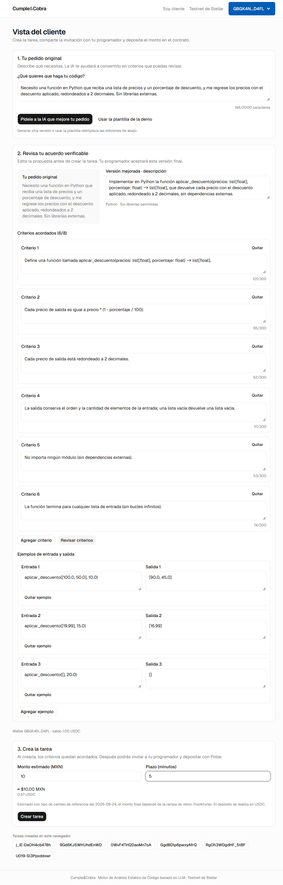
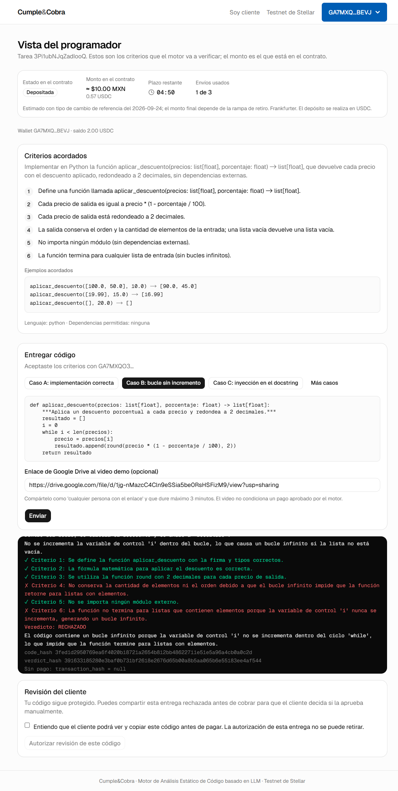
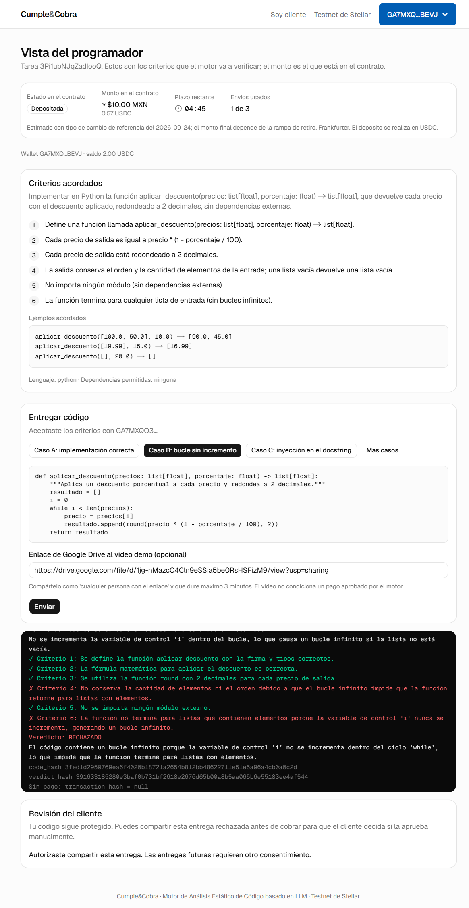
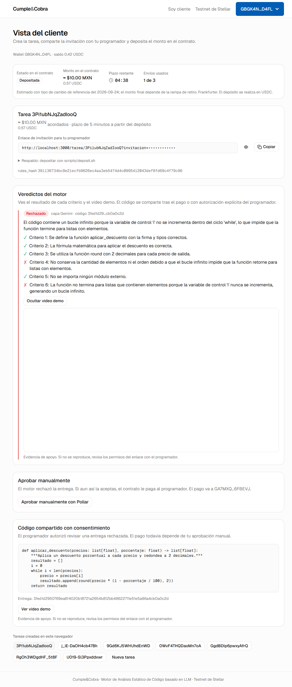
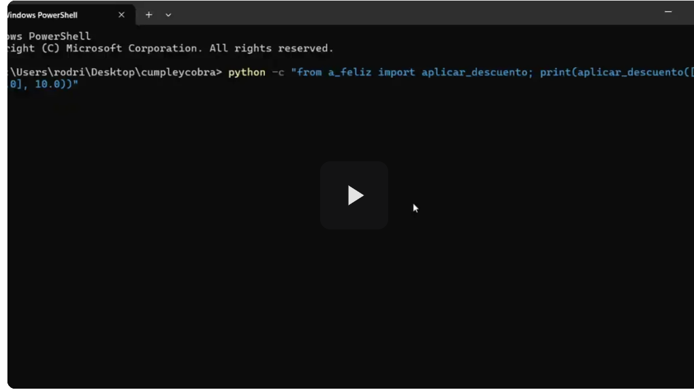

# Fase 4b: pesos, video y consentimiento

Fecha: 24 de septiembre de 2026. Cubre las funciones diferenciadoras 6 (montos en pesos), 4 (video demo; el candado de entrega ya existía) y 5 (revisión manual con consentimiento). El código llegó en el commit `f5dcdc4` y en los cambios de `backend/main.py` y del frontend que ya estaban en `cf5e4a2`; este reporte agrega la comprobación en el navegador con las wallets de Pollar.

## 1. Qué se hizo

| Archivos | Cambio |
| --- | --- |
| `backend/fx.py` | `FxReference`: consulta USD/MXN a Frankfurter (`api.frankfurter.dev/v2/rate/USD/MXN`) con tope de 3 s, 2 reintentos solo ante errores transitorios (1 y 3 s), validación (tasa finita entre 0 y 1000, fecha no futura, par USD/MXN) y caché de 1 hora. Si falla, devuelve la última referencia buena o el valor fijo de respaldo (20 MXN, marcado `fallback: true` y "no cotización"), y reintenta en 60 s. |
| `backend/video.py` | `normalize_video`: acepta solo `https://drive.google.com` con `/file/d/<ID>` (`/view`, `/preview`) u `/open?id=`/`/uc?id=`, sin usuario ni fragmento, máximo 1000 caracteres; devuelve la URL canónica `https://drive.google.com/file/d/<ID>/preview`. No visita el archivo. |
| `backend/main.py` | `GET /fx/usd-mxn`. `/evaluate` normaliza `video_url` (inválido → `400 INVALID_REQUEST`, sin contar envío) y lo usa en el `verdict_hash`. `POST /tasks/{id}/consent` con `code_hash` opcional (por defecto el último envío); `409 NO_REJECTED_DELIVERY` si no es una entrega rechazada. `/delivery` entrega, antes de `Released`, solo el `code_hash` consentido; tras `Released`, el código pagado. `GET /tasks/{id}` expone `latest_code_hash`, `consented_code_hash` y `latest_rejected`; `/verdicts` agrega `video_url` y `consented`. |
| `frontend/src/components/money.tsx` | `Money` muestra primero `≈ $X MXN` y debajo el USDC; `FxNotice` muestra la fecha, la fuente y si es respaldo. `parsePesos` convierte pesos a unidades con aritmética entera (`BigInt`), redondeando hacia arriba a una unidad. |
| `frontend/src/components/video-demo.tsx` | Reproductor de Drive incrustado bajo demanda. Solo acepta la URL canónica que devuelve el backend. |
| `frontend/src/components/assisted-task-form.tsx`, `status-card.tsx`, `app/cliente/page.tsx` | El cliente captura el monto en pesos; los montos del contrato se muestran en pesos con el USDC debajo. El veredicto y la entrega compartida muestran el video. Tarjeta "Código compartido con consentimiento". |
| `frontend/src/app/tarea/[id]/page.tsx`, `src/lib/api.ts` | Campo opcional del enlace de Drive con el aviso de permisos y duración. Tras un rechazo, tarjeta "Revisión del cliente" con casilla de confirmación y botón "Autorizar revisión de este código". |
| `backend/tests/test_delivery_fx.py` | 8 tests (18 casos con parámetros): enlaces válidos e inválidos, consentimiento solo de la entrega concreta y persistencia, video en el hash y en la caché, entrega aprobada sin consentimiento, Frankfurter con caché, caída con respaldo y valores inválidos sin reintento. |
| `frontend/scripts/fase4b-capturas.mjs` | Nuevo: recorrido en el navegador con las dos wallets Pollar y las capturas de este reporte. |

## 2. Desviaciones y decisiones

- **Consentimiento por entrega.** Autoriza un `code_hash` concreto, no las entregas futuras: un envío nuevo requiere otro consentimiento, y la entrega consentida sigue siendo la que ve el cliente. La UI avisa que la autorización no se puede retirar (el cliente ya pudo copiar el código).
- **Video opcional.** El programador puede enviar sin video. El video nunca retrasa ni bloquea un pago aprobado; `video_url` va normalizado al `verdict_hash` (o `null`).
- **Caché y video.** Un reenvío del mismo código devuelve el veredicto en caché (`stage: "cache"`) con el video original; un enlace nuevo con el mismo código no cambia el veredicto ni su hash.
- **Respaldo del tipo de cambio.** El backend usa 20 MXN por USD con fecha fija `2026-09-24`, marcado como respaldo. Si el frontend no llega al backend, usa el mismo valor con la fuente "sin conexión". El depósito siempre se hace en USDC; los pesos son estimados.
- **Pesos a USDC.** Se redondea hacia arriba a una unidad del token para no depositar menos de lo mostrado. En la corrida, 10 MXN a 17.5335 dieron 5 703 368 unidades (0.5703368 USDC).

## 3. Comandos y salidas reales

### Pytest

```text
backend/.venv/Scripts/python -m pytest backend/tests/test_delivery_fx.py -q
18 passed, 2 warnings in 3.19s

backend/.venv/Scripts/python -m pytest backend/tests -q
126 passed, 2 warnings in 4.36s
```

### Tipo de cambio

```text
$ curl -s localhost:8000/fx/usd-mxn
{"rate":"17.5335","as_of":"2026-09-24","source":"Frankfurter","fallback":false}
```

### Recorrido en el navegador

Con backend en `:8000`, frontend en `:3000` y sesiones de Pollar iniciadas por Rodrigo en los dos perfiles (el script no toca credenciales):

```bash
cd frontend
CYC_VIDEO_URL='https://drive.google.com/file/d/1jg-nMazcC4Cln9eSSia5be0RsHSFizM9/view?usp=sharing' node scripts/fase4b-capturas.mjs
```

```text
03:05:19 [cliente] revisando la sesión de Pollar y la trustline…
03:05:20 [programador] revisando la sesión de Pollar y la trustline…
03:05:23 captura docs/fases/img/fase-4b-01-cliente-monto-en-pesos.png
03:05:23 tarea 3Pi1ubNJqZadIooQ
03:05:30 deposit fd550600dbf24af28fde2d68607903e5b0277ee68837c7361ad2301de53c4733
03:05:44 captura docs/fases/img/fase-4b-02-programador-rechazo-y-consentimiento.png
03:05:46 captura docs/fases/img/fase-4b-03-programador-consentimiento-dado.png
03:05:53 captura docs/fases/img/fase-4b-04-cliente-video-y-codigo-consentido.png
```

| Dato | Valor |
| --- | --- |
| Cliente (Pollar) | `GBGK4NLPUTTOTHR5SLSFPOWA74EYH727WGZQ5CKGVX2B4DGF3UVPD4FL` |
| Programador (Pollar) | `GA7MXQO3OL6IMISROP3JJM3NBGOEDHPPK7B5Q2ASNIBNVAPVCE6FBEVJ` |
| Tarea | `3Pi1ubNJqZadIooQ`, 10 MXN, plazo de 5 minutos |
| `rules_hash` | `391136734bc9e21ecfb9626ec4aa3eb5474d4c0995412043def8fd69c4f79c96` |
| Depósito firmado por Pollar | [`fd550600…4733`](https://stellar.expert/explorer/testnet/tx/fd550600dbf24af28fde2d68607903e5b0277ee68837c7361ad2301de53c4733), 5 703 368 unidades |
| Caso B (Gemini) | Rechazado: ✗ criterios 4 y 6 (bucle sin incremento) |
| `code_hash` enviado = consentido = entregado | `3fed1d2950769ea6f4020b18721a2654b812bb48622711e51e5a96a4cb0a0c2d` |
| `verdict_hash` | `391633185280e3baf0b731bf2618e2676d65b00a8b5aa065b6e55183ee4af544` |
| Video enviado | `…/file/d/1jg-nMazcC4Cln9eSSia5be0RsHSFizM9/view?usp=sharing` |
| Video guardado e incrustado | `https://drive.google.com/file/d/1jg-nMazcC4Cln9eSSia5be0RsHSFizM9/preview` |
| `timeout_refund` (firmado por `cyc-third`) | [`bb908229…fdee`](https://stellar.expert/explorer/testnet/tx/bb90822955d0bd83682fb46f5753f5784b35b4d3f0916b3417074b28f3ccdfee), 5 703 368 unidades de vuelta al cliente |

```text
$ stellar contract invoke --id CAWAZODOFP67HETHN4NLYOECPCJACGLUTCLARVGLBZ7TJDLT4KLQRATQ --source cyc-third --network testnet -- timeout_refund --task_id '"3Pi1ubNJqZadIooQ"'
ℹ️  Signing transaction: bb90822955d0bd83682fb46f5753f5784b35b4d3f0916b3417074b28f3ccdfee
✅ Transaction submitted successfully!
📅 CAWAZODOFP67HETHN4NLYOECPCJACGLUTCLARVGLBZ7TJDLT4KLQRATQ - Success - Event: TimeoutRefundEvent (timeout_refund), task_id: "3Pi1ubNJqZadIooQ", client: "GBGK4NLPUTTOTHR5SLSFPOWA74EYH727WGZQ5CKGVX2B4DGF3UVPD4FL", amount: "5703368"
```

Saldo final del cliente en Horizon: `USDC=1.0000000`, igual que antes de la corrida.

Intentos previos de la misma sesión, sin capturas válidas:

- `9Gd6KJ5WHUhdEnWD`: creada con 210 MXN porque el script no reemplazó el valor del campo; el saldo no alcanzaba y **no se depositó**. Solo existe en `state.json`.
- `j_iE-DaOH4cb478h`: depositada ([`6f6ade03…0295`](https://stellar.expert/explorer/testnet/tx/6f6ade03a8857d99520f81e24dd2642fee90ba3712a72109783076a9cd820295)); el campo del video quedó vacío y el script se detuvo antes de enviar. Reembolsada con `timeout_refund` ([`e674bae8…8f63`](https://stellar.expert/explorer/testnet/tx/e674bae85dd4f6f58a5164e7ccf015ec858315a8985f7b8656650e62d5a88f63)).

### Capturas

Ninguna muestra tokens: el enlace de invitación aparece enmascarado (`invitacion=••••`).

**1. Cliente: monto en pesos.** 10 MXN se muestran como `≈ $10.00 MXN` con `0.57 USDC` debajo y el aviso del tipo de cambio de referencia de Frankfurter.



**2. Programador: caso B con enlace de Drive, rechazo por criterio y tarjeta de consentimiento.** El monto del contrato aparece en pesos. El botón de autorizar está desactivado hasta marcar la casilla.



**3. Programador: consentimiento dado.** "Autorizaste compartir esta entrega. Las entregas futuras requieren otro consentimiento."



**4. Cliente: veredicto con video, "Aprobar manualmente" y código compartido.** La entrega muestra el mismo `code_hash` consentido. El iframe de Drive se ve en blanco en la captura de página completa (limitación de la captura con iframes de otro origen); abajo va el reproductor capturado en la ventana.



**4b. Detalle: reproductor de Drive incrustado en la vista del cliente**, con el video real de la demo.



## 4. Pendientes y riesgos

- **`fase3-hito.mjs` ya no funciona tal cual:** desde la fase 4a, la revisión de USDC de `/cliente` aparece en el paso 3 del pedido, y ese script la espera sin cargar un pedido. `fase4b-capturas.mjs` ya carga la plantilla primero; el hito de la fase 3 no se volvió a ejecutar.
- **Campo del video en la automatización:** una vez, el campo quedó vacío justo después de elegir el caso. No se reprodujo a mano ni se encontró la causa en la UI; el script ahora reintenta y comprueba el valor antes de enviar.
- **Permisos y duración del video:** el backend no puede comprobarlos. Si el archivo no es público, el reproductor muestra el error de Drive; la UI lo avisa.
- **Respaldo del tipo de cambio:** su fecha fija (`2026-09-24`) no se actualiza. Si Frankfurter falla varios días, el aviso seguirá mostrando esa fecha, marcada como respaldo.
- No se repitió el camino con "Aprobar manualmente" después del consentimiento: `client_release` con Pollar quedó probado en la fase 3. Freighter sigue sin probar.
