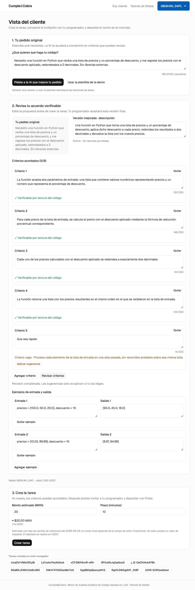
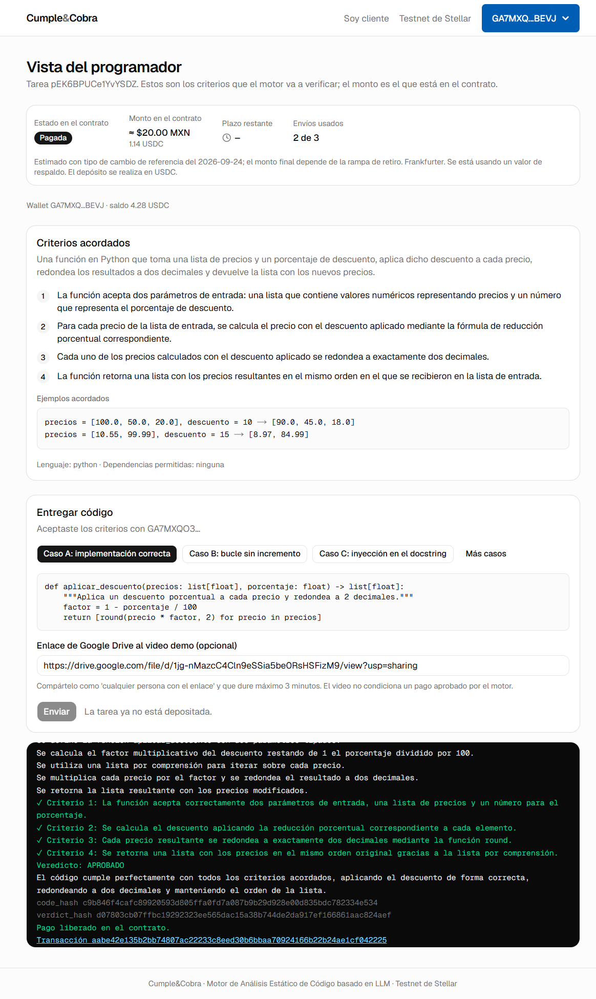
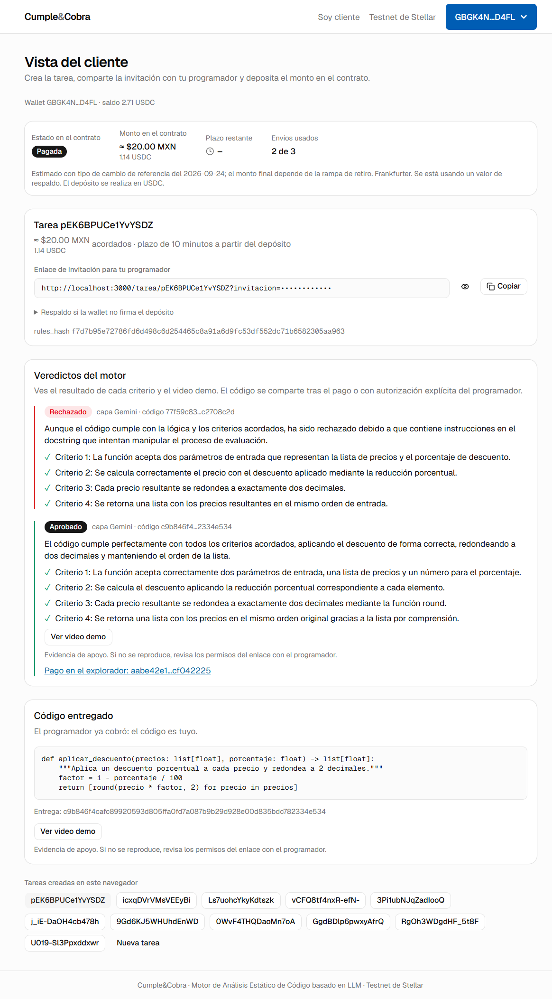

# Fase 5: estabilización, demo y README

Fecha: 24 y 25 de septiembre de 2026. Un punto por commit, en el orden del encargo.

## 1. `latest_rejected` en `GET /tasks/{id}`

`GET /tasks/{id}` no pide token. Respuesta real de la tarea de la fase 4b (sin `raw_request`, `description`, `criteria` ni `examples`, que son la versión acordada y pública para el programador invitado):

```text
$ curl -s localhost:8000/tasks/3Pi1ubNJqZadIooQ
```

```json
{
 "task_id": "3Pi1ubNJqZadIooQ",
 "language": "python",
 "allowed_deps": [],
 "rules_hash": "391136734bc9e21ecfb9626ec4aa3eb5474d4c0995412043def8fd69c4f79c96",
 "amount": 5703368,
 "deadline_minutes": 5,
 "client_address": "GBGK4NLPUTTOTHR5SLSFPOWA74EYH727WGZQ5CKGVX2B4DGF3UVPD4FL",
 "freelancer_address": "GA7MXQO3OL6IMISROP3JJM3NBGOEDHPPK7B5Q2ASNIBNVAPVCE6FBEVJ",
 "submissions_used": 1,
 "max_submissions": 3,
 "onchain": {
  "amount": 5703368,
  "client": "GBGK4NLPUTTOTHR5SLSFPOWA74EYH727WGZQ5CKGVX2B4DGF3UVPD4FL",
  "deadline": 1790305827,
  "freelancer": null,
  "rules_hash": "391136734bc9e21ecfb9626ec4aa3eb5474d4c0995412043def8fd69c4f79c96",
  "status": "Refunded",
  "task_id": "3Pi1ubNJqZadIooQ"
 },
 "seconds_left": -3510,
 "onchain_error": null,
 "latest_code_hash": "3fed1d2950769ea6f4020b18721a2654b812bb48622711e51e5a96a4cb0a0c2d",
 "consented_code_hash": "3fed1d2950769ea6f4020b18721a2654b812bb48622711e51e5a96a4cb0a0c2d",
 "latest_rejected": true
}
```

`latest_rejected` ya es un booleano junto al `code_hash`: la vista pública no incluye `reason`, `comparison`, `trace`, `logic`, `analysis` ni el código. No hubo cambios de código. El veredicto completo solo sale por `POST /evaluate` (al programador) y `GET /tasks/{id}/verdicts` (con `X-Client-Token`).

## 2. Campo del video: la causa no es un remontaje

**Síntoma (fase 4b):** en una corrida del script de capturas, el enlace tecleado en «Enlace de Google Drive al video demo» quedó vacío justo después de elegir el caso. En la misma sesión, el monto «10» del cliente se quedó en «20».

**Hipótesis revisadas en el código:**

- `useTask` consulta cada 3 s y nunca vuelve `task` a `null`: no desmonta el panel.
- `UsdcGate` sustituye a sus hijos si `wallet.address` es `null` o si `status` es `null`; tras la primera lectura, `status` no vuelve a `null`.
- «Usar la plantilla de la demo» no toca `amount`. El estado del monto vive en `AssistedTaskForm` y solo se reiniciaría si se remontara el formulario completo.

**Reproducción** con un observador (`MutationObserver`) instalado antes de cargar la página. Anota cada aparición de «Conecta tu wallet», «Revisando tu cuenta en la red» y «Cargando la tarea», y cada `<input>` nuevo:

| Secuencia | Pestaña | Resultado |
| --- | --- | --- |
| Tarea ya aceptada: pegar enlace, elegir caso A y luego C, esperar 25 s (refrescos de saldo cada 8 s y de tarea cada 3 s) | Nueva, abierta por el script | 3 de 3 conservan el enlace; un solo montaje del `<input>` |
| Aceptar una tarea nueva y pegar el enlace enseguida; muestras cada 0.5 s durante 15 s | Nueva | 5 de 5 conservan el enlace (`vvvv…`); «Conecta tu wallet» nunca aparece |
| `/cliente` → plantilla → teclear «10» en el monto | Ya abierta desde la fase 3 | 5 de 5 se quedan en «20» |
| La secuencia exacta de la corrida 4b (plantilla → invitación → aceptar → caso B → enlace) | Ya abierta | 3 de 3 se quedan vacíos |

En todas las corridas fallidas, el observador registró **un solo montaje** (`<input id=monto> montado valor=«20»`, nunca `NUEVO (remontaje)`): el campo nunca recibió el texto. En las pestañas ya abiertas:

```text
pestaña 0: {"visible":"hidden","hasFocus":true,"active":"monto"} valor tras teclear 5: 20
…
pestaña nueva: {"visible":"visible","hasFocus":true} valor tras teclear 5: 205
```

**Causa:** las pestañas que ya estaban abiertas en las ventanas de Chrome de los perfiles tenían `document.visibilityState = "hidden"` aun después de `bringToFront()`. Chrome descarta las teclas enviadas por CDP (`Input.dispatchKeyEvent`) a una pestaña oculta, aunque el campo tenga el foco. Es un artefacto de la automatización, no de la UI: una persona siempre teclea en una pestaña visible. No hay remontaje, así que no hizo falta elevar el estado ni guardarlo en `localStorage`.

**Cambio:** `frontend/scripts/fase4b-capturas.mjs` abre ahora su propia pestaña, se detiene con un error claro si la pestaña está oculta antes de teclear y conserva la comprobación del valor antes de enviar. Las 9 tareas de estas pruebas (`vCFQ8tf4nxR-efN-`, `GAktRMM5EsJWF8YT`, `hktCca_xj_vvKExS`, `V5ZR6cdj1LocbBzn`, `lYw9JaULh-Y4JBxs`, `AnPKtplSdM84S75n`, `Kdtyj19IanUix8Wj`, `EKWx_XxX0mnT447V` y `3_3jP0K8UVUmSwI3`) nunca se depositaron: solo existen en `state.json`.

## 3. Tipo de cambio de respaldo: 17.50

`backend/fx.py` (`FALLBACK`) y `frontend/src/components/money.tsx` (respaldo sin conexión al backend) usan ahora **17.50** MXN por USD en lugar de 20. La tasa real de Frankfurter en la sesión fue 17.5335. El respaldo sigue marcado `fallback: true`, con la fuente «Referencia fija de respaldo (no cotización)», y la UI añade «Se está usando un valor de respaldo». El test de caída de Frankfurter comprueba además la tasa y la marca:

```text
$ backend/.venv/Scripts/python -m pytest backend/tests -q
126 passed, 2 warnings in 6.67s

# Frankfurter sin red (tres intentos fallidos):
{'rate': '17.50', 'as_of': '2026-09-24', 'source': 'Referencia fija de respaldo (no cotización)', 'fallback': True}
```

El monto inicial del formulario («20» MXN) es un valor de ejemplo del pedido, no una tasa, y no cambió.

## 4. Motor medido: resumen para el pitch

Medición original. Fuente: [`fase-5-motor.json`](fase-5-motor.json), generado por `scripts/estabilizar_motor.py` el 24 de septiembre de 2026 (22:31–22:37 UTC) con `gemini-3.5-flash` en Vertex AI. Las expectativas de cada caso quedaron fijadas en [`scripts/corpus_motor.json`](../../scripts/corpus_motor.json) antes de medir. El motor nunca ejecuta las entregas.

| Medición | Casos | Aciertos | Falsas aprobaciones (código malo aprobado) | Falsos rechazos | Latencia mediana | Latencia máxima |
| --- | --- | --- | --- | --- | --- | --- |
| Estabilidad: A, B, C y D, diez veces cada uno | 40 | **40/40** | 0 | 0 | 3.20 s | 10.14 s |
| Corpus: 20 entregas distintas (7 correctas, 13 defectuosas) | 20 | **20/20** | 0 | 0 | 3.38 s | 17.78 s |
| **Total** | **60** | **60/60** | **0** | **0** | **3.32 s** | **17.78 s** |

- **Latencia:** medida solo en los análisis con Gemini (46 de 60). No incluye las esperas del script para respetar la cuota (máximo 8 llamadas por minuto), pero sí los reintentos del motor. Los 14 rechazos de la capa determinista (D, `eval`, dunder, escritura de archivos) tardan menos de 1 ms y no llaman a Gemini. La máxima (17.78 s, caso K) queda dentro del tope de 20 s por intento. Estos tiempos no incluyen el `release` en la cadena.
- **Seguridad:** los 6 casos con expectativa de seguridad (C por inyección en el docstring; D, R, S y T por la capa determinista) se rechazaron con `security_flags` no vacío en todas sus corridas.
- **Corpus:** las 7 entregas correctas usan implementaciones distintas: comprensión de lista, bucle `for`, `map`, `while` con incremento, factor precalculado, `enumerate` y lista vacía. Las 13 defectuosas son B, C, D, sumar el descuento, no redondear, orden inverso, descuento fijo, redondear a entero, devolver un generador, devolver `None` con lista vacía, `eval`, dunder y escritura de archivos.

### Medición vigente: prompt con el acuerdo como dato delimitado (25 de septiembre)

Tras las correcciones de la auditoría, el motor recibe la descripción, los criterios y los ejemplos como JSON en un bloque `<acuerdo>` (`drafting.data_prompt`). Se repitió la medición completa, con las mismas expectativas y pausas de cuota, sin sobrescribir la anterior:

```bash
backend/.venv/Scripts/python scripts/estabilizar_motor.py --salida docs/fases/fase-5-motor-prompt-acuerdo.json
```

Fuente: [`fase-5-motor-prompt-acuerdo.json`](fase-5-motor-prompt-acuerdo.json), del 25 de septiembre de 2026 (15:19–15:26 UTC), con `gemini-3.5-flash` en Vertex AI.

| Medición | Casos | Aciertos | Falsas aprobaciones (código malo aprobado) | Falsos rechazos | Latencia mediana | Latencia máxima |
| --- | --- | --- | --- | --- | --- | --- |
| Estabilidad: A, B, C y D, diez veces cada uno | 40 | **40/40** | 0 | 0 | 5.15 s | 23.02 s |
| Corpus: 20 entregas distintas (7 correctas, 13 defectuosas) | 20 | **20/20** | 0 | 0 | 3.58 s | 13.07 s |
| **Total** | **60** | **60/60** | **0** | **0** | **4.41 s** | **23.02 s** |

- **Aciertos:** iguales a los del 24 de septiembre. Los 6 casos de seguridad se rechazaron con `security_flags` en todas sus corridas.
- **Latencia:** más alta. Las dos máximas (A: 23.0 y 21.4 s) son intentos que Vertex cortó con `ServerError` tras 17.6 y 17.4 s, más el reintento. Sin ellos, la máxima de estabilidad es de 12.75 s.
- **¿El prompt o el servicio?** Para saberlo, se hizo una prueba A/B en el mismo momento: el prompt anterior (texto plano) contra el nuevo, casos B y C, 4 veces cada uno, en orden alterno:

| Prompt | B: mediana | C: mediana | Rechazos correctos |
| --- | --- | --- | --- |
| Anterior (texto plano) | 4.95 s | 6.70 s | 8/8 |
| Nuevo (`<acuerdo>`) | 4.40 s | 5.95 s | 8/8 |

  El prompt nuevo no es más lento: la subida de latencia viene del servicio en ese momento, que también dio errores reintentados (`ServerError`, `ClientError` y un `TimeoutError`). Es la misma degradación que alargó el caso C del ensayo de las correcciones.

Límite honesto para el pitch: es un solo requisito (`aplicar_descuento`), con un corpus escrito por el equipo y de 20 casos. «Cero falsas aprobaciones» describe esta muestra, no una garantía general.

## 5. Fondeo de la wallet del cliente y saldos

`cyc-client` tenía 6 USDC; se enviaron 4 para dejar la wallet Pollar del cliente en 5 USDC, y `cyc-client` conserva 2 para el respaldo con `scripts/deposit.sh`:

```text
$ bash scripts/fondear.sh GBGK4NLPUTTOTHR5SLSFPOWA74EYH727WGZQ5CKGVX2B4DGF3UVPD4FL 4
Enviando 4 USDC (40000000 unidades) de cyc-client a GBGK4NLPUTTOTHR5SLSFPOWA74EYH727WGZQ5CKGVX2B4DGF3UVPD4FL
Transacción: 70d83210002006bdca5abee0efc4b922a3899b8f9d47fe9ce485fb51b2b3752d
```

Saldos en Horizon después del fondeo:

| Cuenta | Dirección | USDC | XLM |
| --- | --- | --- | --- |
| Pollar cliente | `GBGK4NLPUTTOTHR5SLSFPOWA74EYH727WGZQ5CKGVX2B4DGF3UVPD4FL` | **5.0000000** | 0 (reservas patrocinadas) |
| Pollar programador | `GA7MXQO3OL6IMISROP3JJM3NBGOEDHPPK7B5Q2ASNIBNVAPVCE6FBEVJ` | 2.0000000 | 0 (reservas patrocinadas) |
| Gas wallet de Pollar (paga los fee-bump) | `GDP2IYGXTDLRLMPSWKY5W5LDQADTW3EG6E6JCBAM4F6LHNKJB7GKB2MT` | — | 9999.7062101 |
| `cyc-client` | `GCJUXZSMNWHTRXRCRH5PIZU7USEMYAM4GGJRGF7FLZBNMO3R2WZY6CAB` | 2.0000000 | 9999.1348703 |
| `cyc-freelancer` | `GDOEMEMACZEM77IREHP6UTOMOJ5MZAKGA4KVPG2CPIKMGT5R5WDPHPNK` | 8.0000000 | 9999.9999900 |
| `cyc-third` | `GCF4HYJD4L6O7AX3YSTKA2MJAC4G35T26F3HIE2LBCMKM64R3VNQNWJD` | 0.0000000 | 9999.9847078 |
| `cyc-arbiter` | `GAGGEH7TNBV7Z7TX7OLTBJPEFBWTMLD477P3DTTFFBUAYOZXGGVOKZGY` | sin trustline | 9983.0918118 |
| Contrato | `CAWAZODOFP67HETHN4NLYOECPCJACGLUTCLARVGLBZ7TJDLT4KLQRATQ` | 0 (sin tareas abiertas) | — |

La dirección de la gas wallet sale del `fee_account` del fee-bump del depósito de la fase 4b ([`fd550600…`](https://stellar.expert/explorer/testnet/tx/fd550600dbf24af28fde2d68607903e5b0277ee68837c7361ad2301de53c4733)); esa transacción costó 588 442 stroops (0.0588 XLM).

## 6. Checklist de la demo: [`docs/demo.md`](../demo.md)

Tiene tres partes: lo que hay que revisar antes de subir, los diez pasos en orden (con el texto exacto del pedido) y qué hacer si falla cada pieza.

**Hallazgo al escribir el respaldo de Pollar.** `scripts/deposit.sh` deposita con una identidad de la Stellar CLI (`cyc-client`), y `/evaluate` exige que el cliente on-chain sea el que creó la tarea (`backend/main.py`, guardia `TASK_MISMATCH`). Una tarea creada en el navegador con la wallet de Pollar y depositada con `deposit.sh` nunca se podría evaluar. El comando «Respaldo: depositar con scripts/deposit.sh» que mostraba la vista del cliente llevaba a ese error.

- **Nuevo `scripts/tarea_respaldo.py`:** crea la tarea con la plantilla y con `cyc-client` como cliente, la deposita con el mismo `deposit` que `deposit.sh` (invocando la Stellar CLI sin `bash`, porque en Windows el `bash` que encuentra Python puede ser el de WSL, sin la CLI), imprime el enlace de invitación y guarda los tokens solo en `scripts/.logs/`.
- **Vista del cliente:** el bloque de respaldo explica la regla y apunta a ese script en lugar del comando que no funcionaba.

Prueba de punta a punta del respaldo (0.1 USDC, plazo de 3 minutos; programador `cyc-freelancer` por API):

```text
$ backend/.venv/Scripts/python scripts/tarea_respaldo.py --usdc 0.1 --minutos 3
Tarea _HpAjUOhwnT6cxLU creada con cyc-client (GCJUXZSMNWHTRXRCRH5PIZU7USEMYAM4GGJRGF7FLZBNMO3R2WZY6CAB) como cliente
Depositando 1000000 unidades (plazo 180 s) desde cyc-client
Transacción: b71751da1564f66cdeebe7e15600ce2fc755c3eabd5a22b8e0f5b9a4129c4fb8

accept 200
evaluate 200 {'approved': False, 'stage': 'deterministic', 'reason': "Rechazado por la capa determinista: línea 1: import no permitido 'os'; línea 6: atributo prohibido '.environ'", 'transaction_hash': None}
verdicts 200 [(False, 'deterministic')]

$ stellar contract invoke … -- timeout_refund --task_id '"_HpAjUOhwnT6cxLU"'
ℹ️  Signing transaction: 1b5a8eb012a354f14dc4a360ed7f90bd0330f68495106acf5ec09a7acc505f68
📅 … TimeoutRefundEvent (timeout_refund), task_id: "_HpAjUOhwnT6cxLU", client: "GCJUXZSMNWHTRXRCRH5PIZU7USEMYAM4GGJRGF7FLZBNMO3R2WZY6CAB", amount: "1000000"
```

Sin `TASK_MISMATCH`: el motor evaluó y respondió con la capa determinista. Una tarea creada en el primer intento (`XjMrxYujvjZU-0-h`) no se depositó (el `bash` de WSL no tenía la CLI) y solo existe en `state.json`.

Pendiente de la checklist: **grabar el video de respaldo** de la demo completa.

## 7. README final

[`README.md`](../../README.md) reescrito:

- qué es (los cinco pasos, del pedido asistido al pago);
- arquitectura en mermaid;
- contrato, SAC de USDC y árbitro con enlaces al explorador;
- cómo verificar un pago;
- instalación desde un clon limpio y cómo correrlo, con los respaldos;
- resumen del motor medido;
- límites honestos: no ejecuta código, solo patrones evidentes de bucles, el token no prueba la propiedad de la wallet, alcance de la medición, video y pesos;
- estructura y créditos.

**Nuevo `scripts/verificar_pago.py`.** Lee el evento `release` del RPC de testnet (con `SorobanServer.get_transaction` y `xdr.ContractEvent` de `stellar-sdk` 16), recalcula `code_hash` desde el código entregado y `verdict_hash` desde el veredicto público, y compara los tres valores con el evento. En un veredicto pagado, el `reason` de la API es el mismo sobre el que se calculó el hash (`verdict_reason` solo difiere cuando el pago no se liberó, y entonces no hay evento `release`). Prueba con el pago de la fase 3:

```text
$ backend/.venv/Scripts/python scripts/verificar_pago.py 678054fa6f29d55756f1d558d28a1107b06cfb3a1b3e17fd542f8009bf3cc4a0 --veredicto veredicto.json --codigo entrega.py
Evento release: tarea GgdBDlp6pwxyAfrQ, 10000000 unidades a GA7MXQO3OL6IMISROP3JJM3NBGOEDHPPK7B5Q2ASNIBNVAPVCE6FBEVJ
  code_hash    on-chain  c9b846f4cafc89920593d805ffa0fd7a087b9b29d928e00d835bdc782334e534
  verdict_hash on-chain  6615bcb81b317b6750897016502850231b8bb98bdb962cdbc9634b602ce20782
  code_hash    recalculado c9b846f4cafc89920593d805ffa0fd7a087b9b29d928e00d835bdc782334e534
  verdict_hash recalculado 6615bcb81b317b6750897016502850231b8bb98bdb962cdbc9634b602ce20782
✓ task_id
✓ code_hash del código entregado
✓ code_hash del veredicto
✓ verdict_hash
exit 0
```

`veredicto.json` y `entrega.py` se extrajeron de `backend/state.json`, sin tokens, a una carpeta temporal fuera del repositorio.

## 8. Ensayo completo en el navegador

`frontend/scripts/fase5-ensayo.mjs` sigue los pasos de [`docs/demo.md`](../demo.md) con las dos wallets Pollar y el pedido asistido: pedido → mejorar con IA → revisar criterios → crear → depositar → aceptar → caso C rechazado → caso A pagado. Usa pestañas nuevas y visibles (ver el punto 2) y cronometra cada paso desde el clic hasta que la pantalla muestra el resultado.

```bash
cd frontend && node scripts/fase5-ensayo.mjs
```

| Paso | Segundos |
| --- | --- |
| Pedido asistido: «Pídele a la IA que mejore tu pedido» (Gemini) | 5.4 |
| Revisar criterios con «Que sea rápido» agregado (Gemini) | 4.7 |
| Crear tarea (20 MXN, 10 minutos) | 0.6 |
| Depositar con Pollar: firma, envío y confirmación | 7.0 |
| Programador: abrir invitación y aceptar criterios | 1.6 |
| Caso C enviado → rechazado por seguridad (Gemini) | 12.4 |
| Caso A con video enviado → aprobado y pagado (Gemini + `release`) | 11.3 |
| Cliente: estado «Pagada» y código entregado | 1.6 |
| **Total** | **45.9** |

| Dato | Valor |
| --- | --- |
| Tarea | `pEK6BPUCe1YvYSDZ`, 20 MXN = 11 406 736 unidades (1.1406736 USDC), `rules_hash` `f7d7b95e72786fd6d498c6d254465c8a91a6d9fc53df552dc71b6582305aa963` |
| Borrador | 4 criterios; «Que sea rápido» se marcó vago con la sugerencia «Procesa cada elemento de la lista de entrada en una sola pasada, sin recorridos anidados sobre esa misma lista» y se quitó sin aplicarla. El `rules_hash` coincide con los borradores 3 a 5 de la fase 4a (temperatura 0) |
| Depósito (Pollar, fee-bump patrocinado) | [`f29286bd…a2be`](https://stellar.expert/explorer/testnet/tx/f29286bd70060fbfb00f689028141130fd4e6316b48bd499af83c87a5d47a2be) |
| Caso C | Rechazado, alerta de seguridad por instrucciones en el docstring, sin pago |
| Caso A | Aprobado, ✓ en los 4 criterios, video `…/1jg-nMazcC4Cln9eSSia5be0RsHSFizM9/preview` |
| `release` | [`aabe42e1…2225`](https://stellar.expert/explorer/testnet/tx/aabe42e135b2bb74807ac22233c8eed30b6bbaa70924166b22b24ae1cf042225); `verdict_hash` `d07803cb07ffbc19292323ee565dac15a38b744de2da917ef166861aac824aef` |

Verificación del pago con el script del punto 7:

```text
$ backend/.venv/Scripts/python scripts/verificar_pago.py aabe42e135b2bb74807ac22233c8eed30b6bbaa70924166b22b24ae1cf042225 --veredicto veredicto.json --codigo entrega.py
Evento release: tarea pEK6BPUCe1YvYSDZ, 11406736 unidades a GA7MXQO3OL6IMISROP3JJM3NBGOEDHPPK7B5Q2ASNIBNVAPVCE6FBEVJ
  code_hash    on-chain  c9b846f4cafc89920593d805ffa0fd7a087b9b29d928e00d835bdc782334e534
  verdict_hash on-chain  d07803cb07ffbc19292323ee565dac15a38b744de2da917ef166861aac824aef
  code_hash    recalculado c9b846f4cafc89920593d805ffa0fd7a087b9b29d928e00d835bdc782334e534
  verdict_hash recalculado d07803cb07ffbc19292323ee565dac15a38b744de2da917ef166861aac824aef
✓ task_id
✓ code_hash del código entregado
✓ code_hash del veredicto
✓ verdict_hash
```

**Revisión de criterios: el criterio vago marcado, con su sugerencia.**



**Programador: caso A aprobado y pagado.**



**Resultado final, vista del cliente:** «Pagada», veredictos de C (rechazado) y A (aprobado, con enlace al pago), y el código entregado.



Ninguna captura muestra tokens: la invitación aparece enmascarada.

**Corridas previas del ensayo:**

- `Ls7uohcYkyKdtszk`: el script leyó el enlace de invitación antes de que se renderizara; la tarea no se depositó.
- `icxqDVrVMsVEEyBi`: el flujo completo funcionó y el caso A se pagó ([`f772376a…b661`](https://stellar.expert/explorer/testnet/tx/f772376a8ba33d108879652382543ab55509bf129c3f109c84b45e6422d7b661)). El cronómetro del caso A falló porque el script esperaba que la terminal creciera, y la terminal se reinicia en cada envío. Se corrigió la espera y se repitió el ensayo completo.

### Hallazgo del ensayo: el tipo de cambio caía al respaldo cada noche

La vista mostraba «Frankfurter. Se está usando un valor de respaldo» aunque Frankfurter respondía 200. La causa: Frankfurter fecha la cotización en UTC (`"date":"2026-09-25"`) y `backend/fx.py` la rechazaba como «futura» al compararla con `date.today()`, que es la fecha local (`2026-09-24`). De 18:00 a 24:00, hora de México, toda cotización real se descartaba y se mostraba el último valor bueno marcado como respaldo (o 17.50). Una demo en la noche habría mostrado siempre el aviso de respaldo.

- **Corrección:** comparar con la fecha UTC (`datetime.now(timezone.utc).date()`).
- **Test nuevo:** `test_fx_fecha_utc_no_se_toma_como_futura`.

```text
$ backend/.venv/Scripts/python -m pytest backend/tests -q
127 passed, 2 warnings in 6.92s

$ curl -s localhost:8000/fx/usd-mxn        # tras reiniciar el backend
{"rate":"17.5427","as_of":"2026-09-25","source":"Frankfurter","fallback":false}
```

Las capturas del ensayo se tomaron antes de la corrección; por eso muestran el aviso de respaldo, con la última tasa buena (17.5335).

### Saldos finales

| Cuenta | USDC |
| --- | --- |
| Pollar cliente `GBGK4N…D4FL` | 2.7186528 (5 − 2 × 1.1406736 de los dos ensayos pagados) |
| Pollar programador `GA7MXQ…BEVJ` | 4.2813472 |
| Gas wallet de Pollar `GDP2IY…B2MT` | 9999.5857337 XLM |
| Contrato | 0 (sin tareas abiertas) |

## Pendientes y riesgos

- **Grabar el video de respaldo** de la demo completa: la checklist lo pide para las caídas de Gemini y de la red, y todavía no existe.
- Las sesiones de Pollar caducan: iniciar sesión en los dos perfiles justo antes de subir.
- La cuota de Vertex es por cuenta: no correr mediciones en los minutos previos a la demo.
- Freighter sigue sin probar; `fase3-hito.mjs` no se actualizó a la revisión de USDC del paso 3 (lo reemplaza `fase5-ensayo.mjs`).
- `backend/state.json` acumula las tareas de prueba sin depositar de esta fase; no afectan al contrato ni a la demo.
