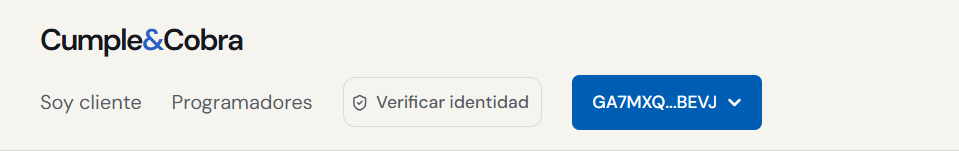
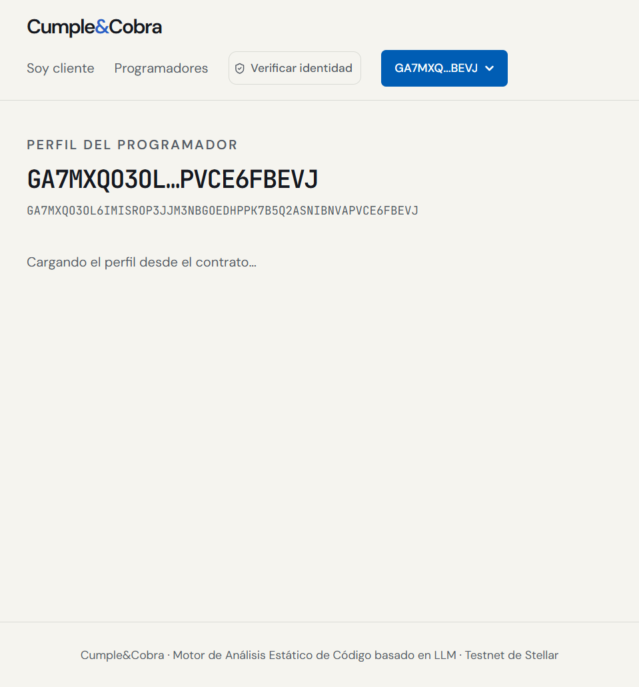
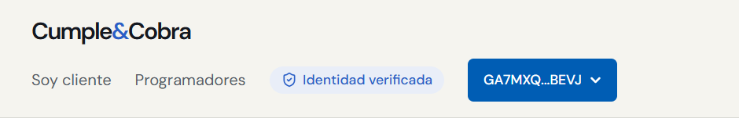
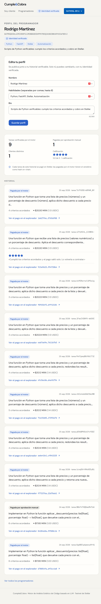
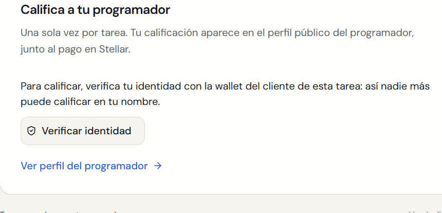
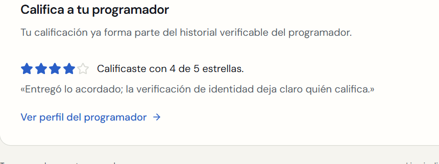
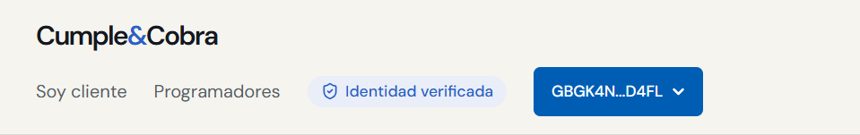
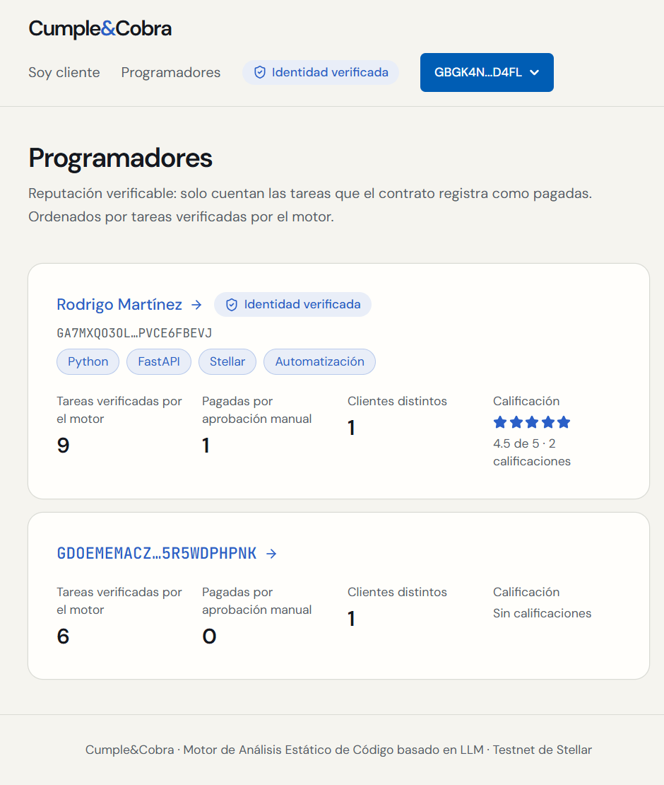

# Identidad verificable (SEP-10) y perfiles

Rama `identidad`, creada desde `main` (`e47aa11`, que ya incluía `reputacion`: `git merge-base --is-ancestor origin/reputacion origin/main` → sí). **No se fusionó con `main`.** Fecha: 25 de septiembre de 2026.

Todo es aditivo:

- **El flujo del dinero no exige identidad:** invitación, `/accept`, depósito, `/evaluate` y pago funcionan igual.
- **Sin cambios** en el contrato, `stellar_client.py`, la capa determinista, `gemini.py`, `/evaluate`, `/accept`, `/consent`, `/delivery` ni los hooks de wallet y Pollar (`git diff main` vacío en todos).

| Commit | Contenido |
| --- | --- |
| `5417042` | Backend: retos SEP-10, sesión HMAC, `PUT /perfil`, calificación con sesión y 21 tests |
| `9460541` | Frontend: «Verificar identidad», insignia, edición del perfil, calificación con sesión y tests |
| (este) | Script de capturas, capturas y este reporte |

## Paso 1: prueba rápida (unos 10 minutos de los 45)

**Resultado: funciona.** Pollar firma el reto SEP-10 de su wallet custodial y la firma verifica con los firmantes de la cuenta.

1. **Método de firma.** En `@pollar/core` 0.11.3 (el instalado) existe `PollarClient.stellar.sep10.sign({ challengeXdr, homeDomains, webAuthDomain })`: `readonly stellar: StellarSepApi` en `index.d.ts`, línea 9537. Su documentación dice «Sign a SEP-10 web-auth challenge (ownership proof, custodial)» y que el servidor de Pollar valida que sea un reto inofensivo y no enviable antes de firmarlo. Es el método propio para SEP-10, en lugar de `signTx`, que además intentaría patrocinar la comisión con un fee-bump. `tsc` confirmó la firma de la función.
2. **Reto.** `build_challenge_transaction` de `stellar_sdk.sep.stellar_web_authentication` para `GA7MXQO3OL6IMISROP3JJM3NBGOEDHPPK7B5Q2ASNIBNVAPVCE6FBEVJ`, con una llave de servidor temporal en memoria: dos `ManageData`, secuencia 0 y 300 s de validez.
3. **Firma.** Desde el navegador del programador, con su sesión de Pollar (custodia `internal`): `{"status":"signed","signedXdr":"AAAAAgAAAAA…","signerAddress":"GA7MXQO3OL6IMISROP3JJM3NBGOEDHPPK7B5Q2ASNIBNVAPVCE6FBEVJ"}`. El sobre es una transacción normal (`AAAAAg…`, no un fee-bump), con el mismo hash que el reto y 2 firmas (servidor y cliente).
4. **Firmantes en Horizon:** solo la llave maestra `GA7MXQ…` con peso 1; `med_threshold` 0.
5. **Verificación con el SDK:**

```text
cliente del reto: GA7MXQO3OL6IMISROP3JJM3NBGOEDHPPK7B5Q2ASNIBNVAPVCE6FBEVJ
✓ verify_challenge_transaction_signed_by_client_master_key
✓ verify_challenge_transaction_signers -> ['GA7MXQ']
✓ verify_challenge_transaction_threshold (med) -> ['GA7MXQ']
✓ XDR alterado rechazado: InvalidSep10ChallengeError Transaction not signed by server: …
```

La página temporal de la prueba (`/prueba-sep10`) se borró y nunca se subió.

## Paso 2: identidad y perfiles

### Backend (`backend/identidad.py` y endpoints en `main.py`)

| Endpoint | Qué hace |
| --- | --- |
| `GET /auth/challenge?address=G…` | Reto SEP-10 firmado con `SEP10_SIGNING_SECRET`, de un solo uso (se guarda por su nonce en memoria) y que caduca en 5 min. Responde `transaction`, `network_passphrase`, `home_domain` (`localhost:3000`), `web_auth_domain` (`localhost:8000`) y `expires_in`. |
| `POST /auth/token {transaction}` | Consume el reto: `CHALLENGE_USED` si ya se usó, `CHALLENGE_EXPIRED` si pasaron 5 min, `CHALLENGE_INVALID` si no es de este servidor, está alterado o mal formado. Valida con `read_challenge_transaction`. Lee de Horizon los firmantes y el umbral medio y verifica con `verify_challenge_transaction_threshold`; si la cuenta no existe, con `verify_challenge_transaction_signed_by_client_master_key` (`SIGNATURE_INVALID` si la firma no es de la cuenta). Si Horizon no responde: `502` y el reto vuelve a quedar pendiente. Devuelve un token HMAC-SHA256 de `dirección.expira` (12 h) para `Authorization: Bearer`. |
| `PUT /perfil` | Con sesión: `nombre` (≤ 60), `habilidades` (máx. 8, cada una ≤ 30; sin vacíos ni repetidos) y `bio` (≤ 280). Guarda el perfil de la dirección de la sesión; si el cuerpo trae otra `address`, `403 NOT_PROFILE_OWNER`. |
| `GET /programadores` y `/programadores/{address}` | Incluyen `nombre`, `habilidades`, `bio` e `identidad_verificada: true` solo si el dueño publicó su perfil. |
| `POST /tasks/{id}/calificacion` | Además del `X-Client-Token`, exige una sesión cuya dirección sea el cliente on-chain de la tarea: `401 SESSION_REQUIRED` si falta, caducó o es inválida; `403 NOT_TASK_CLIENT` si no coincide. |

- **Llaves:** `SEP10_SIGNING_SECRET` (llave nueva, sin fondos: su cuenta no existe en testnet) y `SESSION_SECRET` se generaron directo en `backend/.env` sin imprimirse, y están en `.env.example` sin valores.
- **Comprobaciones de seguridad:** el backend se niega a emitir retos si la llave SEP-10 es la del árbitro (`503 AUTH_NOT_CONFIGURED`). Si faltan las llaves, solo la identidad responde 503; el resto de la API sigue igual.
- **CORS:** se agregaron `PUT` y el header `Authorization`.
- **Perfiles:** viven en `state.json` bajo `profiles`.

### Frontend (mismo diseño)

| Punto | Qué se hizo |
| --- | --- |
| 6 | En el encabezado, con la wallet conectada: «Verificar identidad». Pide el reto, Pollar lo firma con `getClient().stellar.sep10.sign` (Freighter con `signTransaction` en el respaldo) y la sesión se guarda por dirección en `localStorage` (`cumpleycobra:sesion:<dirección>`; «Limpiar lista» no la borra). Después aparece la insignia «Identidad verificada». Si el backend rechaza la sesión, se borra y se vuelve a pedir. |
| 7 | En `/programador/[mi dirección]`, sin sesión: «Es tu perfil… Verifica tu identidad para editar…». Con sesión: editor de nombre, habilidades (separadas por comas) y bio. El perfil muestra nombre, insignia, etiquetas y bio. En `/programadores`: nombre, insignia y habilidades como etiquetas. |
| 8 | «Califica a tu programador» sin sesión del cliente on-chain: «Para calificar, verifica tu identidad con la wallet del cliente de esta tarea…» y el botón (o, si la wallet conectada es otra, cuál conectar). |

## Pruebas

### Tests

**Backend (`backend/tests/test_identidad.py`, 21):**

| Caso | Resultado esperado |
| --- | --- |
| Flujo completo | Sesión de 12 h |
| Reto reutilizado | `CHALLENGE_USED` |
| Reto caducado (reloj +301 s) | `CHALLENGE_EXPIRED` |
| Firma de otra cuenta y reto sin firmar | `SIGNATURE_INVALID` |
| XDR alterado, en el nonce y en el `web_auth_domain` | `CHALLENGE_INVALID` |
| Reto de otro servidor y XDR mal formado | `CHALLENGE_INVALID` |
| Cuenta que no está en Horizon | Se exige su llave maestra |
| Horizon caído | 502, y el reto no se consume |
| Sesión caducada, falsificada (otra dirección con la firma de otra sesión), truncada o ausente | `SESSION_REQUIRED` |
| Perfil editado por quien no es su dueño | `NOT_PROFILE_OWNER`, y no se guarda |
| Límites del perfil | 400 |
| Listado sin perfil y con perfil | Nombre y habilidades solo con perfil |
| Calificar sin sesión, con la sesión de otro cliente o la del programador | `SESSION_REQUIRED`; `NOT_TASK_CLIENT` en los dos casos |
| Sin llaves de identidad | 503, y crear y aceptar una tarea siguen funcionando |
| La llave SEP-10 igual a la del árbitro | Se rechaza |

**Reputación:** los tests de calificación ahora envían la sesión del cliente.

**Frontend (`frontend/tests/identidad.test.mjs`, 4):**

- validez de la sesión por dirección y por caducidad;
- habilidades sin repetidos;
- límites del perfil;
- «Limpiar lista» no borra las sesiones.

```text
$ backend/.venv/Scripts/python -m pytest backend/tests -q
185 passed, 2 warnings in 8.48s          # 164 de main + 21 de identidad

$ cargo test -p cumpleycobra
test result: ok. 18 passed; 0 failed; …

$ cd frontend && npm test
ℹ tests 13
ℹ pass 13
ℹ fail 0                                 # 9 de main + 4 de identidad

$ npx next typegen && npx tsc --noEmit   # exit 0
$ npm run lint                           # exit 0
$ npm run build
✓ Compiled successfully
✓ Generating static pages using 9 workers (6/6)
```

### Ensayo completo de la fase 5, sin cambios en su resultado

`frontend/scripts/fase5-ensayo.mjs` sin modificar, con backend y frontend de esta rama. El flujo principal no pidió identidad: el log del backend no tiene llamadas a `/auth` ni a `/perfil` durante el ensayo (la única es la comprobación manual con `curl` antes de empezar).

| Paso | Segundos |
| --- | --- |
| Pedido asistido | 16.6 |
| Revisar criterios | 5.1 |
| Crear tarea | 0.8 |
| Depositar con Pollar | 6.8 |
| Aceptar | 2.6 |
| Caso C → rechazado por seguridad | 8.2 |
| Caso A con video → aprobado y pagado | 20.0 |
| Cliente: «Pagada» y código | 1.7 |
| **Total** | **63.1** |

- **Tarea:** `7cfYU5EreB9AR_NY`.
- **Depósito:** [`ff0e3822…1380`](https://stellar.expert/explorer/testnet/tx/ff0e3822122404bfb8ca8efb4b5a1322f9cb10bde9c9dfd042a49de4aba81380).
- **`release`:** [`1d627f6c…df00`](https://stellar.expert/explorer/testnet/tx/1d627f6ca95b391e7b44302a3390794da953eadd7a11afdd4d461f205765df00).
- **Capturas:** en `docs/img/identidad-ensayo-*.png`; las de la fase 5 no se tocaron.

### Identidad con las dos wallets, perfil y calificación

`frontend/scripts/identidad-capturas.mjs`, con las sesiones de Pollar de los dos perfiles:

```json
{
 "task_id": "7cfYU5EreB9AR_NY",
 "programador_verificado": true,
 "perfil_api": {"nombre": "Rodrigo Martínez", "habilidades": ["Python", "FastAPI", "Stellar", "Automatización"],
                "bio": "Scripts de Python verificables: cumplo los criterios acordados y cobro en Stellar.", "identidad_verificada": true},
 "sin_sesion": "SESSION_REQUIRED",
 "cliente_verificado": true,
 "rating": {"estrellas": 4, "comentario": "Entregó lo acordado; la verificación de identidad deja claro quién califica."}
}
```

En el log del backend:

1. `POST /auth/token 200` (programador);
2. `PUT /perfil 200`;
3. `POST …/calificacion 401` (sin sesión, aunque con `X-Client-Token`);
4. `GET /auth/challenge 200` y `POST /auth/token 200` (cliente);
5. `POST …/calificacion 200`.

**Programador sin verificar: botón en el encabezado.**



**Su perfil pide verificar para editar.**



**Identidad verificada con la firma de Pollar.**



**Perfil editado:** nombre, insignia, habilidades y bio, sobre el historial verificable.



**Cliente: calificar pide verificar la identidad del cliente on-chain.**



**Calificada con sesión.**



**Cliente verificado.**



**Lista con nombre, insignia y habilidades.**



## Límites y pendientes

- **Qué prueba la sesión:** que quien la pidió controla la wallet (firma SEP-10), no quién es la persona. «Identidad verificada» significa «dueño verificado de esta dirección». Varias wallets siguen siendo gratis: el riesgo de inflar la reputación entre cuentas propias (ver `docs/reputacion.md`) baja, porque ahora hay que controlar ambas wallets, pero no desaparece.
- **Retos pendientes en memoria:** un reinicio del backend invalida los retos sin usar (el usuario pide otro). Las sesiones sobreviven al reinicio, porque son HMAC sin estado, mientras no cambie `SESSION_SECRET`. Cambiarlo invalida todas.
- **La sesión vive en `localStorage`:** un script en la misma página podría leerla. Para la demo local es aceptable; en producción convendría una cookie `HttpOnly`.
- **Freighter:** el respaldo firma el reto con `signTransaction`, pero sigue sin probarse (como en todas las fases).
- **El historial de calificaciones anterior se conserva:** las calificaciones hechas antes de esta rama no tienen sesión asociada; las nuevas sí la exigen.
