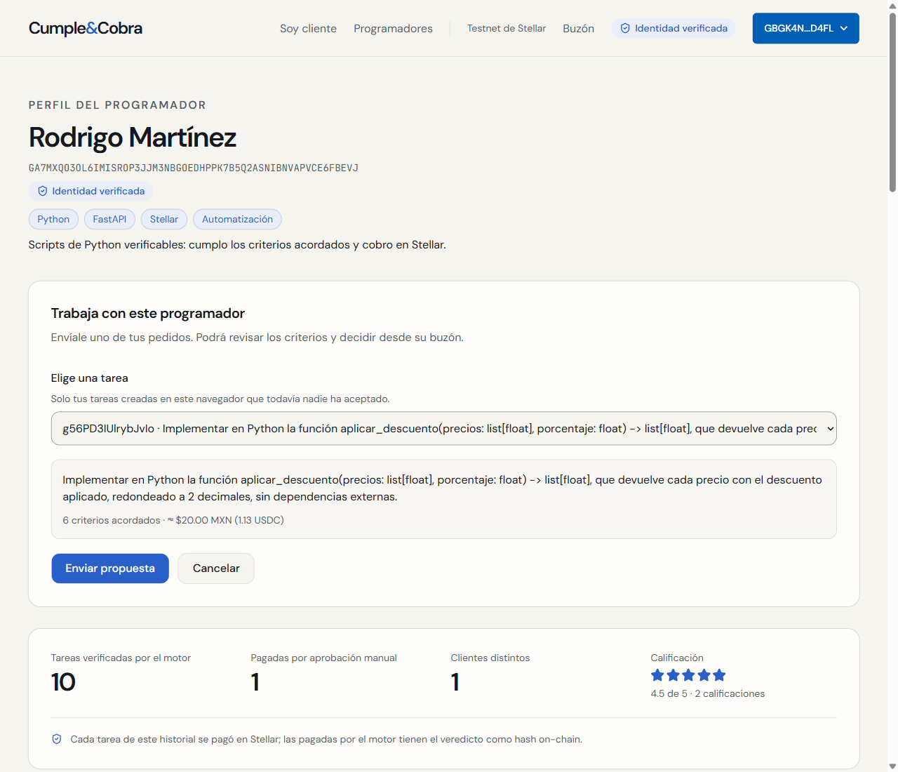
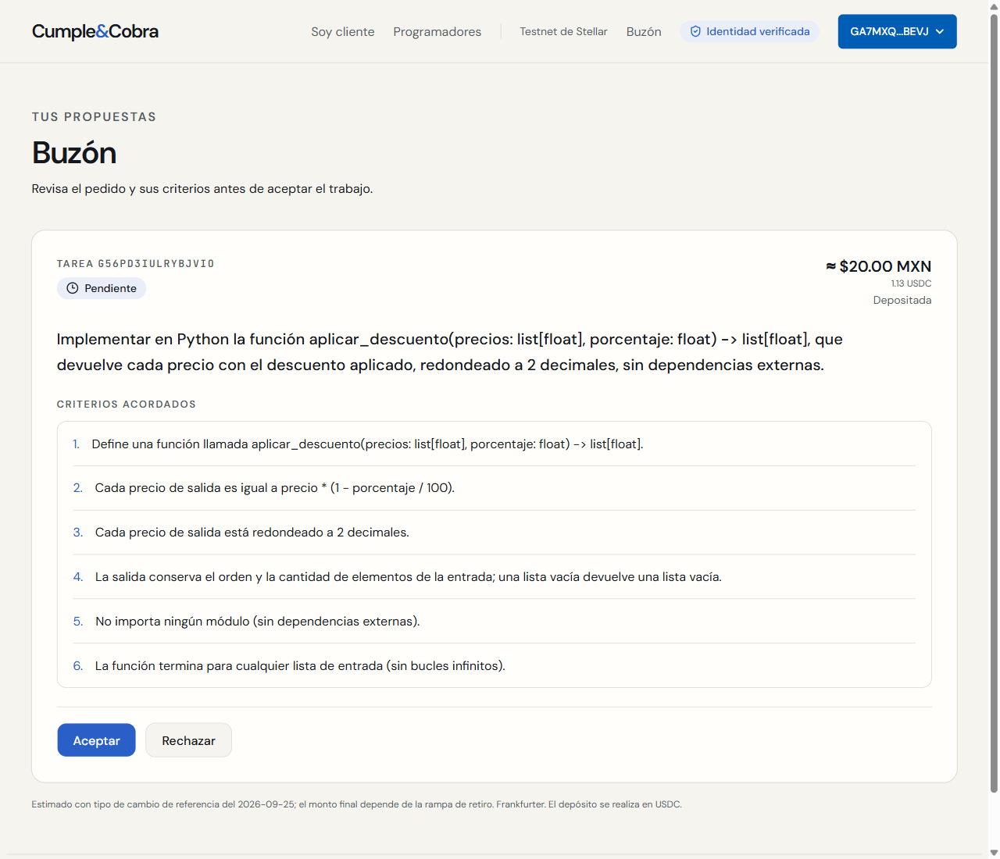
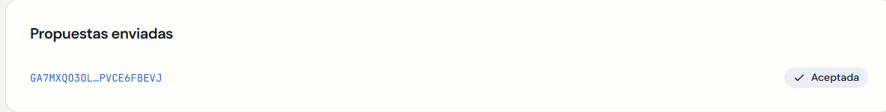
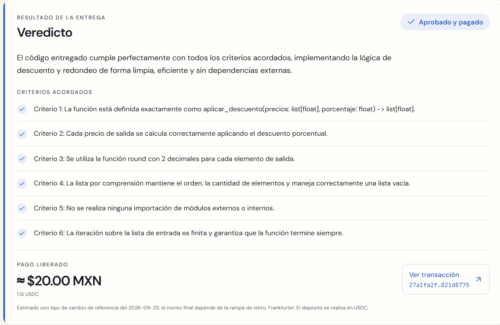

# Propuestas privadas y buzón

Trabajo del 25 de septiembre de 2026 en la carpeta original `C:/Users/rodri/Desktop/cumpleycobra`, rama `propuestas`. Antes de empezar se leyeron completos `AGENTS.md` y `CLAUDE.md`. `git merge-base --is-ancestor identidad main` terminó con código 0: `main`, `identidad` y sus referencias remotas apuntaban a `864f787`. Se creó la rama desde ese `main`.

## Qué se hizo

**Backend — `4182ce3`, “Propuestas: backend”.** Propuestas persistidas en `backend/state.py`, rutas aditivas al final de `backend/main.py` y 33 pruebas en `backend/tests/test_propuestas.py`.

| Ruta | Autorización y resultado |
| --- | --- |
| `POST /propuestas` | Sesión de identidad del cliente y `X-Client-Token` de la tarea. Cuerpo `{task_id, programador}`. Crea una propuesta `pendiente` si nadie aceptó la tarea. |
| `GET /buzon` | Sesión del destinatario. Filtra por su dirección antes de consultar el contrato; devuelve exclusivamente sus propuestas con descripción, criterios, monto y estado on-chain. |
| `POST /propuestas/{id}/aceptar` | Sesión del destinatario. Llama a la función existente `accept`, con la invitación guardada internamente, y devuelve `freelancer_token`. Marca la propuesta `aceptada`. |
| `POST /propuestas/{id}/rechazar` | Sesión del destinatario. Marca la propuesta `rechazada`; no se puede aceptar después. |
| `GET /tasks/{task_id}/propuestas` | Sesión del cliente y `X-Client-Token`. Consulta privada para mostrar el estado de las propuestas en su vista de tarea. |

Sesión ausente, inválida o caducada: `401 SESSION_REQUIRED`. Cliente o token incorrecto: `403 NOT_TASK_CLIENT`. Destinatario incorrecto: `403 NOT_PROPOSAL_RECIPIENT`. Tarea tomada: `409 TASK_TAKEN`. Duplicado de la misma tarea al mismo programador, incluso tras rechazar: `409 PROPOSAL_EXISTS`. Propuesta rechazada al intentar aceptar: `409 PROPOSAL_REJECTED`. Propuesta inexistente: `404 PROPOSAL_NOT_FOUND`.

Una tarea puede proponerse a distintos programadores mientras siga libre; solo uno puede aceptarla. Se coordinan decisiones por tarea y se conserva el bloqueo existente de `accept` frente al enlace de invitación. Una propuesta pendiente cuyo trabajo ya tomó otra persona no ofrece botones de decisión. El buzón muestra explícitamente los fallos de consulta del contrato y distingue un monto acordado de un depósito confirmado. Las respuestas de listas nunca incluyen tokens.

**Frontend — `0883d00`, “Propuestas: frontend”.** El perfil incorpora “Enviar propuesta”, un selector de tareas propias guardadas en este navegador y confirmación del envío. `/buzon` presenta descripción, criterios, monto y estado, con Aceptar y Rechazar. Aceptar guarda el token con `store.saveFreelancerTask` y abre `/tarea/[id]`. El encabezado muestra Buzón con una sesión válida. La vista del cliente consulta los estados cada cinco segundos.

Archivos nuevos: `app/buzon/page.tsx`, `components/send-proposal.tsx`, `client-proposals.tsx`, `header-inbox.tsx`, `proposal-status.tsx`, `lib/proposals.ts` y `tests/propuestas.test.mjs`, bajo `frontend/src` salvo los tests. Integraciones aditivas en el perfil, la página del cliente, el encabezado y `lib/api.ts`. Se reutilizan identidad, wallet, almacenamiento, Money y los componentes visuales actuales; no se instalaron dependencias.

**Verificación — “Propuestas: verificación”.** Este reporte, las capturas en `docs/img/propuestas/` y `frontend/scripts/propuestas-ensayo.mjs`.

## Alcance protegido

Las 44 funciones anteriores de `backend/main.py` son idénticas a las de `main`, comprobado comparando sus segmentos de código con AST. `/evaluate`, `/accept`, `/consent`, `/delivery` y `/auth` conservan su implementación. Sin cambios en el contrato, `stellar_client.py`, la capa determinista, `gemini.py`, `identidad.py`, los hooks, Soroban ni el script original de fase 5.

El test de regresión llama al `/accept` original y comprueba su respuesta, el mismo token al repetir con la misma wallet, los errores previos y la aceptación por invitación sin sesión de identidad. Las pruebas de concurrencia incluyen dos propuestas, duplicados simultáneos y la competencia con una invitación.

## Comandos y resultados

Desde la raíz:

```text
backend/.venv/Scripts/python -m pytest -q
218 passed, 2 warnings in 10.51s
```

Desde `frontend/`:

```text
npm test
16 tests, 16 pass, 0 fail

npx --no-install next typegen
Types generated successfully

npx --no-install tsc --noEmit
Código de salida 0

npm run lint
Código de salida 0

npm run build
Compiled successfully in 3.0s
Finished TypeScript in 2.5s
Generating static pages (7/7)
Rutas: /, /_not-found, /buzon, /cliente, /programador/[address], /programadores, /tarea/[id]
```

`git diff --check`: código de salida 0. Las 33 pruebas nuevas del backend cubren permisos de todas las rutas, sesiones caducadas, aislamiento del buzón y de tokens, persistencia, validación, duplicados, tarea tomada, rechazo definitivo, trustline, errores de red, aceptación original y concurrencia. Las tres nuevas del frontend cubren tareas elegibles, estados definitivos y tarea aceptada por invitación.

## Ensayo original de la fase 5

`node scripts/fase5-ensayo.mjs`, sin modificar el script. Ejecución exitosa a las 21:33 UTC (15:33 de Ciudad de México). Recorrido completo en **36,729 s**.

| Paso | Resultado | Tiempo |
| --- | --- | ---: |
| Pedido asistido | Borrador de cuatro criterios | 6,822 s |
| Revisión | “Que sea rápido” marcado como vago; eliminado antes de crear | 4,113 s |
| Crear tarea | `Tw33Xw7zvSTGjRf3` | 0,740 s |
| Depósito con Pollar | Confirmado | 5,221 s |
| Invitación y aceptación | Flujo original operativo | 1,972 s |
| Caso C | Rechazado; `transaction_hash = null` | 5,223 s |
| Caso A con video | Aprobado y pagado | 7,983 s |
| Cliente | Estado Pagada y código recibido | 3,466 s |

Monto: **11.328.172 unidades, 1,1328172 USDC**, aproximadamente **20 MXN**.

- [Depósito en Stellar](https://stellar.expert/explorer/testnet/tx/984a9c97fbbef1fa483b32b83fb5bdb54fdd789a9197320b202b759ee37622fb).
- [Pago en Stellar](https://stellar.expert/explorer/testnet/tx/fbbc28be73d8781bd1524b496604ea8962e855bc270d3ff7763e7fd8e59d2881).
- Estado on-chain `Released`, destinatario `GA7MXQO3OL6IMISROP3JJM3NBGOEDHPPK7B5Q2ASNIBNVAPVCE6FBEVJ`.

[Revisión del criterio](img/propuestas/fase-5-01-revision-criterio-vago.png) · [Programador pagado](img/propuestas/fase-5-02-programador-caso-a-pagado.png) · [Cliente con entrega](img/propuestas/fase-5-03-cliente-pagada.png).

Las capturas históricas de `docs/fases/img/` se respaldaron y restauraron byte a byte; las nuevas evidencias están en la carpeta de este encargo.

## Propuesta con las dos wallets reales

Cliente: `GBGK4NLPUTTOTHR5SLSFPOWA74EYH727WGZQ5CKGVX2B4DGF3UVPD4FL`.
Programador: `GA7MXQO3OL6IMISROP3JJM3NBGOEDHPPK7B5Q2ASNIBNVAPVCE6FBEVJ`.

Se comprobaron las sesiones vigentes de Pollar e identidad antes de los recorridos y después de reiniciar los servidores. No se renovaron ni firmaron retos de identidad durante este trabajo.

| Paso | Evidencia |
| --- | --- |
| Crear y depositar | Tarea `g56PD3IUlrybJvIo`, plantilla de la demo, plazo de 10 minutos, 20 MXN estimados |
| Enviar desde el perfil | Propuesta `63Ym1Ggvrg5sqqSY`, estado `pendiente` |
| Consultar buzón | El destinatario ve el pedido y los seis criterios |
| Aceptar | Token guardado en su navegador y navegación a `/tarea/g56PD3IUlrybJvIo` |
| Estado del cliente | Propuesta `aceptada` visible |
| Caso A | Aprobado y pagado; respuesta con transacción en **8,575 s** |
| Contrato y entrega | `Released` para el programador destinatario; cliente recibe el código |
| Errores JavaScript | Ninguno en las páginas del recorrido |

Monto pagado: **11.328.172 unidades = 1,1328172 USDC ≈ 20 MXN**.

[Depósito](https://stellar.expert/explorer/testnet/tx/8db00e2d219824e7dadf8c54349263a01ae65786d5552ae3e4d6028bc9b4c6b8) · [Pago](https://stellar.expert/explorer/testnet/tx/27a1fa2fd4b92248a9085f054756135df7bc013960d60732c70d28b9021d8775).

### Perfil con “Enviar propuesta”



### Buzón del destinatario



### Propuesta aceptada



[Vista del programador tras aceptar](img/propuestas/03-programador-acepto.png).

### Pago confirmado



[Estado Pagada en la vista del cliente](img/propuestas/06-cliente-pagada.png).

## Verificación de los pagos contra el evento release

```text
backend/.venv/Scripts/python scripts/verificar_pago.py fbbc28be73d8781bd1524b496604ea8962e855bc270d3ff7763e7fd8e59d2881 --veredicto scripts/.logs/ensayo-evaluate-a.json --codigo scripts/.logs/ensayo-entrega.py
✓ task_id
✓ code_hash del código entregado
✓ code_hash del veredicto
✓ verdict_hash

backend/.venv/Scripts/python scripts/verificar_pago.py 27a1fa2fd4b92248a9085f054756135df7bc013960d60732c70d28b9021d8775 --veredicto scripts/.logs/propuestas-evaluate-a.json --codigo scripts/.logs/propuestas-entrega.py
✓ task_id
✓ code_hash del código entregado
✓ code_hash del veredicto
✓ verdict_hash
```

`code_hash` de A en ambos: `c9b846f4cafc89920593d805ffa0fd7a087b9b29d928e00d835bdc782334e534`.

`verdict_hash` de fase 5: `4d48ee7f764c134deaa41f6a7b92b1f189843d1e05488b24f562e4aa7462759f`.

`verdict_hash` de la propuesta: `4764933dbf658982c6cc6e9cf1d2ffc9d8cc98f938839cffeec44b670eab578b`.

En ambos casos coinciden los valores recalculados a partir del código recibido y del JSON del veredicto con los del evento on-chain.

## Repetir el recorrido de propuestas

Con los servidores en `localhost:8000` y `localhost:3000`, y las dos ventanas de Chrome del ensayo de fase 5 con sus sesiones ya iniciadas:

```text
cd frontend
node scripts/propuestas-ensayo.mjs
```

El script se detiene si falta la sesión o el backend rechaza la identidad. Crea una nueva tarea de 20 MXN estimados y usa Pollar para depositar. Los resultados se guardan en `scripts/.logs/propuestas-ensayo.json`, el veredicto en `propuestas-evaluate-a.json` y la entrega en `propuestas-entrega.py`; esos archivos locales continúan ignorados por Git.

Si una interrupción ocurre después de aceptar y antes de entregar, `node scripts/propuestas-ensayo.mjs --continuar` retoma esa misma tarea desde el registro, sin crear ni depositar otra. Es necesario que conserve plazo suficiente. La reanudación no vuelve a aceptar la propuesta.

## Incidencias, desviaciones y pendientes

- El primer intento del ensayo original se detuvo por una pestaña que Chrome reportó oculta, antes de crear o depositar. Se restauraron las ventanas y el segundo intento pasó completo, sin editar el ensayo ni el producto.
- En el script nuevo, el observador inicial de aceptación capturó la respuesta `OPTIONS` de CORS. La propuesta sí se había aceptado. Se restringió el observador a `POST` y se continuó con la misma tarea y el mismo depósito hasta el pago; todas las capturas pertenecen a esa tarea. Fue un error del script de verificación, no del endpoint.
- Advertencias previas: deprecación de `httpx` en TestClient y de `_UnionGenericAlias` en google-genai; aviso de Node sobre módulos TypeScript; mensaje de Pollar al prerenderizar en servidor. No causaron fallos. No se cambiaron librerías ni comportamientos fuera de alcance.
- La consulta de estados del cliente se añadió como ruta privada separada para conservar intacta la respuesta pública actual de la tarea. Los commits se agruparon por los tres bloques pedidos. El reporte se coloca en `docs/propuestas.md` conforme al encargo.
- No quedan pasos funcionales o de verificación pendientes de este encargo. La rama queda para revisión, sin fusionar con `main`.
