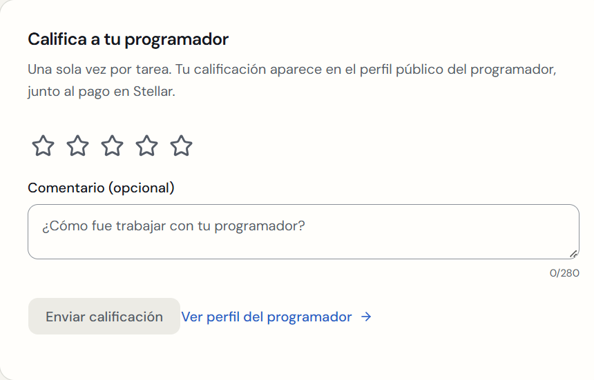
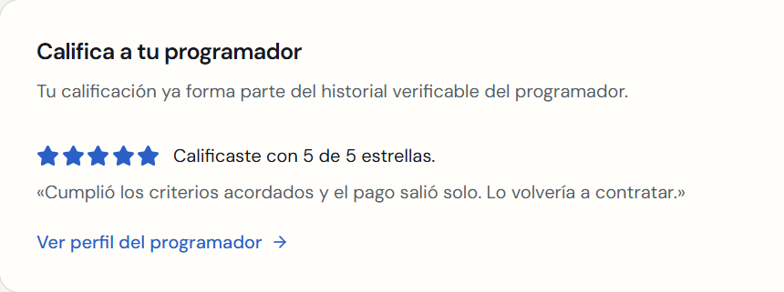
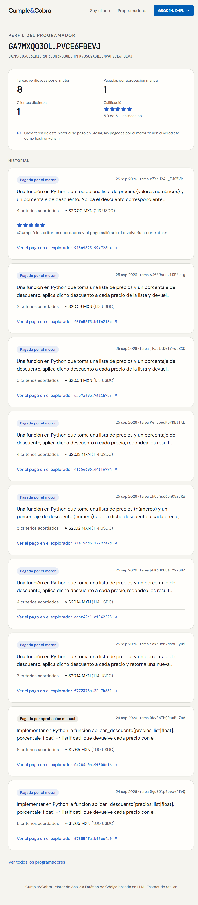
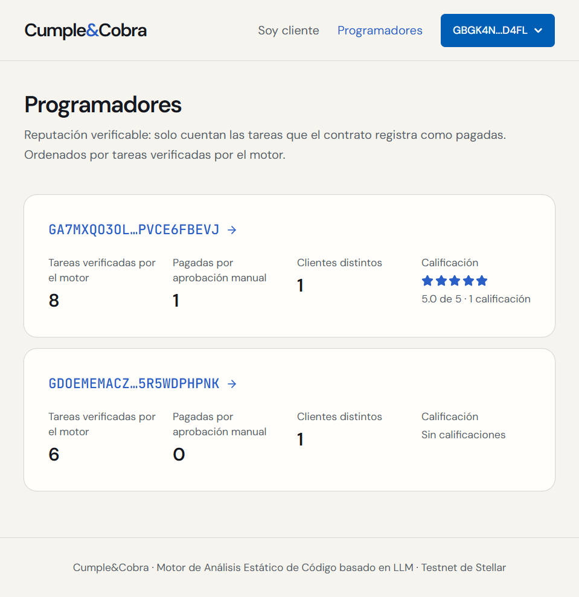
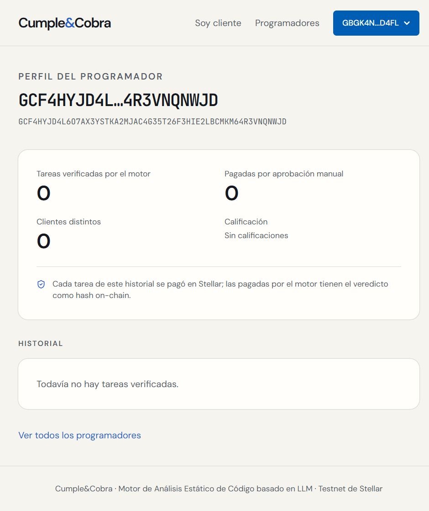

# Reputación verificable del programador

Rama `reputacion`, creada desde `main` (`dfac4be`). Opcional: `main` sigue congelado y esta rama **no se fusionó**. Fecha: 25 de septiembre de 2026.

**Objetivo:** que cualquiera vea qué ha cobrado un programador y cómo, sin cuentas nuevas y sin tocar el flujo del dinero.

| Commit | Contenido |
| --- | --- |
| `f5b0f2d` | Backend: calificación, listado y perfil, con 17 tests |
| `241361b` | Frontend: tarjeta para calificar, `/programador/[address]`, `/programadores` y enlace en el encabezado |
| (este) | Script de capturas, capturas y este reporte |

## Qué no se tocó

Sin cambios en ninguno de estos:

- el contrato, `stellar_client.py`, la capa determinista y `gemini.py`;
- `/evaluate`, `/accept`, `/consent` y `/delivery`;
- los hooks de wallet y Pollar.

`git diff main` sobre esos archivos está vacío. En el frontend, los archivos existentes solo tienen líneas agregadas: ninguna eliminada, así que ningún texto ni `data-testid` existente cambió. En `backend/main.py`, la única línea cambiada es el import (`from . import drafting, gemini, reputacion`), más un campo nuevo (`rating`) al final de `GET /tasks/{id}`.

## Backend

### De dónde sale cada dato (`backend/reputacion.py`)

| Dato | Fuente |
| --- | --- |
| Tarea pagada y a quién | `chain().get_task` en el contrato: solo cuenta `status == "Released"`, y el programador es el `freelancer` on-chain. Que `state.json` diga que hubo un `release` no basta: hay un test donde state dice pagada y la cadena dice `Funded`, y no cuenta. |
| Motor o manual, hash y fecha | Eventos del propio contrato, leídos con `getEvents` del RPC: `release` (lo firma el árbitro tras el veredicto del motor) o `client_release` (aprobación manual del cliente). La consulta es incremental con cursor: la primera recorre la ventana del RPC y las siguientes siguen donde quedó. |
| Respaldo si el evento no está | El RPC guarda unos 7 días (`ledger_retention_window = 120960`). Si el evento ya salió de la ventana o `getEvents` falla, un pago del motor se toma de `state.json` (hash del `release`, fecha del envío aprobado). Uno manual queda sin hash, y la interfaz lo explica. |
| Descripción, criterios y calificación | `state.json`: descripción recortada a 140 caracteres, número de criterios y la calificación del cliente. |
| Monto y cliente | El contrato. Los clientes solo se cuentan, nunca se muestran. |

- **Por qué eventos y no solo `state.json`:** el backend no conoce el hash de una aprobación manual, porque `client_release` lo firma el cliente en su navegador. Con los eventos, el historial sale de lo que registró la cadena.
- **Rendimiento:** las lecturas de `get_task` van en paralelo (máximo 8) con caché por cliente de cadena. `Released` y `Refunded` son terminales y se guardan sin vencimiento; los demás estados vencen a los 30 s. Con los datos reales, la primera consulta tardó 7.4 s en frío y la segunda 0.45 s.

### Endpoints

| Endpoint | Entrada | Salida |
| --- | --- | --- |
| `GET /programadores` | — | `{"programmers": [...]}`: por programador, `address`, `engine_paid`, `manual_paid`, `distinct_clients`, `rating_average` (o `null`), `rating_count`. Solo programadores con al menos una tarea Released. Orden: pagadas por el motor, luego manuales, luego calificación. |
| `GET /programadores/{address}` | dirección G… (400 si no es válida) | Lo mismo más `history`, una fila por tarea con `task_id`, `description`, `criteria_count`, `amount` (unidades), `paid_by` (`motor`/`manual`), `transaction_hash`, `paid_at` (ISO UTC) y `rating`. Una dirección sin tareas pagadas devuelve 200 con historial vacío. |
| `POST /tasks/{id}/calificacion` | header `X-Client-Token`; `{"estrellas": 1–5, "comentario": opcional, ≤ 280}` | `{"task_id", "estrellas", "comentario"}`. Errores: `403 INVALID_TOKEN`, `409 ALREADY_RATED`, `409 TASK_NOT_RELEASED` (Released se confirma con el contrato), `404 TASK_NOT_FOUND`, `400 INVALID_REQUEST` y `502 CHAIN_UNAVAILABLE`. Se guarda en `state.json` y no se sobrescribe. |

El perfil y la lista **nunca** incluyen código, tokens, `trace`, `logic`, `analysis`, `comparison`, `reason` ni la dirección del cliente. Si el RPC no responde a `get_task`, los dos endpoints dan `502 CHAIN_UNAVAILABLE`, en lugar de mostrar una reputación sin confirmar.

### Tests (`backend/tests/test_reputacion.py`, 17)

- **Calificación, reglas:** token equivocado o ausente → 403; tarea `Funded` o nunca depositada → `TASK_NOT_RELEASED`; la segunda calificación → `ALREADY_RATED` y la primera no se sobrescribe; se persiste en `state.json` y aparece en `GET /tasks/{id}`.
- **Calificación, límites:** con 0, 6, 4.5, `"5"`, `true`, sin estrellas, comentario de 281, campo extra o comentario no textual → 400. Se aceptan 1 y 5 con 280 caracteres; un comentario solo con espacios queda en `null`; una tarea inexistente → 404.
- **Listado y perfil:** motor por evento, manual por evento, motor sin evento (desde `state.json`) y manual sin evento (hash `null`). Una tarea que state da por pagada y la cadena por `Funded` no cuenta. Se comprueban promedio, clientes distintos, orden, campos exactos del historial y orden por fecha.
- **Privacidad:** ni los tres tokens, ni el código, ni la dirección del cliente aparecen en el JSON crudo de la lista ni del perfil, ni hay llaves de análisis.
- **Direcciones:** una dirección inválida → 400; una sin tareas → historial vacío.
- **Fallos del RPC:** `get_task` caído → 502; `getEvents` caído → se usa `state.json`.
- **Caché:** `Released` no se vuelve a leer; los demás estados vencen.
- **`PaymentEvents`:** paginación con cursor (ventanas sin eventos, fin cuando el cursor no avanza), eventos de llamadas fallidas descartados, clasificación motor/manual, y la siguiente consulta sigue desde el cursor.

## Frontend (mismo diseño de la rama `diseno`)

| Punto | Qué se hizo |
| --- | --- |
| 5 | Vista del cliente, con la tarea Pagada: tarjeta «Califica a tu programador» con estrellas (grupo de opciones accesible), comentario con contador de 280 y enlace «Ver perfil del programador». Tras calificar, muestra «Calificaste con N de 5 estrellas.» y el comentario. |
| 6 | `/programador/[address]`: métricas arriba (tareas verificadas por el motor, pagadas por aprobación manual, clientes distintos, calificación), la nota honesta «Cada tarea de este historial se pagó en Stellar; las pagadas por el motor tienen el veredicto como hash on-chain.» y el historial con enlace al explorador por tarea. El monto va en pesos con el USDC en línea. |
| 7 | `/programadores`: lista con las mismas métricas, cada dirección enlazada a su perfil. Enlace «Programadores» en el encabezado. |
| 8 | Estados vacíos: «Todavía no hay tareas verificadas.» en el perfil y en la lista; mensajes de carga y de error del backend. |

Tests de frontend (`frontend/tests/reputacion.test.mjs`, 3): etiqueta de calificación, las mismas reglas del formulario que el backend, cómo se pagó, fecha y texto exacto de la nota honesta.

## Verificación

```text
$ backend/.venv/Scripts/python -m pytest backend/tests -q
164 passed, 2 warnings in 21.14s          # 147 de main + 17 de reputación

$ cargo test -p cumpleycobra
test result: ok. 18 passed; 0 failed; …

$ cd frontend && npm test
ℹ tests 9
ℹ pass 9
ℹ fail 0                                   # 6 de main + 3 de reputación

$ npx next typegen && npx tsc --noEmit     # exit 0
$ npm run lint                             # exit 0
$ npm run build
✓ Compiled successfully in 2.1s
✓ Generating static pages using 9 workers (6/6)   # nuevas: /programador/[address] (dinámica) y /programadores
```

### Ensayo completo de la fase 5, sin cambios en su resultado

`frontend/scripts/fase5-ensayo.mjs` sin modificar (`git diff main` vacío), con backend y frontend de esta rama:

| Paso | Segundos |
| --- | --- |
| Pedido asistido | 28.6 (el primer intento a Gemini llegó al tope de 20 s, `TimeoutError`, y el reintento respondió) |
| Revisar criterios | 5.5 |
| Crear tarea | 0.7 |
| Depositar con Pollar | 4.0 |
| Aceptar | 2.2 |
| Caso C → rechazado por seguridad | 5.2 |
| Caso A con video → aprobado y pagado | 7.3 |
| Cliente: «Pagada» y código | 1.7 |
| **Total** | **56.4** |

El resultado es el mismo que en `main`: C rechazado sin pago y A aprobado y pagado. Tarea `xZYoH24L_EJSWVk-`, depósito [`99b2ff44…b83d`](https://stellar.expert/explorer/testnet/tx/99b2ff44d240e66e758f16c44aa2f2b083b6ed8fff625f6e5e16fe329a9eb83d), `release` [`913a9623…28b4`](https://stellar.expert/explorer/testnet/tx/913a9623ba808d8060559ac1476b720eacfa9d21085e9865d4243e4a994728b4) y `video_url` normalizado. Sus capturas están en `docs/img/reputacion-ensayo-*.png`; las de la fase 5 no se tocaron.

### Calificar la tarea del ensayo, perfil y lista

`frontend/scripts/reputacion-capturas.mjs` califica desde el navegador del cliente (5 estrellas y comentario) y recorre la tarjeta, el perfil y la lista:

```json
{
 "task_id": "xZYoH24L_EJSWVk-",
 "rating": {"estrellas": 5, "comentario": "Cumplió los criterios acordados y el pago salió solo. Lo volvería a contratar."},
 "token_equivocado": "INVALID_TOKEN",
 "perfil": "/programador/GA7MXQO3OL6IMISROP3JJM3NBGOEDHPPK7B5Q2ASNIBNVAPVCE6FBEVJ",
 "metricas": {"motor": "8", "manual": "1", "clientes": "1", "calificacion": "5.0 de 5 · 1 calificación"},
 "nota": "Cada tarea de este historial se pagó en Stellar; las pagadas por el motor tienen el veredicto como hash on-chain.",
 "enlaces_explorador": 9
}
```

El historial real de `GA7MXQ…BEVJ` coincide con los hashes de los reportes anteriores:

- `678054fa` (fase 3);
- `04284e0a`: la aprobación manual de la fase 3, encontrada por su evento `client_release`;
- `f772376a` y `aabe42e1` (fase 5);
- `eab7a69e` (correcciones);
- `913a9623` (este ensayo).

**Tarjeta antes de calificar.**



**Tarjeta después de calificar.**



**Perfil del programador:** métricas, nota honesta e historial con enlace al explorador por tarea.



**Lista de programadores.**



**Estado vacío:** una dirección sin tareas pagadas (`cyc-third`).



## Límites y riesgos

- **La reputación se puede inflar entre cuentas propias.** Un cliente y un programador de la misma persona pueden pagarse tareas entre sí; las wallets no cuestan. «Clientes distintos» lo hace visible (en testnet, las 9 tareas de `GA7MXQ…` son de un solo cliente), pero no lo impide. Lo mismo vale para las calificaciones: las da quien tiene el `client_token`, que no prueba la propiedad de la wallet (el mismo límite de los tokens en CLAUDE.md).
- **Ventana del RPC:** pasados unos 7 días, una tarea manual pierde su hash y su fecha (se sigue contando porque `get_task` la confirma). Una del motor conserva el hash de `state.json`.
- **Latencia en frío:** la primera consulta lee `get_task` de cada tarea aceptada (7.4 s con los datos de testnet). Después, 0.45 s.
- **Comentarios públicos, sin moderación:** React los escapa y el límite de 280 caracteres se valida en el servidor.
- **Datos de testnet:** `GDOEME…` (`cyc-freelancer`) aparece con 6 tareas del motor: son las pruebas por CLI de la fase 1. Son pagos reales en testnet, pero de prueba.
